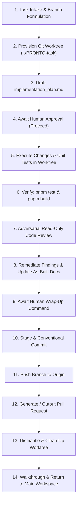

# Parallel Worktree & Multi-Window Task Execution Protocol

This skill codifies the protocol for executing isolated, concurrent tasks in the **PRONTO Insumos Odontológicos** repository using **Git Worktrees** and **Antigravity IDE parallel workspaces**.

When this skill is activated, the agent operates in an isolated filesystem location and dedicated Git branch, preventing file locks, line-range collision, and dirty working trees. Upon task completion, review, and human wrap-up approval, the branch is pushed, a Pull Request is initiated, and the worktree is cleanly dismantled.

---

## 🔁 Workflow Lifecycle (Mermaid Flowchart)



---

## 🛠️ Phase-by-Phase Execution Protocol

### Phase 1: Task Intake & Worktree Provisioning

1. **Formulate Branch & Directory Names:**
   * Branch convention: `feat/<task-kebab-name>` or `fix/<task-kebab-name>`.
   * Worktree directory path: `../PRONTO-<task-kebab-name>` (adjacent to the main repository).
   * Example: For task *"Synchronize Order Identifier"*, use branch `fix/sync-order-id` and worktree `../PRONTO-sync-order-id`.

2. **Verify Clean Base State:**
   * Ensure `main` is up to date and clean before branching:
     ```bash
     git status
     git fetch origin main
     ```

3. **Create the Isolated Worktree:**
   ```bash
   git worktree add ../PRONTO-<task-slug> -b <branch-name>
   ```

4. **Context Switching & Multi-Window Guidance:**
   * **In Antigravity IDE (Multi-Window):** Instruct the user they can open the new worktree in a second Antigravity IDE window (`File` → `New Window` → `Open Folder` → `../PRONTO-<task-slug>`) to run parallel agent chat sessions.
   * **In Direct Tool Execution:** All subsequent file operations, terminal commands, and test runners MUST point their working directory (`Cwd`) to the absolute path of the worktree:
     ```powershell
     # Cwd: C:\Users\ecmv2\Documents\PRONTO-<task-slug>
     ```

---

### Phase 2: Implementation & Rigorous Verification

All work inside the worktree must strictly observe the **PRONTO Master Guardrails** in [AGENTS.md](file:///c:/Users/ecmv2/Documents/PRONTO/AGENTS.md):

1. **Draft `implementation_plan.md`:**
   * Create or overwrite `implementation_plan.md` in the artifact directory.
   * Include the 5 mandatory sections:
     1. *Context & Problem Statement* (reference [PRODUCTION_READINESS_TODO.md](file:///c:/Users/ecmv2/Documents/PRONTO/PRODUCTION_READINESS_TODO.md)).
     2. *Human Action Items & Credentials* (safe placeholders in `.env.example`).
     3. *Proposed Changes* (categorized by `[NEW]`, `[MODIFY]`, `[DELETE]`).
     4. *Robust Unit Testing Plan* (Vitest test suites in `src/tests/`).
     5. *As-Built Documentation Plan* (updates to localized `AGENTS.md`).
   * Set `RequestFeedback: true` and `UserFacing: true`.
   * **STOP and await explicit human approval ("Proceed").**

2. **Execute Code in Worktree:**
   * Apply minimal, lean changes. No extraneous libraries (no Redux, no Tailwind, no Express).
   * Adhere to Chilean localization: Integer CLP currency, Modulo 11 RUT, Boleta/Factura separation.

3. **Write Robust Unit Tests:**
   * Add automated Vitest tests covering happy path, missing fields, race conditions, and boundary mock fallbacks in `src/tests/`.

4. **Verify in Worktree Context:**
   ```bash
   # Run within ../PRONTO-<task-slug>
   pnpm test
   pnpm build
   ```
   * **Zero Regression Policy:** All tests (95+) must pass 100%.

5. **Adversarial Read-Only Code Review:**
   * Inspect modified files for:
     - Runtime safety (`process.env` vs `import.meta.env`).
     - Defensive guards and boundary fallbacks.
     - Unintended formatting diffs or dangling secrets.
   * Address any findings directly in the worktree working tree.

6. **Update Documentation & Checklist:**
   * Update the relevant subdirectory's `AGENTS.md` (e.g., `api/AGENTS.md`, `src/services/AGENTS.md`).
   * Mark the corresponding item `[x]` in [PRODUCTION_READINESS_TODO.md](file:///c:/Users/ecmv2/Documents/PRONTO/PRODUCTION_READINESS_TODO.md).

---

### Phase 3: Completion, PR Creation & Worktree Cleanup

> [!CAUTION]
> **CRITICAL TIMING GUARD:** Never stage, commit, push, or delete the worktree prematurely. Await explicit human command to **"wrap up and proceed"**.

Once the human gives wrap-up authorization:

1. **Stage & Commit on Task Branch (Inside Worktree):**
   ```bash
   git add .
   git commit -m "<type>: <Task Title>"
   ```
   * Example: `git commit -m "fix: Synchronize Order Identifier across Mercado Pago and Firestore"`

2. **Push Dedicated Branch to Remote:**
   ```bash
   git push -u origin <branch-name>
   ```

3. **Generate Pull Request (Automated via `gh` CLI):**
   * The GitHub CLI (`gh`) is authenticated for this repository (`carlosjosemm/pronto-insumos`).
   * Execute the pull request creation in non-interactive mode directly from the worktree:
     ```bash
     gh pr create --base main --head <branch-name> --title "<type>: <Task Title>" --body "$(cat <<'EOF'
     ## 🎯 Objective
     - Reference: PRODUCTION_READINESS_TODO.md
     - Description of changes and problem solved.

     ## 🛠️ Changes Implemented
     - Summary of modified and newly added files.

     ## 🧪 Verification & Test Results
     - Vitest suite passed (pnpm test).
     - Build validation passed (pnpm build).
     - Zero regressions.
     EOF
     )"
     ```
   * Capture and report the created Pull Request URL (e.g., `https://github.com/carlosjosemm/pronto-insumos/pull/XX`).

4. **Dismantle & Clean Up Worktree:**
   * Switch the execution context back to the primary repository root (`c:\Users\ecmv2\Documents\PRONTO`).
   * Remove the isolated worktree directory:
     ```bash
     git worktree remove ../PRONTO-<task-slug>
     ```
   * Verify cleanup:
     ```bash
     git worktree list
     ```
   * Ensure no orphaned directories or lock files remain outside the main repository.

5. **Final Walkthrough:**
   * Write or update `walkthrough.md` in the artifact directory detailing the branch pushed, the PR URL, the test verification results, and confirmation that the worktree was dismantled.
