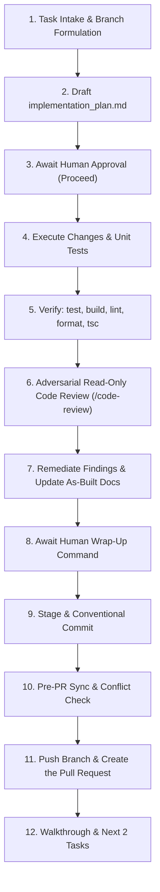

# Development Task Execution Protocol (Primary Working Tree)

This skill codifies the mechanics for executing a development task in the **PRONTO Insumos Odontológicos** repository: branch → plan → approval → implement → verify → review → docs → wrap-up → commit → push → PR → walkthrough. Roadmap task *selection* lives in [`production-readiness-workflow`](../production-readiness-workflow/SKILL.md); the review report format lives in the [`code-review`](../../../.devin/skills/code-review/SKILL.md) skill.

> [!IMPORTANT]
> **No Git worktrees. Ever.** All task work happens in the **primary working tree**, on a dedicated branch. Do not run `git worktree add`, do not create sibling task directories, and do not open a second workspace per task. *(Owner decision, 2026-09-28 — the previous worktree-based protocol is retired; the skill directory name is retained only to preserve the historical identifier.)*

---

## 🔁 Workflow Lifecycle (Mermaid Flowchart)


```mermaid
flowchart TD
    A["1. Task Intake & Branch Formulation"] --> B["2. Draft implementation_plan.md"]
    B --> C["3. Await Human Approval (Proceed)"]
    C --> D["4. Execute Changes & Unit Tests"]
    D --> E["5. Verify: test, build, lint, format, tsc"]
    E --> F["6. Adversarial Read-Only Code Review (/code-review)"]
    F --> G["7. Remediate Findings & Update As-Built Docs"]
    G --> H["8. Await Human Wrap-Up Command"]
    H --> I["9. Stage & Conventional Commit"]
    I --> J["10. Pre-PR Sync & Conflict Check"]
    J --> K["11. Push Branch & Create the Pull Request"]
    K --> L["12. Walkthrough & Next 2 Tasks"]
```

---

## 🛠️ Phase-by-Phase Execution Protocol

### Phase 1: Task Intake & Branch Formulation

1. **Sync the base and create the task branch — in this working tree:**
   * Branch convention: `feat/task-X.Y-<kebab-slug>` or `fix/task-X.Y-<kebab-slug>` (e.g. `fix/task-0.11-submit-order-write-failure`).

     ```bash
     git checkout main && git pull --ff-only
     git checkout -b <branch-name>
     ```

   * ❌ Never work directly on `main` for roadmap tasks. Documentation/tooling-only changes may go to `main` **only** when the owner explicitly asks for it.

### Phase 2: Implementation & Rigorous Verification

All work must strictly observe the **PRONTO Master Guardrails** in [AGENTS.md](../../../AGENTS.md).

1. **Draft `implementation_plan.md`** — overwrite the volatile artifact with the 5 mandatory sections:
   1. *Context & Problem Statement* (reference [PRODUCTION_READINESS_TODO.md](../../../PRODUCTION_READINESS_TODO.md)).
   2. *Human Action Items & Placeholders* (safe placeholders in `.env.example`).
   3. *Proposed Changes* (`[NEW]`, `[MODIFY]`, `[DELETE]`).
   4. *Robust Unit Testing Plan* (Vitest suites in `src/tests/`).
   5. *As-Built Documentation & Roadmap Sync Plan*.
   * Note the branch name and status in the header. **STOP and await explicit human approval ("Proceed").**

2. **Execute the changes** — minimal and lean. No extraneous libraries (no Redux, no Tailwind, no Express). Chilean localization: integer CLP, Modulo 11 RUT, Boleta/Factura separation.

3. **Write robust unit tests** — happy path, missing fields, race conditions, boundary/mock fallbacks, in `src/tests/`.

4. **Verify (all five gates):**

   ```bash
   pnpm test && pnpm build && pnpm lint && pnpm format:check && pnpm exec tsc --noEmit
   ```

   * **Zero Regression Policy:** every pre-existing test plus the new ones must pass 100%.

5. **Adversarial read-only code review** — invoke the `code-review` skill (`/code-review`), which spawns a fresh-context reviewer and returns the structured report (verdict, severity-ranked findings, verified-vs-assumed evidence). Applying its protocol inline is acceptable when no subagent is available.

6. **Remediate valid findings**, re-run the gates, update the as-built docs (the relevant `AGENTS.md`) and mark the roadmap checkbox `[x]`.

### Phase 3: Completion, PR & Walkthrough

> [!CAUTION]
> **CRITICAL TIMING GUARD:** Never stage, commit, push, or open the PR prematurely. Await the explicit human command **"wrap up and proceed"**.

> [!IMPORTANT]
> **MANDATORY PRE-PR SYNC — never push a branch that is behind `origin/main`.** Run the check below on **every** wrap-up, even when the branch is only minutes old; it is not optional, and the owner must never have to ask for it. Pushing a stale branch is what produces conflicted, un-mergeable PRs.

Once authorized:

1. **Stage & conventional commit** on the task branch (match the repository's commit style; include the Devin trailer).

2. **Pre-PR sync & conflict check (MANDATORY — `main` may have moved since the branch was cut):**

   ```bash
   git fetch origin
   git log --oneline HEAD..origin/main     # MUST be empty before you push
   ```

   * **Empty output** → `main` has not moved; continue to step 3.
   * **Commits listed** → `main` has moved; you MUST integrate before pushing:
     ```bash
     git rebase origin/main
     ```
     Resolve conflicts (they are usually confined to shared docs — combine both sides, then fix counts/status lines), **re-run all five gates**, and amend the commit if counts changed. Do not continue until `git log --oneline HEAD..origin/main` is empty again. Never `git push --force` a shared branch to sidestep this — rebase the local branch only.

3. **Push the branch:** `git push -u origin <branch-name>`.

4. **Create the Pull Request** with `gh pr create --base main`, then immediately confirm it is conflict-free: `gh pr view <n> --json mergeable,mergeStateStatus` → expect `MERGEABLE` / `CLEAN`. If it reports `CONFLICTING` / `DIRTY`, you skipped step 2 — go back and sync. Write the body to a **`.txt` file** and use `--body-file`: heredocs inside `--body "$(…)"` are fragile in this shell, and `.md` temp files trigger IDE markdownlint noise.

   ```bash
   gh pr create --base main --title "<type>(<scope>): <summary> (Task X.Y)" --body-file /tmp/<task>-pr-body.txt
   ```

   * Body sections: Objective & reference · Changes implemented (grouped by area) · Chilean localization compliance · Verification (test counts, build/lint/format results) · Strict guardrails verification.
   * Report the PR URL back to the owner.

5. **Walkthrough:** write/update `walkthrough.md` (gitignored local artifact) with the branch, commit, PR URL, verification results, human action items, and the disposition of every review finding.

6. **Next 2 tasks (mandatory):** re-read the Active Action Board in `PRODUCTION_READINESS_TODO.md` §1 and report the **next 2 open tasks in priority order** to the owner in the wrap-up message — task ID, one-line outcome/risk, and its gate. Skip suspended rows and owner-only checklist gates (note them separately if they still stand); the two tasks must be agent-executable items from the P1→P2→P3 queue.
