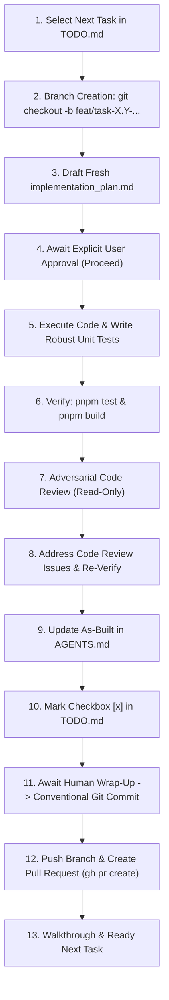

# PRONTO Production Readiness Workflow & Task Execution Protocol

This skill codifies the standard operating procedure for implementing tasks from [PRODUCTION_READINESS_TODO.md](file:///c:/Users/ecmv2/Documents/PRONTO/PRODUCTION_READINESS_TODO.md) in the PRONTO dental storefront repository.

Any AI agent operating in this repository must follow this sequential protocol strictly to guarantee zero regressions, maintain architectural simplicity, and ensure production readiness.

---

## 🔁 The Single-Task Execution Loop (Step-by-Step)

Each cycle executes exactly **1 (ONE) task** from top to bottom (Priority P0 downwards). Never bundle multiple roadmap items into a single run.



### Step 1: Select the Next Pending Task
* Open [PRODUCTION_READINESS_TODO.md](file:///c:/Users/ecmv2/Documents/PRONTO/PRODUCTION_READINESS_TODO.md) and identify the topmost unchecked task `[ ]` in priority order.
* Never skip ahead unless explicitly instructed by the user.

### Step 2: Dedicated Feature Branch Creation
* Ensure local `main` is completely synchronized with remote (`git checkout main && git pull`).
* Create and checkout a dedicated feature branch for the task:
  ```bash
  git checkout -b feat/task-X.Y-<short-description>
  # or fix/task-X.Y-<short-description>
  ```
  *(e.g., `git checkout -b feat/task-2.2-cart-localstorage`)*
* Never work directly on `main` for roadmap tasks.

### Step 3: Draft the Volatile `implementation_plan.md`
* Overwrite `implementation_plan.md` in the artifact directory.
* Set `RequestFeedback: true` and `UserFacing: true`.
* **The plan must strictly adhere to the Minimum Required Structure defined below.**
* Note the active task branch name in the plan.
* **STOP** and do not write or modify source code until the user approves.

### Step 4: Await Human Approval
* The user reviews the plan and clicks **Proceed** (or provides feedback to refine the plan).

### Step 5: Execute Code & Add Robust Unit Tests
* Apply the proposed code changes cleanly, following the anti-overshooting guardrails in [AGENTS.md](file:///c:/Users/ecmv2/Documents/PRONTO/AGENTS.md).
* If third-party secrets or human credentials are required (e.g., Mercado Pago live keys, Firebase service account keys), use safe mock placeholders and clearly document human action items in `.env.example`.
* **Implement robust unit tests** covering the new or modified logic in `src/tests/`.

### Step 6: Verify via Automated Tests & Production Build
* Run `pnpm test` (Vitest) and `pnpm build`.
* **Zero Regression Policy:** All pre-existing tests plus newly added tests must pass 100%.

### Step 7: Adversarial Code Review (Read-Only Inspection)
* **AUTOMATIC TRIGGER:** Proceed immediately and autonomously into this step as soon as Step 6 passes. **Do NOT stop or wait for the user to prompt or request the review.**
* Perform an independent, rigorous, read-only code review of all modified and newly created files.
* Inspect for:
  - Defensive programming: Input sanitation, accidental quotation wrapping in secrets, non-numeric quantity guards, boundary fallbacks, attribute injections.
  - Runtime safety: Strict Node.js vs. browser runtime separation (`process.env` vs `import.meta.env`).
  - Observability: Useful diagnostic warning logs on unhandled paths or missing database records.
  - Test completeness: Negative assertions, CORS preflight (`OPTIONS`), error recovery.
* Document findings clearly in a Code Review Report.

### Step 8: Address Code Review Claims
* Remediate every valid issue flagged in the review report directly in the working tree.
* Add unit tests to verify each edge case and re-run `pnpm test` and `pnpm build`.

### Step 9: Update As-Built Documentation
* Document what was implemented and any new patterns in the relevant directory's `AGENTS.md` (e.g., `api/AGENTS.md`, `src/components/AGENTS.md`, etc.).

### Step 10: Update Roadmap Checklist
* Mark the task as completed `[x]` in [PRODUCTION_READINESS_TODO.md](file:///c:/Users/ecmv2/Documents/PRONTO/PRODUCTION_READINESS_TODO.md).

### Step 11: Human Wrap-Up Approval & Conventional Git Commit
* **CRITICAL TIMING RULE:** **NEVER commit prematurely.** Keep changes uncommitted in the working tree until the user explicitly reviews the code-review report and issues the command to **"wrap up and proceed"**.
* Only upon receiving explicit wrap-up authorization, stage and commit on the dedicated branch:
  ```bash
  git add .
  git commit -m "feat(<scope>): <Task Title> (Task X.Y)"
  ```
  *(e.g., `git commit -m "feat(cart): persistent shopping cart via localStorage with schema migration (Task 2.2)"`)*

### Step 12: Push Branch & Create Detailed Pull Request
* Push the task branch to origin:
  ```bash
  git push -u origin feat/task-X.Y-<short-description>
  ```
* Open a pull request targeting `main` using the GitHub CLI (`gh pr create`).
* Provide a comprehensive, well-structured description matching the repository standard:
  ```bash
  gh pr create --title "feat(<scope>): <Task Title> (Task X.Y)" --body "$(cat <<'EOF'
  ## Summary of Changes
  [Detailed categorized description of changes, architecture decisions, and Chilean localization adherence]

  ## 🧪 Verification & Quality Assurance
  - **Vitest Unit Tests:** All test suites passed (X/X tests passing).
  - **Production Build:** `pnpm build` verified clean with zero errors.
  - **Strict Guardrails:** Compliant with AGENTS.md (no heavy libraries, Vanilla CSS, integer CLP).
  EOF
  )"
  ```

### Step 13: Walkthrough & Ready Next Task
* Write/update `walkthrough.md` summarizing the completed changes, test results, and the link to the created PR.
* Report back to the user and await instructions to draft the implementation plan for the next task.

---

## 📋 Minimum Required Structure for `implementation_plan.md`

Every volatile task implementation plan **must** contain these 5 mandatory sections:

```markdown
# Task [X.Y]: [Task Title]

## 1. Context & Problem Statement
- Reference the exact item from PRODUCTION_READINESS_TODO.md.
- Explain the current security flaw, financial risk, or missing capability.

## 2. Human Action Items & Placeholders (TODO for Human)
- Identify external credentials, keys, or configurations requiring human setup (e.g., Mercado Pago Access Token, Firebase Service Account, Resend API key).
- Specify the safe placeholder / environment variable name added to .env.example.

## 3. Proposed Changes
- Categorize file edits by directory:
  - [MODIFY] path/to/file
  - [NEW] path/to/file
  - [DELETE] path/to/file
- Keep changes minimal, lean, and compliant with the Anti-Overshooting Principle in AGENTS.md.

## 4. Robust Unit Testing Plan (MANDATORY)
- Because this project lacks live E2E/staging test environments, unit testing is the primary safety net.
- Detail the exact Vitest test cases to be written or updated in src/tests/.
- Specify mocking strategy for network boundaries, Firebase, and payment gateways.
- Explicitly list edge cases and failure scenarios to test (e.g., duplicate webhooks, network drops, malformed payloads).
- Confirm that the full suite (84+ existing tests) remains green.

## 5. As-Built Documentation & Roadmap Sync Plan
- Specify which AGENTS.md files will receive updated "as built" descriptions.
- Target checkbox to mark [x] in PRODUCTION_READINESS_TODO.md.
```

---

## 🧪 Unit Testing Requirements & Guidelines

Given the absence of live E2E test pipelines or dedicated staging environments:
1. **Never skip unit tests:** Every functional code change must include automated Vitest tests.
2. **Boundary Mocking:** Mock external network and SDK layers (`global.fetch`, `firebase/firestore`, `@vercel/node` request/response) at the boundary. Never make real outbound network requests in tests.
3. **Negative & Edge Testing:** Always test:
   * Valid happy path.
   * Missing or malformed payload fields.
   * Unauthorized or invalid signature requests.
   * Race conditions and duplicate calls (idempotency).
4. **Execution Speed:** The full suite must execute in under 5 seconds.

---

## 🌿 Pull Request & Branching Standards

To maintain an immutable, auditable, and beautifully documented Git history:

### 1. Branch Naming Standard
Every task branch must strictly follow:
* `feat/task-X.Y-<kebab-case-slug>` for features or enhancements (e.g., `feat/task-2.2-cart-localstorage`).
* `fix/task-X.Y-<kebab-case-slug>` for bug fixes, security remediations, or patches.

### 2. Pull Request Description Standard
Every PR created via `gh pr create` must contain:
1. **Title:** `feat(<scope>): <concise summary> (Task X.Y)`
2. **Context & Motivation:** Reference to the specific item in `PRODUCTION_READINESS_TODO.md` and problem solved.
3. **Summary of Changes:** Grouped by architectural area (Data Model, Component UI, API / Services, CSS / Aesthetics).
4. **Chilean Localization Compliance:** Explicit statement of CLP integer handling, Modulo 11 RUT validation, SII invoicing fields, or ISP regulatory controls.
5. **🧪 Verification & Quality Assurance:**
   * Vitest test count and suite results.
   * Production build validation (`pnpm build`).
6. **Strict Guardrails Verification:** Confirmation of Anti-Overshooting Principle compliance (no heavy state libs, Vanilla CSS only, serverless functions only).
