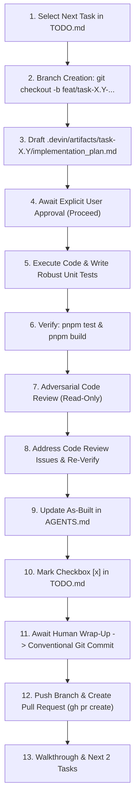

# PRONTO Production Readiness Workflow & Task Execution Protocol

This skill codifies the standard operating procedure for implementing tasks from [PRODUCTION_READINESS_TODO.md](../../../PRODUCTION_READINESS_TODO.md) in the PRONTO dental storefront repository.

Any AI agent operating in this repository must follow this sequential protocol strictly to guarantee zero regressions, maintain architectural simplicity, and ensure production readiness.

**Two modes.** The default is the **single-task loop** below: one task per run, stopping for owner approval twice (at the plan and at the wrap-up). The only exception is **`--YOLO` mode** (owner-authorized, for a named set of related tasks): no approval gates, several tasks executed back to back, each landing as its own PR, published as a single GitHub stack. See the **`--YOLO` Mode** section below. Nothing else about the protocol changes between the two modes.

---

## 🔁 The Single-Task Execution Loop (Step-by-Step)

Each cycle executes exactly **1 (ONE) task** from top to bottom (Priority P0 downwards). Never bundle multiple roadmap items into a single run — unless the owner has explicitly authorized **`--YOLO` mode** (see below) for that specific set of tasks.


```mermaid
flowchart TD
    A["1. Select Next Task in TODO.md"] --> B["2. Branch Creation: git checkout -b feat/task-X.Y-..."]
    B --> C["3. Draft .devin/artifacts/task-X.Y/implementation_plan.md"]
    C --> D["4. Await Explicit User Approval (Proceed)"]
    D --> E["5. Execute Code & Write Robust Unit Tests"]
    E --> F["6. Verify: pnpm test & pnpm build"]
    F --> G["7. Adversarial Code Review (Read-Only)"]
    G --> H["8. Address Code Review Issues & Re-Verify"]
    H --> I["9. Update As-Built in AGENTS.md"]
    I --> J["10. Mark Checkbox [x] in TODO.md"]
    J --> K["11. Await Human Wrap-Up -> Conventional Git Commit"]
    K --> L["12. Push Branch & Create Pull Request (gh pr create)"]
    L --> M["13. Walkthrough & Next 2 Tasks"]
```

### Step 1: Select the Next Pending Task
* Open [PRODUCTION_READINESS_TODO.md](../../../PRODUCTION_READINESS_TODO.md) and identify the topmost unchecked task `[ ]` in priority order.
* Never skip ahead unless explicitly instructed by the user.

### Step 2: Dedicated Feature Branch Creation
* Ensure local `main` is completely synchronized with remote (`git checkout main && git pull`).
* Create and checkout a dedicated feature branch for the task:
  ```bash
  git checkout -b feat/task-X.Y-<short-description>
  # or fix/task-X.Y-<short-description>
  ```
  *(e.g., `git checkout -b feat/task-2.2-cart-localstorage`)*
* Never work directly on `main` for roadmap tasks.

### Step 3: Draft the Implementation Plan in the Task's Artifact Folder
* Write `.devin/artifacts/task-X.Y/implementation_plan.md` — every task owns a persistent sub-folder under `.devin/artifacts/` named after the task (owner decision, 2026-09-30), so plans and walkthroughs never collide across parallel branches and stay in the repository for decision audits. The old volatile root `implementation_plan.md` is retired.
* Set `RequestFeedback: true` and `UserFacing: true`.
* **The plan must strictly adhere to the Minimum Required Structure defined below.**
* Note the active task branch name in the plan.
* **STOP** and do not write or modify source code until the user approves.

### Step 4: Await Human Approval
* The user reviews the plan and clicks **Proceed** (or provides feedback to refine the plan).
* *(Suspended under `--YOLO` mode — see below. The plan artifact is still written and committed.)*

### Step 5: Execute Code & Add Robust Unit Tests
* Apply the proposed code changes cleanly, following the anti-overshooting guardrails in [AGENTS.md](../../../AGENTS.md).
* If third-party secrets or human credentials are required (e.g., Mercado Pago live keys, Firebase service account keys), use safe mock placeholders and clearly document human action items in `.env.example`.
* **Implement robust unit tests** covering the new or modified logic in `src/tests/`.

### Step 6: Verify via Automated Tests & Production Build
* Run `pnpm test` (Vitest) and `pnpm build`.
* **Zero Regression Policy:** All pre-existing tests plus newly added tests must pass 100%.

### Step 7: Adversarial Code Review (Read-Only Inspection)
* **AUTOMATIC TRIGGER:** Proceed immediately and autonomously into this step as soon as Step 6 passes. **Do NOT stop or wait for the user to prompt or request the review.**
* Perform an independent, rigorous, read-only code review of all modified and newly created files.
* Inspect for:
  - Defensive programming: Input sanitation, accidental quotation wrapping in secrets, non-numeric quantity guards, boundary fallbacks, attribute injections.
  - Runtime safety: Strict Node.js vs. browser runtime separation (`process.env` vs `import.meta.env`).
  - Observability: Useful diagnostic warning logs on unhandled paths or missing database records.
  - Test completeness: Negative assertions, CORS preflight (`OPTIONS`), error recovery.
* Document findings clearly in a Code Review Report.

### Step 8: Address Code Review Claims
* Remediate every valid issue flagged in the review report directly in the working tree.
* Add unit tests to verify each edge case and re-run `pnpm test` and `pnpm build`.

### Step 9: Update As-Built Documentation
* Document what was implemented and any new patterns in the relevant directory's `AGENTS.md` (e.g., `api/AGENTS.md`, `src/components/AGENTS.md`, etc.).

### Step 10: Update Roadmap Checklist
* Mark the task as completed `[x]` in [PRODUCTION_READINESS_TODO.md](../../../PRODUCTION_READINESS_TODO.md).

### Step 11: Human Wrap-Up Approval & Conventional Git Commit
* **CRITICAL TIMING RULE:** **NEVER commit prematurely.** Keep changes uncommitted in the working tree until the user explicitly reviews the code-review report and issues the command to **"wrap up and proceed"**.
* *(Suspended under `--YOLO` mode — see below. The gates, the review and the docs are still mandatory; only the human wait is removed.)*
* Only upon receiving explicit wrap-up authorization, stage and commit on the dedicated branch:
  ```bash
  git add .
  git commit -m "feat(<scope>): <Task Title> (Task X.Y)"
  ```
  *(e.g., `git commit -m "feat(cart): persistent shopping cart via localStorage with schema migration (Task 2.2)"`)*

### Step 12: Push Branch & Create Detailed Pull Request
* **MANDATORY pre-PR sync (never push a branch that is behind `origin/main`).** Run this on every wrap-up, even when the branch is only minutes old — the owner must never have to ask for it, and pushing a stale branch is what produces conflicted, un-mergeable PRs:
  ```bash
  git fetch origin
  git log --oneline HEAD..origin/main     # MUST be empty before you push
  ```
  * If it lists commits, `main` moved: `git rebase origin/main`, resolve conflicts (usually confined to shared docs — combine both sides, then fix counts/status lines), re-run all five gates, and amend the commit if counts changed. Do not continue until the command is empty again. Never `git push --force` a shared branch to sidestep this.
* Push the task branch to origin:
  ```bash
  git push -u origin feat/task-X.Y-<short-description>
  ```
* Open a pull request targeting `main` using the GitHub CLI (`gh pr create`), then confirm it is conflict-free with `gh pr view <n> --json mergeable,mergeStateStatus` → expect `MERGEABLE` / `CLEAN`; a `CONFLICTING` / `DIRTY` result means the sync above was skipped.
* Provide a comprehensive, well-structured description matching the repository standard:
  ```bash
  gh pr create --title "feat(<scope>): <Task Title> (Task X.Y)" --body "$(cat <<'EOF'
  ## Summary of Changes
  [Detailed categorized description of changes, architecture decisions, and Chilean localization adherence]

  ## 🧪 Verification & Quality Assurance
  - **Vitest Unit Tests:** All test suites passed (X/X tests passing).
  - **Production Build:** `pnpm build` verified clean with zero errors.
  - **Strict Guardrails:** Compliant with AGENTS.md (no heavy libraries, Vanilla CSS, integer CLP).
  EOF
  )"
  ```

### Step 13: Walkthrough & Next 2 Tasks
* Write `.devin/artifacts/task-X.Y/walkthrough.md` (the same per-task artifact folder as the plan) summarizing the completed changes, test results, and the link to the created PR.
* **Report the next 2 open tasks (mandatory):** re-read the Active Action Board (§1) in [PRODUCTION_READINESS_TODO.md](../../../PRODUCTION_READINESS_TODO.md) and name the next 2 agent-executable tasks in priority order — task ID, one-line outcome/risk, and its gate. Skip suspended rows and owner-only checklist gates (mention those separately if still standing).
* Report back to the user and await instructions to draft the implementation plan for the next task.
* *(Under `--YOLO` mode this report happens once, at the end of the whole stack — see below.)*

---

## 🚀 `--YOLO` Mode — Owner-Authorized Multi-Task Stack

The default loop stops twice per task: once at the plan (Step 4) and once at the wrap-up (Step 11). **`--YOLO` is the explicit, owner-authorized exception**: a **named set of related tasks** runs back to back with **no approval gates**, each task landing as its own PR, and the PRs published as a **single GitHub stack**.

`--YOLO` is a conversational flag for the agent, not a script in the repository. The trigger is the owner's explicit instruction; nothing in the tooling reads it.

### 1. Trigger — explicit and scoped

The owner must name the tasks **and** authorize the mode, e.g. *"work on 8.4, 8.12 and 8.13 in sequence with `--YOLO`; do not stop for approval"*.

* Never infer the mode, never enable it for "the next task", and never carry it into a later session — it expires with the run it was granted for.
* Tasks named **without** the mode keep the default single-task protocol and its approval gates.
* A request to "stack the PRs" is **not** a `--YOLO` request: stacking is a publication detail, and the gates stay in place unless the owner also authorizes the mode.
* The owner may still interrupt at any point; `--YOLO` removes the mandatory waits, not the owner's authority.

### 2. What it suspends — and only this

| Suspended | Still mandatory, unchanged |
| :--- | :--- |
| Step 4 — plan approval (`Proceed`) | Step 3 — the plan artifact, written and committed per task |
| Step 11 — wrap-up approval ("wrap up and proceed") | Step 5 — the code **and** its robust unit tests |
| The one-task-per-run rule | Step 6 — the five gates green (`pnpm run verify:full`) before each commit |
| The per-task "await instructions for the next plan" handoff | Steps 7–8 — the adversarial code review and the remediation of its findings |
| | Step 9 — as-built documentation in the relevant `AGENTS.md` |
| | Step 10 — the roadmap checkbox |
| | Step 12 — the conventional commit with the Devin trailer, the pre-PR sync, and the PR |
| | Step 13 — the per-task walkthrough, and the final next-2-tasks report |

**`--YOLO` is not a licence to skip verification, review, tests or documentation.** It removes the human *waiting*, not the engineering. An agent that "saves time" by dropping the review or the tests has broken the mode, not used it — and the review is exactly what catches the findings that would otherwise reach production.

### 3. Ordering the tasks before branching

Decide the order up front and state the rationale in the first plan:

* A task that adds tooling the others rely on (a release gate, a type-check config) goes **first**, so the later layers are validated by it.
* Independent, low-risk, config-only tasks sit **below** behavioural ones: a small diff at the bottom of a stack rebases cleanly onto a moving `main`.
* Each layer is cut from the **previous task's branch**, never from `main` — that is what chains the PR bases.
* If two tasks genuinely conflict, or a dependency makes the order ambiguous in a way that changes the design, stop and ask rather than inventing a merge order.

### 4. Branch and PR stack mechanics

```bash
# Bottom of the stack, cut from a fresh main
git checkout main && git pull --ff-only
git checkout -b feat/task-A-<slug>
# ... implement, verify, review, docs, commit ...
git push -u origin feat/task-A-<slug>
gh pr create --base main --title "<type>(<scope>): <summary> (Task A)" --body-file /tmp/task-A-pr-body.txt

# Each following layer, cut from the branch below it
git checkout -b feat/task-B-<slug>
# ... implement, verify, review, docs, commit ...
git push -u origin feat/task-B-<slug>
gh pr create --base feat/task-A-<slug> --title "<type>(<scope>): <summary> (Task B)" --body-file /tmp/task-B-pr-body.txt
```

* One commit per task, with the Devin trailer. Each layer's PR body names the layer it sits on and says what the reviewer should read.
* Link the stack with the official GitHub CLI extension — it uses the **existing** open PRs (it does not create new ones) and sets the chain:
  ```bash
  gh extension install github/gh-stack                # once per machine
  gh stack link <branch-A> <branch-B> <branch-C>      # bottom → top, after every PR exists
  gh stack checkout <stack-number>                    # optional: local tracking
  gh stack view --short                               # confirm the chain and each PR state
  ```
  If the extension is unavailable, plain `gh pr create --base <previous-branch>` still produces a correct chain — only the GitHub "Stack" grouping is lost. Say which path you took in the final report.
* Confirm every layer is conflict-free before reporting: `gh pr view <n> --json mergeable,mergeStateStatus` → `MERGEABLE` / `CLEAN`, with CI green on **each** layer. A green bottom layer with a red top one is not a finished stack.
* Keep the PR bodies on disk as `.txt` files (`--body-file`); heredocs inside `--body "$(…)"` are fragile and `.md` temp files trigger markdownlint noise.

### 5. When `main` moves mid-stack (assume it will)

Step 12's pre-PR sync applies to the **whole chain**, not just the branch you happen to be on:

```bash
git fetch origin
git log --oneline <branch>..origin/main     # MUST be empty for EVERY layer before pushing
```

If `main` moved, rebase the chain and re-verify per layer:

```bash
gh stack rebase            # cascades bottom → top, pausing on conflicts
# resolve, then:
git add <files> && gh stack rebase --continue
```

* **Expect the shared docs to conflict** (`AGENTS.md`, `src/tests/AGENTS.md`, `PRODUCTION_READINESS_TODO.md`): combine both sides rather than picking one, then fix the counts and status lines.
* **Recompute the test counts per layer.** Each branch's count is that branch's own measurement, not the top of the stack's — an ancestor's count must not include tests its descendants add.
* An amended commit anywhere invalidates every layer above it: amend, cascade (`gh stack rebase`), then re-verify. Never leave a descendant pointing at a rewritten ancestor.
* Push the rewritten chain with `gh stack push` (per-branch `--force-with-lease`). ❌ Never force-push `main`, and never force-push a branch you do not own.
* Re-check CI on every layer after the push, and re-confirm `MERGEABLE` / `CLEAN`.

### 6. Wrapping up a `--YOLO` run

Report once, at the end of the whole stack, in this order:

1. **The stack:** stack number, each PR with its base, and the CI/merge state per layer.
2. **Per task:** the one-line outcome and where its as-built detail lives.
3. **The review findings that mattered** and how each was dispositioned. A blocked or major finding that was caught and remediated is a feature of the mode, not a footnote.
4. **What `main` did while you worked** (any rebase/cascade), with the per-layer verification counts.
5. **Remaining human action items** (owner preview/deploy steps, credentials, manual walkthroughs) — these are not suspended by the mode.
6. **The next 2 agent-executable tasks** in priority order, exactly as Step 13 requires — reported **once** for the stack, not per layer.

Then stop. `--YOLO` ends with the stack; the next task starts a fresh run under the default protocol unless the owner authorizes the mode again.

---

## 📋 Minimum Required Structure for the Implementation Plan

Every task implementation plan (`.devin/artifacts/task-X.Y/implementation_plan.md`) **must** contain these 5 mandatory sections:

```markdown
# Task [X.Y]: [Task Title]

## 1. Context & Problem Statement
- Reference the exact item from PRODUCTION_READINESS_TODO.md.
- Explain the current security flaw, financial risk, or missing capability.

## 2. Human Action Items & Placeholders (TODO for Human)
- Identify external credentials, keys, or configurations requiring human setup (e.g., Mercado Pago Access Token, Firebase Service Account, Resend API key).
- Specify the safe placeholder / environment variable name added to .env.example.

## 3. Proposed Changes
- Categorize file edits by directory:
  - [MODIFY] path/to/file
  - [NEW] path/to/file
  - [DELETE] path/to/file
- Keep changes minimal, lean, and compliant with the Anti-Overshooting Principle in AGENTS.md.

## 4. Robust Unit Testing Plan (MANDATORY)
- Because this project lacks live E2E/staging test environments, unit testing is the primary safety net.
- Detail the exact Vitest test cases to be written or updated in src/tests/.
- Specify mocking strategy for network boundaries, Firebase, and payment gateways.
- Explicitly list edge cases and failure scenarios to test (e.g., duplicate webhooks, network drops, malformed payloads).
- Confirm that the full suite (84+ existing tests) remains green.

## 5. As-Built Documentation & Roadmap Sync Plan
- Specify which AGENTS.md files will receive updated "as built" descriptions.
- Target checkbox to mark [x] in PRODUCTION_READINESS_TODO.md.
```

---

## 🧪 Unit Testing Requirements & Guidelines

Given the absence of live E2E test pipelines or dedicated staging environments:
1. **Never skip unit tests:** Every functional code change must include automated Vitest tests.
2. **Boundary Mocking:** Mock external network and SDK layers (`global.fetch`, `firebase/firestore`, `@vercel/node` request/response) at the boundary. Never make real outbound network requests in tests.
3. **Negative & Edge Testing:** Always test:
   * Valid happy path.
   * Missing or malformed payload fields.
   * Unauthorized or invalid signature requests.
   * Race conditions and duplicate calls (idempotency).
4. **Execution Speed:** The full suite must execute in under 5 seconds.

---

## 🌿 Pull Request & Branching Standards

To maintain an immutable, auditable, and beautifully documented Git history:

### 1. Branch Naming Standard
Every task branch must strictly follow:
* `feat/task-X.Y-<kebab-case-slug>` for features or enhancements (e.g., `feat/task-2.2-cart-localstorage`).
* `fix/task-X.Y-<kebab-case-slug>` for bug fixes, security remediations, or patches.

### 2. Pull Request Description Standard
Every PR created via `gh pr create` must contain:
1. **Title:** `feat(<scope>): <concise summary> (Task X.Y)`
2. **Context & Motivation:** Reference to the specific item in `PRODUCTION_READINESS_TODO.md` and problem solved.
3. **Summary of Changes:** Grouped by architectural area (Data Model, Component UI, API / Services, CSS / Aesthetics).
4. **Chilean Localization Compliance:** Explicit statement of CLP integer handling, Modulo 11 RUT validation, SII invoicing fields, or ISP regulatory controls.
5. **🧪 Verification & Quality Assurance:**
   * Vitest test count and suite results.
   * Production build validation (`pnpm build`).
6. **Strict Guardrails Verification:** Confirmation of Anti-Overshooting Principle compliance (no heavy state libs, Vanilla CSS only, serverless functions only).
