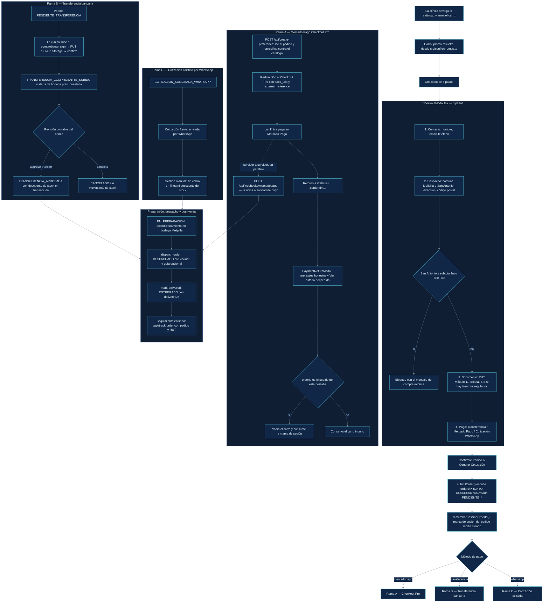
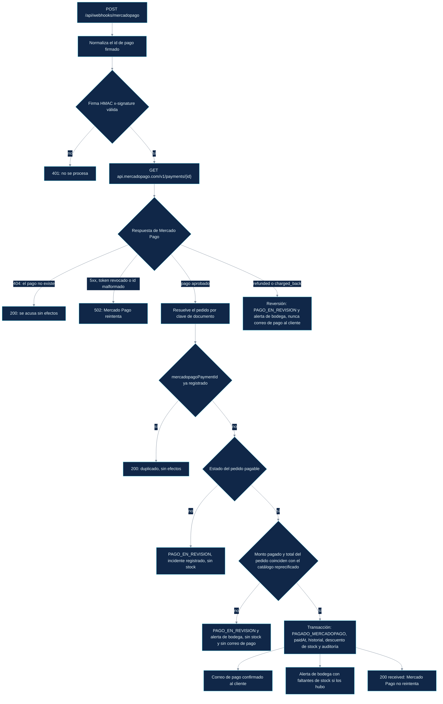
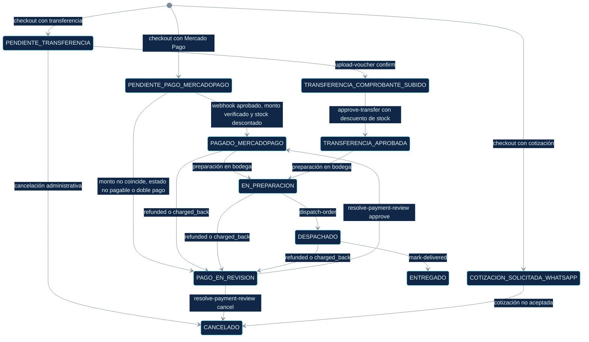
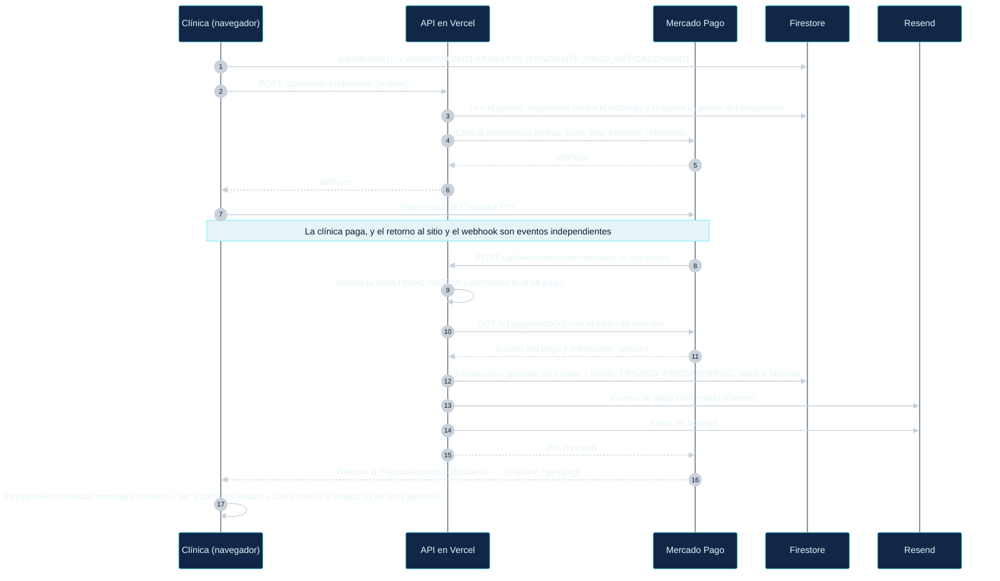

# PRONTO — Flujo de Checkout y Post-Pago (tal como está implementado)

Referencia de extremo a extremo del ciclo de vida del pedido en la tienda: el checkout de 5 pasos,
las tres vías de pago, la autoridad de pago del lado servidor, el flujo del comprobante de
transferencia y el traspaso a despacho.

> Este es el **único documento del repositorio redactado en español** (decisión del owner,
> 2026-09-29). Los identificadores de código, rutas de archivo, nombres de estado, endpoints y
> variables de entorno se mantienen en su forma literal.

**Cómo leerlo:** los diagramas describen el comportamiento **tal como está implementado** en el
commit `f599694` (estado con la Task 2.12 integrada). Cada flecha está respaldada por los archivos
listados en la §5 — si el código y este documento se contradicen, manda el código y el error está
aquí.

**Tema de los diagramas:** cada diagrama abre con una directiva `init` de mermaid que pinta un
**panel azul marino oscuro autocontenido** (`#0b1a33`, el `--ink-900` de la tienda) con texto claro,
para que se lea igual en GitHub claro/oscuro y en una vista previa de IDE oscura, en lugar de
heredar el fondo del anfitrión. La paleta replica los tokens de la tienda: nodos azul marino
(`#102748`), bordes cian (`#67e8f9`) y conectores gris pizarra (`#7c8a9a`). Mantén los diagramas
nuevos con la misma directiva; la regla de fondo está acotada con `svg[aria-roledescription]`, que
solo puede coincidir con el SVG raíz de un diagrama mermaid. Evita `;` dentro de las etiquetas —
mermaid lo interpreta como separador de sentencias y el diagrama no compila.

**Las dos reglas de hierro que codifican los diagramas** (raíz [AGENTS.md](./AGENTS.md) §4):

1. **El navegador nunca aprueba un pago ni toca el stock.** Los pedidos se crean en `PENDIENTE_*`;
   solo una vía verificada del servidor puede fijar `PAGADO_MERCADOPAGO` o descontar `stockCount`.
2. **Una URL nunca es prueba de pago.** El retorno de Mercado Pago (`?status=approved&orderId=…`)
   es falsificable y llega *antes* de que el webhook haya verificado nada, así que solo alimenta
   mensajes honestos y un atajo de seguimiento (Task 2.12).

---

## 1. Flujo de extremo a extremo

### 1.1 El webhook de Mercado Pago en detalle (la única autoridad de pago)

**Descuento de stock a lo sumo una vez:** `paidAt` / `approvedAt` son las marcas de liquidación. Un
pedido cuyas líneas ya se descontaron nunca se puede descontar dos veces — un segundo pago aprobado
sobre un pedido ya liquidado se convierte en un **incidente de doble pago** (registro de historial y
alerta de bodega), nunca en un segundo descuento y nunca en un cambio de estado que haga retroceder
el seguimiento del cliente.

---

## 2. Ciclo de vida del estado del pedido

Notas sobre la unión de estados (`src/types/index.ts` §2.1):

* `PAGADO_TRANSFERENCIA` es el estado pagado terminal heredado del flujo manual de transferencia —
  el seguimiento del cliente lo muestra igual que `PAGADO_MERCADOPAGO` (paso 2, `Pago Acreditado`).
* `PENDIENTE_PAGO` existe solo como respaldo genérico del mapa de estados de `submitOrder()`; las
  tres vías del checkout nunca lo producen.
* Los reembolsos quedan deliberadamente **fuera de la plataforma**: una reversión estaciona el
  pedido en `PAGO_EN_REVISION` para conciliación manual en lugar de modelar un estado `REEMBOLSADO`.

---

## 3. Viaje de ida y vuelta de Mercado Pago (vista de secuencia)

**Por qué el retorno no es el pago:** `auto_return` dispara la redirección en cuanto Mercado Pago
aprueba el cargo, mientras que el webhook es una llamada independiente de servidor a servidor que
puede llegar antes, después o nunca (si el cliente cierra la pestaña). Por eso la tienda muestra el
estado honesto — "recibimos tu retorno de pago, estamos confirmando" — y ofrece al cliente consultar
el estado real a través de `/api/track-order` (pedido más RUT).

---

## 4. Puntos de contacto con el cliente y la bodega después del pago

| Disparador | Superficie | Autoridad / guarda |
| :--- | :--- | :--- |
| Pedido registrado (transferencia, cotización WhatsApp) | `POST /api/order-confirmation` → correo "pedido recibido" | Idempotente vía `confirmationEmailSentAt`; doble factor (pedido + RUT); limitado por IP y por pedido |
| Pago aprobado (Mercado Pago) | Correo de pago confirmado al cliente + alerta de bodega | Solo los envía el webhook tras una liquidación limpia — nunca en un pago marcado o revertido |
| Transferencia aprobada por bodega | Correo al cliente + alerta de bodega | `approve-transfer`, transaccional, a lo sumo una vez |
| Pago estacionado en `PAGO_EN_REVISION` | Solo alerta de bodega | Monto no coincide, estado no pagable, doble pago o reversión — al cliente nunca se le dice que el pago se acreditó |
| Comprobante recibido | Alerta de bodega "comprobante recibido" | Presupuestada por pedido (5 minutos de espera, máximo 5, reservada dentro de la transacción de confirmación) |
| Cualquier pedido | `GET /api/track-order` → línea de tiempo de 5 etapas | Doble factor; un `404` idéntico para pedido inexistente y RUT que no coincide; limitado por IP y por pedido |
| Retorno desde Mercado Pago | `PaymentReturnModal` | Los mensajes afirman solo lo que se sabe; el carro se vacía únicamente si el pedido es de esta pestaña (Task 2.12) |

### 4.1 Quién puede hacer qué (no negociable)

| Acción | Autoridad permitida | Nunca |
| :--- | :--- | :--- |
| Fijar `PAGADO_MERCADOPAGO` | `/api/webhooks/mercadopago`, `resolve-payment-review` (admin) | Componentes del cliente, `api.ts` |
| Descontar `stockCount` | Webhook, `approve-transfer`, `resolve-payment-review` | El navegador |
| Mover a `TRANSFERENCIA_COMPROBANTE_SUBIDO` | `/api/upload-voucher` (fase `confirm`) | Que el cliente escriba directo en Firestore |
| Cobrar un monto | `/api/create-preference` desde el documento del pedido, reprecificado contra el catálogo | Cualquier total o código promo enviado por el cliente |
| Vaciar el carro en un retorno de pago | `App.tsx` cuando `isSessionOrder(orderId)` es verdadero | Una URL por sí sola |

---

## 5. Mapa del código

| Paso | Dónde |
| :--- | :--- |
| Checkout de 5 pasos, guardas, comprobante pro-forma y subida del comprobante | [`src/components/CheckoutModal.tsx`](./src/components/CheckoutModal.tsx) |
| Creación del pedido, id canónico y recálculo de promo/total | [`src/services/api.ts`](./src/services/api.ts) (`submitOrder`, `generateOrderId`) |
| Marca de sesión del pedido | [`src/services/orderSession.ts`](./src/services/orderSession.ts) |
| Modal de retorno de pago y sus mensajes | [`src/components/PaymentReturnModal.tsx`](./src/components/PaymentReturnModal.tsx) |
| Arranque desde la URL y guarda de vaciado del carro | [`src/App.tsx`](./src/App.tsx) (`parseUrlBootstrap`) |
| Preferencia de pago (reprecificación en servidor) | [`api/create-preference.ts`](./api/create-preference.ts) |
| Autoridad de pago (firma, guardas, stock, correos) | [`api/webhooks/mercadopago.ts`](./api/webhooks/mercadopago.ts) |
| Ciclo sign/confirm del comprobante | [`api/upload-voucher.ts`](./api/upload-voucher.ts) |
| Correo de pedido recibido | [`api/order-confirmation.ts`](./api/order-confirmation.ts) |
| Línea de tiempo del seguimiento del cliente | [`api/track-order.ts`](./api/track-order.ts) |
| Transiciones del admin | [`api/_lib/admin/approve-transfer.ts`](./api/_lib/admin/approve-transfer.ts), [`dispatch-order.ts`](./api/_lib/admin/dispatch-order.ts), [`mark-delivered.ts`](./api/_lib/admin/mark-delivered.ts), [`resolve-payment-review.ts`](./api/_lib/admin/resolve-payment-review.ts) |
| Zonas de despacho y umbrales comerciales | [`src/config/delivery.ts`](./src/config/delivery.ts) |

Contratos en profundidad: raíz [AGENTS.md](./AGENTS.md) §3–§4, [`api/AGENTS.md`](./api/AGENTS.md),
[`src/components/AGENTS.md`](./src/components/AGENTS.md), [`src/services/AGENTS.md`](./src/services/AGENTS.md),
[`src/types/AGENTS.md`](./src/types/AGENTS.md).
