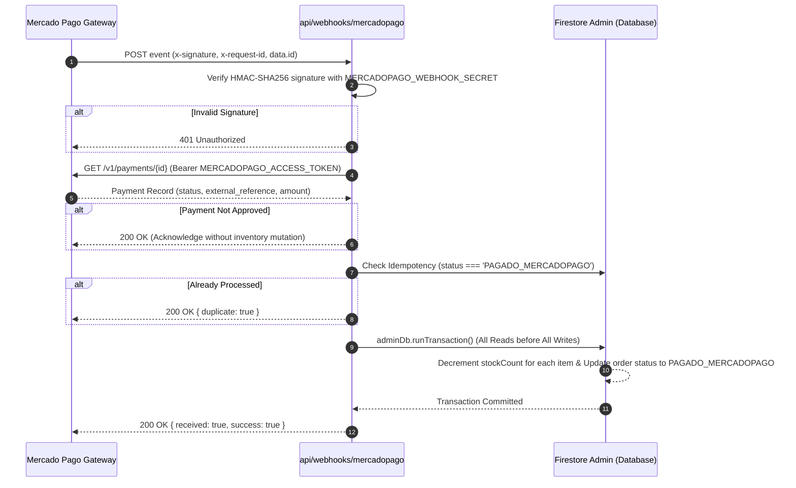

# PRONTO Serverless Backend Guide (`api/`)

This document is the **authoritative technical and operational guide** for the serverless backend layer of PRONTO Insumos Odontológicos. It details the runtime architecture, external payment integration with Mercado Pago Chile, cryptographic security, database transactions via Google Firebase Admin SDK, and fulfillment tracking services.

---

## 🎯 1. Directory Scope & Runtime Architecture

* **Execution Runtime:** Node.js (Vercel Serverless Function Environment).
* **Core Philosophy:** Lean, stateless micro-endpoints. No monolithic Express/NestJS apps, no heavy ORMs, and no persistent background threads.
* **Database Driver:** Official Google Cloud `firebase-admin` SDK executing with service account privileges.

### 1.1 Summary of Serverless Endpoints

| Endpoint | Method | Security / Auth | Business Function & Domain Role |
| :--- | :--- | :--- | :--- |
| [`/api/create-preference`](file:///c:/Users/ecmv2/Documents/PRONTO/api/create-preference.ts) | `POST` | Public / Server Secrets | Generates Mercado Pago Checkout Pro preferences after strictly validating that all requested dental supplies are in-stock in Firestore Admin. Rejects immediately if stock is insufficient. |
| [`/api/webhooks/mercadopago`](file:///c:/Users/ecmv2/Documents/PRONTO/api/webhooks/mercadopago.ts) | `POST` | HMAC-SHA256 (`x-signature`) | The single authority for payment reconciliation and physical stock deduction. Verifies payment status with Mercado Pago API and executes atomic inventory decrements inside a Firestore transaction. |
| [`/api/track-order`](file:///c:/Users/ecmv2/Documents/PRONTO/api/track-order.ts) | `POST` | Dual Factor (Order ID + Chilean RUT) | Public order lookup service bypassing client-side Firestore read locks. Verifies ownership via Chilean Modulo 11 RUT and returns a sanitized 5-stage fulfillment timeline. |
| [`/api/upload-voucher`](file:///c:/Users/ecmv2/Documents/PRONTO/api/upload-voucher.ts) | `POST` | Dual Factor (Order ID + Chilean RUT) | Intake endpoint for bank transfer receipts (Banco de Chile). Validates file size (<= 5MB), MIME types (PDF, PNG, JPG), records voucher URL, and transitions order status to `'TRANSFERENCIA_COMPROBANTE_SUBIDO'`. |

---

## 💳 2. Deep Dive: Payment Gateway Architecture (Mercado Pago Chile)

### 2.1 The Two-Phase Payment Boundary
To maintain strict PCI-DSS compliance and prevent fraud:
1. **Client Isolation:** The browser never sees credit card numbers or secret tokens. In checkout, the client invokes `/api/create-preference` passing the canonical `orderId` (`PRONTO-XXXXXX`), customer tax details, and cart items.
2. **Stock Pre-Check:** `/api/create-preference` reads the live `products` collection in Firestore Admin. If any item is depleted (`inStock === false` or `stockCount < requestedQuantity`), it aborts with HTTP `400 Bad Request`, preventing the customer from paying for items that Melipilla warehouse cannot fulfill.
3. **Checkout Pro Redirection:** Upon approval, Mercado Pago returns an `init_point` URL. The customer is redirected to Mercado Pago's secure hosted checkout (supporting Webpay Plus, Redcompra, Visa, and Mastercard).

### 2.2 Asynchronous Webhook & Cryptographic Verification (`/api/webhooks/mercadopago`)
When a payment succeeds, Mercado Pago dispatches an HTTP POST event to `/api/webhooks/mercadopago`.



### 2.3 Strict Idempotency & Stock Decrement Protection
Payment gateways frequently retry webhook deliveries due to network latency. Without defensive idempotency, an order's inventory could be decremented multiple times.
PRONTO enforces **two layers of idempotency defense**:
1. **Fast-Path Check:** Checks if the target order already has `status === 'PAGADO_MERCADOPAGO'` or `mercadopagoPaymentId === paymentId`. If yes, it immediately acknowledges HTTP 200 with `{ duplicate: true }` without touching database writes.
2. **Concurrent Transaction Guard:** Inside `adminDb.runTransaction()`, the order document is re-read. If another concurrent worker processed the payment during the transaction window, the transaction safely aborts without modifying stock.

---

## 📦 3. Deep Dive: Order Tracking & Voucher Services

### 3.1 Order Tracking Service (`/api/track-order.ts`)
* **The Problem:** Under [`firestore.rules`](file:///c:/Users/ecmv2/Documents/PRONTO/firestore.rules), client-side queries against `/orders/{orderId}` are blocked (`allow read: if false;`) to protect clinic purchase history and commercial pricing.
* **The Serverless Solution:** `/api/track-order` acts as a secure reverse proxy:
  - Accepts `{ orderId, rut }`.
  - Normalizes both RUTs using Chilean Modulo 11 rules (`cleanRut()`).
  - Reads the order via `firebase-admin`.
  - Compares the order's registered customer/company RUT against the requesting RUT. If they do not match, it rejects with `403 Forbidden` (`"RUT no coincide con el registro del pedido"`).
  - Returns a sanitized `OrderTrackingInfo` model omitting database keys, internal payment tokens, and sensitive accounting notes.

### 3.2 Bank Transfer Voucher Intake (`/api/upload-voucher.ts`)
* **The Problem:** Chilean dental clinics frequently pay via electronic bank transfer (Banco de Chile). Previously, proof of transfer had to be emailed or sent via WhatsApp, requiring manual correlation by warehouse staff.
* **The Serverless Solution:** `/api/upload-voucher`:
  - Enforces a 5MB payload limit to protect serverless memory.
  - Validates MIME types strictly: `application/pdf`, `image/png`, `image/jpeg`.
  - Authenticates order ownership using Chilean RUT comparison.
  - Stores receipt metadata and transitions the order status to `'TRANSFERENCIA_COMPROBANTE_SUBIDO'` with an ISO timestamp (`voucherUploadedAt`).
  - Warehouse staff in Melipilla can immediately see uploaded vouchers and verify them against Banco de Chile online banking.

---

## 🔒 4. Serverless Security & Runtime Isolation Rules

> [!CAUTION]
> **STRICT NODE.JS ISOLATION:**  
> Code in `api/` executes in Node.js on Vercel servers, NEVER in the customer's browser!

1. **Environment Variables (`process.env` ONLY):**
   * ❌ **NEVER** reference `import.meta.env` in `api/`. It causes fatal runtime crashes in Node.js.
   * ✅ Use `process.env.VARIABLE_NAME`.
   * ✅ Secrets (`MERCADOPAGO_ACCESS_TOKEN`, `MERCADOPAGO_WEBHOOK_SECRET`, `FIREBASE_PRIVATE_KEY`) belong strictly in `process.env`.
2. **Database Access (`firebase-admin` ONLY):**
   * ❌ **NEVER** import client Firebase instances from `src/services/firebase.ts`.
   * ✅ Use `getAdminFirestore()` from [`api/lib/firebaseAdmin.ts`](file:///c:/Users/ecmv2/Documents/PRONTO/api/lib/firebaseAdmin.ts) initialized as a singleton using service account credentials.
3. **CORS & Response Standard:**
   * All functions set permissive CORS headers for web clients while restricting methods:
     ```typescript
     res.setHeader('Access-Control-Allow-Origin', '*');
     res.setHeader('Access-Control-Allow-Methods', 'POST, OPTIONS');
     res.setHeader('Access-Control-Allow-Headers', 'Content-Type');
     ```
   * Preflight `OPTIONS` requests immediately return HTTP 200.

---

## 🛡️ 5. Deep Dive: Administrative Serverless Endpoints (`api/admin/`)

The internal administrative portal communicates with dedicated serverless endpoints under `api/admin/`. These endpoints perform privileged operations (order updates, transfer approval, inventory mutations) protected by Firebase ID token authentication.

### 5.1 Admin Authentication Middleware ([`api/lib/adminAuth.ts`](file:///c:/Users/ecmv2/Documents/PRONTO/api/lib/adminAuth.ts))
* **Cryptographic Verification:** Extracts `Authorization: Bearer <ID_TOKEN>` and invokes `auth.verifyIdToken(token, true)` via `firebase-admin/auth`.
* **Custom Claim Enforcement:** Asserts `decodedToken.admin === true`. If the claim is missing or false, immediately rejects with `403 Forbidden` (`"Permisos insuficientes: se requiere rol de administrador"`).
* **Clock Tolerance:** Configured with 5 seconds clock drift allowance (`checkRevoked: true`).

### 5.2 Admin Endpoints Reference

| Endpoint | Method | Role & Transaction Behavior |
| :--- | :--- | :--- |
| [`/api/admin/dashboard-stats`](file:///c:/Users/ecmv2/Documents/PRONTO/api/admin/dashboard-stats.ts) | `GET` | Aggregates daily sales in CLP, counts pending bank transfers, identifies low-stock items (<5 units), and counts monthly orders. |
| [`/api/admin/orders`](file:///c:/Users/ecmv2/Documents/PRONTO/api/admin/orders.ts) | `GET` | Fetches orders sorted by creation date with optional status filtering and pagination. Returns customer tax data, sanitary verification, and uploaded transfer vouchers. |
| [`/api/admin/approve-transfer`](file:///c:/Users/ecmv2/Documents/PRONTO/api/admin/approve-transfer.ts) | `POST` | **Crucial Operational Transition:** Approves a bank transfer order inside a Firestore atomic transaction (`adminDb.runTransaction`). Decrements physical stock in `products` for all items, transitions order status to `'TRANSFERENCIA_APROBADA'`, and records `approvedBy` (admin email) and `approvedAt` timestamp. |
| [`/api/admin/dispatch-order`](file:///c:/Users/ecmv2/Documents/PRONTO/api/admin/dispatch-order.ts) | `POST` | Updates fulfillment state to `'DESPACHADO'`. Records carrier name (e.g. Starken, Chilexpress, Blue Express, Melipilla Express), tracking number, and dispatch timestamp. |
| [`/api/admin/mark-delivered`](file:///c:/Users/ecmv2/Documents/PRONTO/api/admin/mark-delivered.ts) | `POST` | Updates fulfillment state to `'ENTREGADO'`, recording final delivery confirmation timestamp. |
| [`/api/admin/products`](file:///c:/Users/ecmv2/Documents/PRONTO/api/admin/products.ts) | `GET` | Retrieves full catalog inventory with live `stockCount`, `inStock` flags, and pricing for backoffice staff. |
| [`/api/admin/update-stock`](file:///c:/Users/ecmv2/Documents/PRONTO/api/admin/update-stock.ts) | `POST` | Adjusts product inventory count. Supports audit logging with reason codes (`reposicion`, `merma`, `correccion`, `venta_manual`) and operator notes. Automatically sets `inStock: false` if count reaches 0. |
| [`/api/admin/update-product`](file:///c:/Users/ecmv2/Documents/PRONTO/api/admin/update-product.ts) | `POST` | Updates product metadata: name, description, category, integer CLP price, manufacturer, package contents, and specs. |
| [`/api/admin/toggle-visibility`](file:///c:/Users/ecmv2/Documents/PRONTO/api/admin/toggle-visibility.ts) | `POST` | Instant catalog visibility switch: toggles `inStock` without modifying the physical stock count. |
| [`/api/admin/order-history`](file:///c:/Users/ecmv2/Documents/PRONTO/api/admin/order-history.ts) | `GET` | Retrieves chronological status transition timeline from `order_status_history` for an order. |

### 5.3 Relational Traceability & Audit Trail Architecture
To achieve tamper-proof traceability without an external SQL database, the serverless layer enforces an **append-only audit pattern** across two dedicated root collections:

1. **`order_status_history` (`orderId` Foreign Key):**
   - Whenever an order transitions between statuses (via Mercado Pago webhook, voucher upload, admin approval, dispatch, or delivery), the serverless function atomically inserts an audit event inside the same transaction/batch.
   - Fields: `orderId`, `previousStatus`, `newStatus`, `changedBy`, `changedByEmail`, `actorRole` (`ADMIN` | `CUSTOMER` | `SYSTEM_WEBHOOK`), `timestamp`, `reason`, and contextual `metadata`.
2. **`inventory_audit_logs` (`productId` Foreign Key):**
   - Every physical stock change or product metadata update records an immutable log entry.
   - Fields: `productId`, `productSku`, `productName`, `changeType`, `previousStock`, `newStock`, `delta`, `reasonCode` (`reposicion`, `merma`, `correccion`, `venta_manual`, `orden_compra`), `operatorNotes`, `changedBy`, and `timestamp`.
3. **Security Guardrail:**
   - Under `firestore.rules`, both collections are read-only for authenticated admins (`allow read: if isAdmin();`) and completely write-blocked for all client browser SDKs (`allow write: if false;`).

---

## 🚀 6. Deployment & Vercel Linking

Serverless functions are deployed directly using the **Vercel CLI**:
* Staging Preview: `pnpm dlx vercel`
* Production: `pnpm dlx vercel --prod`
* Server secrets must be configured in Vercel Project Settings prior to production deployment.

