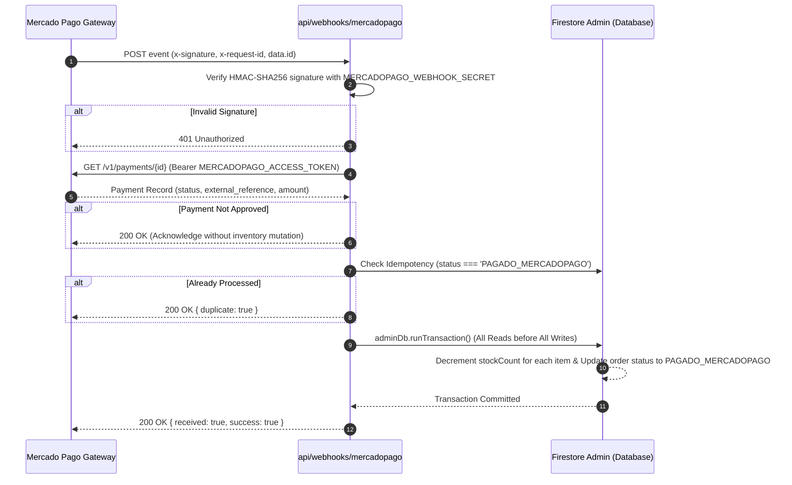

# PRONTO Serverless Backend Guide (`api/`)

This document is the **authoritative technical and operational guide** for the serverless backend layer of PRONTO Insumos Odontológicos. It details the runtime architecture, external payment integration with Mercado Pago Chile, cryptographic security, database transactions via Google Firebase Admin SDK, and fulfillment tracking services.

---

## 🎯 1. Directory Scope & Runtime Architecture

- **Execution Runtime:** Node.js (Vercel Serverless Function Environment).
- **Core Philosophy:** Lean, stateless micro-endpoints. No monolithic Express/NestJS apps, no heavy ORMs, and no persistent background threads. The one routed entry point (`api/admin/[action].ts`) is a documented exception to the single-purpose rule, forced by the Vercel Hobby function cap — see §1.2.
- **Database Driver:** Official Google Cloud `firebase-admin` SDK executing with service account privileges.

### 1.1 Summary of Serverless Endpoints

| Endpoint                                                                                           | Method | Security / Auth                      | Business Function & Domain Role                                                                                                                                                                                                         |
| :------------------------------------------------------------------------------------------------- | :----- | :----------------------------------- | :-------------------------------------------------------------------------------------------------------------------------------------------------------------------------------------------------------------------------------------- |
| [`/api/create-preference`](file:///c:/Users/ecmv2/Documents/PRONTO/api/create-preference.ts)       | `POST` | Public / Server Secrets              | Generates Mercado Pago Checkout Pro preferences after strictly validating that all requested dental supplies are in-stock in Firestore Admin. Rejects immediately if stock is insufficient.                                             |
| [`/api/webhooks/mercadopago`](file:///c:/Users/ecmv2/Documents/PRONTO/api/webhooks/mercadopago.ts) | `POST` | HMAC-SHA256 (`x-signature`)          | The single authority for payment reconciliation and physical stock deduction. Verifies payment status with Mercado Pago API and executes atomic inventory decrements inside a Firestore transaction.                                    |
| [`/api/track-order`](file:///c:/Users/ecmv2/Documents/PRONTO/api/track-order.ts)                   | `POST` | Dual Factor (Order ID + Chilean RUT) | Public order lookup service bypassing client-side Firestore read locks. Verifies ownership via Chilean Modulo 11 RUT and returns a sanitized 5-stage fulfillment timeline.                                                              |
| [`/api/upload-voucher`](file:///c:/Users/ecmv2/Documents/PRONTO/api/upload-voucher.ts)             | `POST` | Dual Factor (Order ID + Chilean RUT) | Intake endpoint for bank transfer receipts (Banco de Chile). Validates file size (<= 5MB), MIME types (PDF, PNG, JPG), records voucher URL, and transitions order status to `'TRANSFERENCIA_COMPROBANTE_SUBIDO'`.                       |
| [`/api/order-confirmation`](file:///c:/Users/ecmv2/Documents/PRONTO/api/order-confirmation.ts)     | `POST` | Dual Factor (Order ID + Chilean RUT) | Sends the transactional "order received" confirmation email via Resend for orders created client-side (bank transfer & WhatsApp quote). Idempotent via the `confirmationEmailSentAt` order flag (stamped only after a successful send). |

### 1.2 Function Layout & the Vercel Hobby Function Cap

The Vercel **Hobby plan refuses any deployment that adds more than 12 Serverless Functions**. Vercel treats *every* file under `api/` as a function unless its path contains a `_`-prefixed path segment, starts with `.`, or ends in `.d.ts`. That cap dictates the backend layout:

| Path | Role | Counted as a function? |
| :--- | :--- | :--- |
| `api/create-preference.ts`, `api/order-confirmation.ts`, `api/track-order.ts`, `api/upload-voucher.ts`, `api/webhooks/mercadopago.ts` | Public endpoints | ✅ Yes |
| `api/admin/[action].ts` | **Single routed entry point** for all 11 administrative actions | ✅ Yes |
| `api/_lib/**` | Shared non-route code (`adminAuth`, `firebaseAdmin`, `firestoreEnv`, `email`, `emailTemplates`, `mercadopagoSignature`) **and** the 11 admin handler modules under `api/_lib/admin/` | ❌ No — `_`-prefixed segment |

**Current function count: 6** (Hobby cap 12 — 6 slots of headroom).

- **Routing:** `/api/admin/<action>` → `req.query.action === '<action>'`. A plain `Record<string, handler>` lookup table in `api/admin/[action].ts` dispatches to the matching module under `api/_lib/admin/`. Unknown, missing, empty, or non-string actions return `404 { success: false, error: 'Endpoint de administración no encontrado' }` and log a `[Admin Router]` warning. Inherited prototype keys (`constructor`, `__proto__`, …) are rejected by an own-property check.
- **Public URLs are unchanged** — `src/admin/services/adminApi.ts` and `vercel.json` need no edits.
- **No framework.** The dispatcher holds no routing library, no middleware pipeline, and no CORS/auth of its own: each delegated handler keeps its own CORS headers, `OPTIONS` preflight, method gate, `verifyAdminToken` call, and error handling.
- **Rule of thumb:** anything under `api/` that is *not* a public route belongs in `api/_lib/`. Every new `api/*.ts` route consumes one of the 12 Hobby slots.

### 1.3 Runtime Module Resolution (ESM on Vercel)

Vercel does **not** bundle `api/` functions. It transpiles each file in place and ships the directory tree, so **Node's own ESM resolver** runs against the emitted `.js` files at request time. Two consequences are load-bearing — break either one and every affected endpoint returns `FUNCTION_INVOCATION_FAILED` (HTTP 500) while the build still reports success.

1. **Relative imports must carry an explicit `.js` extension.** `package.json` declares `"type": "module"`, and Node's ESM resolver rejects extensionless specifiers. `import { getAdminFirestore } from './_lib/firebaseAdmin'` transpiles fine but throws `ERR_MODULE_NOT_FOUND` at runtime. Always write `'./_lib/firebaseAdmin.js'`.
   - **Exception — type-only imports targeting a directory** (e.g. `import type { Product } from '../../../src/types'`) stay extensionless: they are erased during transpile and appending `.js` would break TypeScript's directory resolution.
   - Vitest/Vite maps the `.js` specifier back to the `.ts` source, so tests and the storefront bundle are unaffected.
   - `src/utils/schemaValidation.ts` is traced into the `api/admin/[action]` bundle, so its own `./rut.js` import obeys the same rule.

2. **`jose` is pinned to v5 via `pnpm.overrides`.** `firebase-admin` → `jwks-rsa@4` is CommonJS and calls `require('jose')` at module load, but `jose@6` is ESM-only, so *merely importing `firebase-admin/auth`* crashes with `ERR_REQUIRE_ESM` under Vercel's Node loader (stock Node ≥ 22.12 tolerates it via `require(esm)`; Vercel's does not). Upstream: [auth0/node-jwks-rsa#507](https://github.com/auth0/node-jwks-rsa/issues/507) and [firebase/firebase-admin-node#3181](https://github.com/firebase/firebase-admin-node/issues/3181). jose v5 is the last dual CJS/ESM major, and `jwks-rsa` only uses `jose.importJWK`/`jose.exportSPKI`, which are API-identical across jose 4/5/6.
   - **Removal condition:** drop the override once `jwks-rsa` publishes the lazy-`jose` fix ([PR #508](https://github.com/auth0/node-jwks-rsa/pull/508)) — i.e. any version above `4.1.0` — and re-verify that `firebase-admin/auth` loads on a preview deploy before promoting.

---

## 💳 2. Deep Dive: Payment Gateway Architecture (Mercado Pago Chile)

### 2.1 The Two-Phase Payment Boundary

To maintain strict PCI-DSS compliance and prevent fraud:

1. **Client Isolation:** The browser never sees credit card numbers or secret tokens. In checkout, the client invokes `/api/create-preference` passing the canonical `orderId` (`PRONTO-XXXXXX`), customer tax details, and cart items.
2. **Stock Pre-Check:** `/api/create-preference` reads the live `products` collection in Firestore Admin. If any item is depleted (`inStock === false` or `stockCount < requestedQuantity`), it aborts with HTTP `400 Bad Request`, preventing the customer from paying for items that Melipilla warehouse cannot fulfill.
3. **Checkout Pro Redirection:** Upon approval, Mercado Pago returns an `init_point` URL. The customer is redirected to Mercado Pago's secure hosted checkout (supporting Webpay Plus, Redcompra, Visa, and Mastercard).

### 2.2 Asynchronous Webhook & Cryptographic Verification (`/api/webhooks/mercadopago`)

When a payment succeeds, Mercado Pago dispatches an HTTP POST event to `/api/webhooks/mercadopago`.



### 2.3 Strict Idempotency & Stock Decrement Protection

Payment gateways frequently retry webhook deliveries due to network latency. Without defensive idempotency, an order's inventory could be decremented multiple times.
PRONTO enforces **two layers of idempotency defense**:

1. **Fast-Path Check:** Checks if the target order already has `status === 'PAGADO_MERCADOPAGO'` or `mercadopagoPaymentId === paymentId`. If yes, it immediately acknowledges HTTP 200 with `{ duplicate: true }` without touching database writes.
2. **Concurrent Transaction Guard:** Inside `adminDb.runTransaction()`, the order document is re-read. If another concurrent worker processed the payment during the transaction window, the transaction safely aborts without modifying stock.

---

## 📦 3. Deep Dive: Order Tracking & Voucher Services

### 3.1 Order Tracking Service (`/api/track-order.ts`)

- **The Problem:** Under [`firestore.rules`](file:///c:/Users/ecmv2/Documents/PRONTO/firestore.rules), client-side queries against `/orders/{orderId}` are blocked (`allow read: if false;`) to protect clinic purchase history and commercial pricing.
- **The Serverless Solution:** `/api/track-order` acts as a secure reverse proxy:
  - Accepts `{ orderId, rut }`.
  - Normalizes both RUTs using Chilean Modulo 11 rules (`cleanRut()`).
  - Reads the order via `firebase-admin`.
  - Compares the order's registered customer/company RUT against the requesting RUT. If they do not match, it rejects with `403 Forbidden` (`"RUT no coincide con el registro del pedido"`).
  - Returns a sanitized `OrderTrackingInfo` model omitting database keys, internal payment tokens, and sensitive accounting notes.

### 3.2 Bank Transfer Voucher Intake (`/api/upload-voucher.ts`)

- **The Problem:** Chilean dental clinics frequently pay via electronic bank transfer (Banco de Chile). Previously, proof of transfer had to be emailed or sent via WhatsApp, requiring manual correlation by warehouse staff.
- **The Serverless Solution:** `/api/upload-voucher`:
  - Enforces a 5MB payload limit to protect serverless memory.
  - Validates MIME types strictly: `application/pdf`, `image/png`, `image/jpeg`.
  - Authenticates order ownership using Chilean RUT comparison.
  - Stores receipt metadata and transitions the order status to `'TRANSFERENCIA_COMPROBANTE_SUBIDO'` with an ISO timestamp (`voucherUploadedAt`).
  - Warehouse staff in Melipilla can immediately see uploaded vouchers and verify them against Banco de Chile online banking.

---

## ✉️ 4. Transactional Email Layer (Resend — `api/_lib/email.ts` & `api/_lib/emailTemplates.ts`)

PRONTO sends transactional email via **Resend** (single `fetch` POST to `https://api.resend.com/emails` — zero SDK dependency) with a verified sender domain (`prontoinsumos.com`, DKIM/SPF/DMARC authenticated at the DNS provider).

### 4.1 The Fail-Safe Contract

`sendEmail()` in [`api/_lib/email.ts`](file:///c:/Users/ecmv2/Documents/PRONTO/api/_lib/email.ts) **never throws**. A missing `RESEND_API_KEY`, a Resend API rejection, or a network failure resolves to `{ sent: false, reason }` and only logs a `console.warn`. This guarantees an email outage can never break payment reconciliation, voucher intake, or admin approvals. Outbound calls carry an 8-second `AbortSignal.timeout` so a hung provider cannot stall a webhook.

### 4.2 Environment Variables (`process.env` ONLY — never `VITE_`)

- `RESEND_API_KEY` — Resend API secret.
- `EMAIL_FROM` — Verified-domain sender (e.g. `PRONTO Insumos <pedidos@prontoinsumos.com>`). The local part is arbitrary once the domain is verified.
- `WAREHOUSE_NOTIFICATION_EMAIL` — Melipilla dispatch inbox for internal alerts.
- `SITE_URL` (optional) — Base URL for order-tracking deep links inside emails (defaults to `https://prontoinsumos.com`).
- Bank details in emails reuse the same public `VITE_BANK_*` variables as the storefront (non-secret, single source of truth).

### 4.3 Trigger Points & Templates ([`api/_lib/emailTemplates.ts`](file:///c:/Users/ecmv2/Documents/PRONTO/api/_lib/emailTemplates.ts))

All templates return `{ subject, html, text }`, escape every user-supplied value (`escapeHtml`), and format money as integer CLP (`$189.990`) with the 19% IVA/neto breakdown.

| Event                                        | Endpoint                      | Customer Email                                                           | Warehouse Alert                                                |
| :------------------------------------------- | :---------------------------- | :----------------------------------------------------------------------- | :------------------------------------------------------------- |
| Order registered (transfer / WhatsApp quote) | `/api/order-confirmation`     | `buildOrderConfirmationEmail` (incl. bank details + voucher upload link) | —                                                              |
| Payment approved (Mercado Pago)              | `/api/webhooks/mercadopago`   | `buildPaymentConfirmedEmail`                                             | `buildWarehouseAlertEmail('PAGADO_MERCADOPAGO')`               |
| Voucher uploaded                             | `/api/upload-voucher`         | —                                                                        | `buildWarehouseAlertEmail('TRANSFERENCIA_COMPROBANTE_SUBIDO')` |
| Transfer approved by admin                   | `/api/admin/approve-transfer` | `buildTransferApprovedEmail`                                             | `buildWarehouseAlertEmail('TRANSFERENCIA_APROBADA')`           |

### 4.4 Idempotency & Ordering Guarantees

- **Order confirmation:** `/api/order-confirmation` skips orders already stamped with `confirmationEmailSentAt`; the stamp is written only after a successful Resend send, and a stamp failure degrades to a warning (never a 500 for a sent email).
- **Webhook:** emails are gated on a `stockDeducted` flag set inside the Firestore transaction, so duplicate deliveries and concurrency-guard aborts never re-notify.
- **Admin approval:** emails fire only when the transaction result is non-duplicate.
- **Mercado Pago orders** never hit `/api/order-confirmation` — payment confirmation arrives via the verified webhook instead.

---

## 🔒 5. Serverless Security & Runtime Isolation Rules

> [!CAUTION]
> **STRICT NODE.JS ISOLATION:**  
> Code in `api/` executes in Node.js on Vercel servers, NEVER in the customer's browser!

1. **Environment Variables (`process.env` ONLY):**
   - ❌ **NEVER** reference `import.meta.env` in `api/`. It causes fatal runtime crashes in Node.js.
   - ✅ Use `process.env.VARIABLE_NAME`.
   - ✅ Secrets (`MERCADOPAGO_ACCESS_TOKEN`, `MERCADOPAGO_WEBHOOK_SECRET`, `FIREBASE_PRIVATE_KEY`) belong strictly in `process.env`.
2. **Database Access (`firebase-admin` ONLY):**
   - ❌ **NEVER** import client Firebase instances from `src/services/firebase.ts`.
   - ✅ Use `getAdminFirestore()` from [`api/_lib/firebaseAdmin.ts`](file:///c:/Users/ecmv2/Documents/PRONTO/api/_lib/firebaseAdmin.ts) initialized as a singleton using service account credentials.
3. **CORS & Response Standard:**
   - All functions set permissive CORS headers for web clients while restricting methods:
     ```typescript
     res.setHeader("Access-Control-Allow-Origin", "*");
     res.setHeader("Access-Control-Allow-Methods", "POST, OPTIONS");
     res.setHeader("Access-Control-Allow-Headers", "Content-Type");
     ```
   - Preflight `OPTIONS` requests immediately return HTTP 200.

---

## 🛡️ 6. Deep Dive: Administrative Serverless Endpoints (`api/admin/`)

The internal administrative portal communicates with dedicated serverless endpoints under the public `/api/admin/` URL space. These endpoints perform privileged operations (order updates, transfer approval, inventory mutations) protected by Firebase ID token authentication.

Because of the Hobby function cap (§1.2), the 11 handlers are **not** separate route files: each lives as a plain module under `api/_lib/admin/`, and the single function `api/admin/[action].ts` dispatches to it on `req.query.action`. Behaviour is identical to a dedicated file per endpoint — every handler still owns its CORS headers, `OPTIONS` preflight, method gate, `verifyAdminToken` call, and error handling.

### 6.1 Admin Authentication Middleware ([`api/_lib/adminAuth.ts`](file:///c:/Users/ecmv2/Documents/PRONTO/api/_lib/adminAuth.ts))

- **Cryptographic Verification:** Extracts `Authorization: Bearer <ID_TOKEN>` and invokes `auth.verifyIdToken(token, true)` via `firebase-admin/auth`.
- **Custom Claim Enforcement:** Asserts `decodedToken.admin === true`. If the claim is missing or false, immediately rejects with `403 Forbidden` (`"Permisos insuficientes: se requiere rol de administrador"`).
- **Clock Tolerance:** Configured with 5 seconds clock drift allowance (`checkRevoked: true`).

### 6.2 Admin Endpoints Reference

Each row's link points at the handler module under `api/_lib/admin/`; the public URL is served by the routed entry point `api/admin/[action].ts` (§1.2).

| Endpoint                                                                                                 | Method | Role & Transaction Behavior                                                                                                                                                                                                                                                                                                                                                          |
| :------------------------------------------------------------------------------------------------------- | :----- | :----------------------------------------------------------------------------------------------------------------------------------------------------------------------------------------------------------------------------------------------------------------------------------------------------------------------------------------------------------------------------------- |
| [`/api/admin/dashboard-stats`](file:///c:/Users/ecmv2/Documents/PRONTO/api/_lib/admin/dashboard-stats.ts)     | `GET`  | Aggregates daily sales in CLP (localized to `America/Santiago`), counts pending bank transfers, identifies low-stock items (<5 units), and counts monthly orders.                                                                                                                                                                                                                    |
| [`/api/admin/orders`](file:///c:/Users/ecmv2/Documents/PRONTO/api/_lib/admin/orders.ts)                       | `GET`  | Fetches orders sorted by creation date with optional status filtering and pagination. Returns customer tax data, sanitary verification, and uploaded transfer vouchers.                                                                                                                                                                                                              |
| [`/api/admin/approve-transfer`](file:///c:/Users/ecmv2/Documents/PRONTO/api/_lib/admin/approve-transfer.ts)   | `POST` | **Crucial Operational Transition:** Approves a bank transfer order inside a Firestore atomic transaction (`adminDb.runTransaction`). Decrements physical stock in `products` for all consolidated items, transitions order status to `'TRANSFERENCIA_APROBADA'`, records `approvedBy` (admin email) and `approvedAt` timestamp, and writes an audit event to `order_status_history`. |
| [`/api/admin/dispatch-order`](file:///c:/Users/ecmv2/Documents/PRONTO/api/_lib/admin/dispatch-order.ts)       | `POST` | Updates fulfillment state to `'DESPACHADO'`. Records carrier name (e.g. Starken, Chilexpress, Blue Express, Melipilla Express), tracking number, and dispatch timestamp. Records audit trail.                                                                                                                                                                                        |
| [`/api/admin/mark-delivered`](file:///c:/Users/ecmv2/Documents/PRONTO/api/_lib/admin/mark-delivered.ts)       | `POST` | Updates fulfillment state to `'ENTREGADO'`, recording final delivery confirmation timestamp and audit trail.                                                                                                                                                                                                                                                                         |
| [`/api/admin/products`](file:///c:/Users/ecmv2/Documents/PRONTO/api/_lib/admin/products.ts)                   | `GET`  | Retrieves full catalog inventory with live `stockCount`, `inStock` flags, `isActive` visibility state, and pricing for backoffice staff.                                                                                                                                                                                                                                             |
| [`/api/admin/update-stock`](file:///c:/Users/ecmv2/Documents/PRONTO/api/_lib/admin/update-stock.ts)           | `POST` | Adjusts product inventory count. Supports audit logging in `inventory_audit_logs` with reason codes (`reposicion`, `merma`, `correccion`, `venta_manual`) and operator notes. Updates `inStock = (newStock > 0 && isActive !== false)`.                                                                                                                                              |
| [`/api/admin/update-product`](file:///c:/Users/ecmv2/Documents/PRONTO/api/_lib/admin/update-product.ts)       | `POST` | Updates product metadata: name, description, category, integer CLP price (with automatic `priceNeto = Math.round(price / 1.19)` re-calculation), manufacturer, package contents, and specs. Records audit log.                                                                                                                                                                       |
| [`/api/admin/create-product`](file:///c:/Users/ecmv2/Documents/PRONTO/api/_lib/admin/create-product.ts)       | `POST` | Registers a new dental clinical supply in Firestore Admin. Generates unique canonical IDs (`pronto-*`), supports dynamic categories, validates strictly against frozen schema, enforces Chilean integer CLP and net calculations (`priceNeto = Math.round(price / 1.19)`), and writes an initial audit record to `inventory_audit_logs`.                                             |
| [`/api/admin/toggle-visibility`](file:///c:/Users/ecmv2/Documents/PRONTO/api/_lib/admin/toggle-visibility.ts) | `POST` | Instant catalog visibility switch: toggles `isActive` without zeroing or clearing physical warehouse `stockCount`. Updates `inStock = (stockCount > 0 && newIsActive)`.                                                                                                                                                                                                              |
| [`/api/admin/order-history`](file:///c:/Users/ecmv2/Documents/PRONTO/api/_lib/admin/order-history.ts)         | `GET`  | Retrieves chronological status transition timeline from `order_status_history` for an order, supporting both direct Document ID and `orderId` fallback query.                                                                                                                                                                                                                        |

### 6.3 Relational Traceability & Audit Trail Architecture

To achieve tamper-proof traceability without an external SQL database, the serverless layer enforces an **append-only audit pattern** across two dedicated root collections:

1. **`order_status_history` (`orderId` Foreign Key):**
   - Whenever an order transitions between statuses (via Mercado Pago webhook, voucher upload, admin approval, dispatch, or delivery), the serverless function atomically inserts an audit event inside the same transaction/batch.
   - Fields: `orderId`, `previousStatus`, `newStatus`, `changedBy`, `changedByEmail`, `actorRole` (`ADMIN` | `CUSTOMER` | `SYSTEM_WEBHOOK`), `timestamp`, `reason`, and contextual `metadata`.
2. **`inventory_audit_logs` (`productId` Foreign Key):**
   - Every physical stock change or product metadata update records an immutable log entry.
   - Fields: `productId`, `productSku`, `productName`, `changeType`, `previousStock`, `newStock`, `delta`, `reasonCode` (`reposicion`, `merma`, `correccion`, `venta_manual`, `orden_compra`), `operatorNotes`, `changedBy`, and `timestamp`.
3. **Security Guardrail:**
   - Under `firestore.rules`, both collections are read-only for authenticated admins (`allow read: if isAdmin();`) and completely write-blocked for all client browser SDKs (`allow write: if false;`).

---

## 🧪 7. Multi-Environment Firestore Isolation (`api/_lib/firestoreEnv.ts`)

### 7.1 The Development & QA Testing Bottleneck

Previously, PRONTO operated against a single Firestore database. Running local development servers or manual QA tests risked contaminating live clinical orders and altering real Melipilla warehouse inventory stock. Provisioning a second Google Cloud project introduced unnecessary architectural overhead, additional IAM credential management, and monthly billing complexity.

### 7.2 Dynamic Collection Namespacing Resolution

The serverless backend resolves collection targets dynamically via `getCollectionName()` in [`api/_lib/firestoreEnv.ts`](file:///c:/Users/ecmv2/Documents/PRONTO/api/_lib/firestoreEnv.ts):

```typescript
export function getFirestoreEnv(): "production" | "development" | "test" {
  if (
    process.env.FIRESTORE_ENV === "production" ||
    process.env.FIRESTORE_ENV === "development" ||
    process.env.FIRESTORE_ENV === "test"
  ) {
    return process.env.FIRESTORE_ENV;
  }
  if (process.env.NODE_ENV === "test") return "test";
  if (
    process.env.VERCEL_ENV === "preview" ||
    process.env.NODE_ENV === "development"
  ) {
    return "development";
  }
  return "production";
}

export function getCollectionName(baseCollection: CanonicalCollection): string {
  const env = getFirestoreEnv();
  return env === "development" ? `dev_${baseCollection}` : baseCollection;
}
```

- **Environment Separation:**
  - **Development (`dev_*`):** Used during local development (`pnpm dev`) and Vercel Preview deployments (`VERCEL_ENV === 'preview'`). Collections accessed: `dev_orders`, `dev_products`, `dev_order_status_history`, `dev_inventory_audit_logs`.
  - **Production:** Live production deployments point to canonical root collections: `orders`, `products`, `order_status_history`, `inventory_audit_logs`.
  - **Unit Testing (`NODE_ENV === 'test'`):** Points strictly to canonical names, guaranteeing 100% test determinism across all Vitest suites and mocks.
- **Complete Scoping:** Every `api/` serverless function — the public routes, the `api/admin/[action].ts` router, and every handler under `api/_lib/` — accesses collections exclusively via `getCollectionName()`.

---

## 🛡️ 8. Key Algorithmic Decisions & Edge-Case Safeguards

### 8.1 Document ID Lookup Dual-Strategy (Storefront & Admin Alignment)

- **The Challenge:** The public storefront creates order documents using `setDoc(doc(db, col, orderId))`, making the Firestore Document ID equal to the canonical order code (e.g. `PRONTO-8N4K2P`). However, legacy test data or manual entries might use auto-generated Firestore document IDs with `orderId` stored only as an internal field.
- **The Solution:** Admin endpoints (`approve-transfer`, `dispatch-order`, `mark-delivered`, `order-history`, and `track-order`) implement a dual lookup strategy:
  1. Fast direct lookup: `db.collection(col).doc(orderId).get()`.
  2. Fallback query: If the document does not exist, execute `.where('orderId', '==', orderId).limit(1).get()`.
  3. This guarantees zero 404 errors regardless of how the document was created.

### 8.2 Line-Item Consolidation Before Stock Mutation

- **The Challenge:** If a customer adds the same dental product to their cart in multiple batches (e.g. two line items of `odon-101` with quantities 2 and 3), iterating over the raw array inside `adminDb.runTransaction()` causes duplicate reads and writes on the exact same Firestore product document reference, violating Firestore transactional invariants and causing under-decrement or transaction failures.
- **The Solution:** In both `/api/webhooks/mercadopago` and `/api/admin/approve-transfer`, items are consolidated by `productId` into a `Map<string, { qty: number; title: string }>` **before** entering the transaction:
  ```typescript
  const consolidated = new Map<string, { qty: number; title: string }>();
  for (const item of order.items) {
    const existing = consolidated.get(item.id);
    if (existing) {
      existing.qty += item.quantity;
    } else {
      consolidated.set(item.id, { qty: item.quantity, title: item.title });
    }
  }
  ```
  All transaction reads are performed upfront for each unique product, followed by all transaction writes.

### 8.3 Chilean Timezone Alignment in Executive Metrics

- **The Challenge:** Standard UTC dates cause sales made in Chile between 20:00 and 23:59 (CLT/CLST) to be assigned to the *next day's* sales bucket, confusing Melipilla warehouse accounting.
- **The Solution:** `/api/admin/dashboard-stats` uses `Intl.DateTimeFormat` with `timeZone: 'America/Santiago'` to extract `YYYY-MM-DD` and `YYYY-MM` keys, ensuring daily revenue and monthly volume strictly match the Chilean business day.

### 8.4 Decoupled Catalog Visibility (`isActive`) vs Physical Stock (`stockCount`)

- Physical inventory count (`stockCount`) and storefront purchasing visibility (`isActive`) are decoupled:
  - `stockCount`: Physical inventory in the warehouse.
  - `isActive`: Admin toggle to pause a product from the catalog (e.g. supplier price review or temporary regulatory hold) without zeroing the physical warehouse count.
  - `inStock`: Computed invariant `stockCount > 0 && isActive !== false`.

---

## 🚀 9. Deployment & Vercel Linking

Serverless functions are deployed directly using the **Vercel CLI**:

- Staging Preview: `pnpm dlx vercel`
- Production: `pnpm dlx vercel --prod`
- Server secrets must be configured in Vercel Project Settings prior to production deployment.
