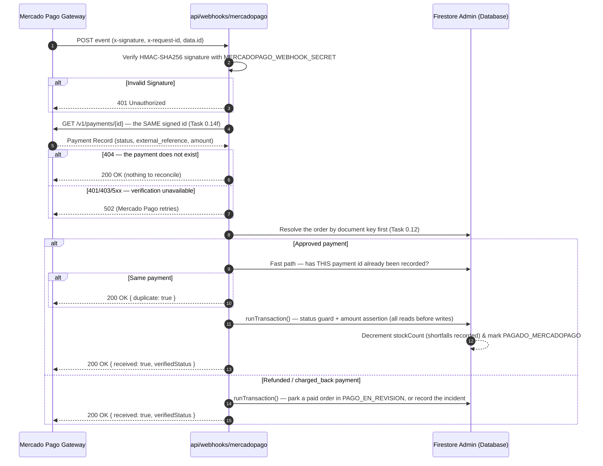

# PRONTO Serverless Backend Guide (`api/`)

As-built technical reference for the serverless backend layer of PRONTO Insumos Odontológicos: Vercel runtime layout, Mercado Pago Chile integration, cryptographic webhook security, Firestore Admin transactions, order tracking, voucher intake, and the transactional email layer.

---

## 🎯 1. Directory Scope & Runtime Architecture

- **Execution Runtime:** Node.js (Vercel Serverless Function Environment).
- **Core Philosophy:** Lean, stateless micro-endpoints. No Express/NestJS, no ORMs, no persistent threads. The one routed entry point (`api/admin/[action].ts`) is a documented exception to the single-purpose rule, forced by the Vercel Hobby function cap — see §1.2.
- **Database Driver:** `firebase-admin` SDK with service-account privileges via `getAdminFirestore()` in [`./_lib/firebaseAdmin.ts`](./_lib/firebaseAdmin.ts) (module singleton; returns `null` when `FIREBASE_PROJECT_ID` / `FIREBASE_CLIENT_EMAIL` / `FIREBASE_PRIVATE_KEY` are missing). When it returns `null`, every endpoint **fails closed with a loud log in a production runtime** (`500`/`503`) and only degrades to a simulated/logged response outside production — see the per-endpoint gates in §2.2/§3 and `api/_lib/simulationPolicy.ts`. The instance is created with `ignoreUndefinedProperties: true` (Task 0.15), mirroring the browser SDK's Task 0.11 setting: a stray `undefined` field value is skipped instead of throwing `Cannot use "undefined" as a Firestore value`.

### 1.1 Serverless Endpoints

| Endpoint | Method | Security / Auth | Business Function |
| :--- | :--- | :--- | :--- |
| [`/api/create-preference`](./create-preference.ts) | `POST` | Public / Server Secrets + abuse throttle | Generates a Mercado Pago Checkout Pro preference. **Rebuilds every line from the Firestore `products` catalog** (the client payload contributes only the `orderId`) and pre-checks quantities against live `stockCount`/`inStock`/`isActive`, rejecting with `400` for unknown products, missing `productId`, invalid catalog prices, paused products or insufficient stock. The applied promo is read from the **order document** (never the request body) and resolved from `src/config/promos.ts`; an order that is not registered in Firestore is refused with `400`. **Lifecycle guards:** only a `mercadopago` order in `PENDIENTE_PAGO_MERCADOPAGO` may get a preference — settled, in-review, transfer, quote and cancelled orders are refused with `409`; the catalog-recomputed payable total (`computeOrderTotal`, the same helper the webhook asserts with) must equal the order's stored `totalAmount` (`409` otherwise); the San Antonio `$60.000` minimum is enforced server-side against the original pre-discount subtotal (`400`); the payer is built from the order's stored customer; every URL is built from `SITE_URL` in a production runtime (fail-closed `500` without it) or a safe-shape Host outside production (`400` otherwise). Repeat creation is bounded by the `create-preference` throttle scope (`429` + `Retry-After`, fail-open). **Fail-closed:** returns `503` when Firestore Admin is unavailable and a real token exists, and `500` in a production runtime when `MERCADOPAGO_ACCESS_TOKEN` is missing/placeholder — every simulated path is gated by [`./_lib/simulationPolicy.ts`](./_lib/simulationPolicy.ts). |
| [`/api/webhooks/mercadopago`](./webhooks/mercadopago.ts) | `POST` (`GET` ping → 200) | HMAC-SHA256 (`x-signature`) | Single authority for payment reconciliation and stock deduction. Verifies the signature, double-checks the payment via `GET /v1/payments/{id}`, then decrements stock inside a Firestore transaction. In a production runtime, a missing/placeholder `MERCADOPAGO_WEBHOOK_SECRET` or `MERCADOPAGO_ACCESS_TOKEN` refuses the delivery with `500` + a loud log (Task 0.10). |
| [`/api/track-order`](./track-order.ts) | `POST` | Dual factor (Order ID + RUT) + abuse throttle | Public order lookup bypassing the client-side Firestore read lock. Compares the order's stored RUT against the normalized request RUT. **Uniform failure (Task 8.8):** "no such order" and "RUT mismatch" return one identical `404` (`respondOrderLookupFailed`) — the old `404`/`401` split was an enumeration oracle — after recording the failure against the per-IP and per-order budgets (`429` + `Retry-After` once locked). Returns a sanitized 5-stage fulfillment payload. **Fail-closed (Task 0.16):** `500` + loud log in a production runtime when Firestore Admin is unavailable — the simulated payload is reachable only through `isSimulatedPaymentAllowed()`. |
| [`/api/upload-voucher`](./upload-voucher.ts) | `POST` | Dual factor (Order ID + RUT) + abuse throttle | Bank-transfer voucher intake, **two-phase** via `req.body.action` (Task 2.9): `sign` authorizes, reserves one durable sign slot and returns a short-lived V4 signed PUT URL; `confirm` re-validates the object's real Storage metadata and persists the order trail. Voucher bytes **never** touch Firestore. Both phases share the Task 8.8 uniform `404` and the per-IP/per-order throttle, the warehouse alert is budgeted per order, and signing is bounded by a lifetime per-order cap (`voucherSignCount`, Task 2.15). |
| [`/api/order-confirmation`](./order-confirmation.ts) | `POST` | Dual factor (Order ID + RUT) + abuse throttle | Sends the "order received" Resend email for client-created orders (bank transfer & WhatsApp quote). Idempotent via the `confirmationEmailSentAt` order flag. The Task 8.8 attempt budgets are also what bound confirmation-email abuse. |

### 1.2 Function Layout & the Vercel Hobby Function Cap

The Vercel **Hobby plan refuses any deployment that adds more than 12 Serverless Functions**. Vercel treats *every* file under `api/` as a function unless its path contains a `_`-prefixed segment, starts with `.`, or ends in `.d.ts`. That cap dictates the backend layout:

| Path | Role | Counted as a function? |
| :--- | :--- | :--- |
| `api/create-preference.ts`, `api/order-confirmation.ts`, `api/track-order.ts`, `api/upload-voucher.ts`, `api/webhooks/mercadopago.ts` | Public endpoints | ✅ Yes |
| `api/admin/[action].ts` | **Single routed entry point** for all 14 administrative actions | ✅ Yes |
| `api/_lib/**` | Shared non-route code (`adminAuth`, `firebaseAdmin`, `firestoreEnv`, `email`, `emailTemplates`, `mercadopagoSignature`, `simulationPolicy`, `voucherStorage`) **and** the 14 admin handler modules under `api/_lib/admin/` | ❌ No — `_`-prefixed segment |

**Current function count: 6** (Hobby cap 12 — 6 slots of headroom).

- **Routing:** `/api/admin/<action>` → `req.query.action === '<action>'`. A plain `Record<string, handler>` lookup table in [`api/admin/[action].ts`](./admin/[action].ts) dispatches to the matching module under `api/_lib/admin/`. Unknown, missing, empty, or non-string actions return `404 { success: false, error: 'Endpoint de administración no encontrado' }` and log a `[Admin Router]` warning. Inherited prototype keys (`constructor`, `__proto__`, …) are rejected by an own-property check.
- **Public URLs are unchanged** — `src/admin/services/adminApi.ts` and `vercel.json` need no edits; the 14 client calls map 1:1 to the dispatch table.
- **No framework.** The dispatcher holds no routing library, no middleware pipeline, and no CORS/auth of its own: each delegated handler keeps its own CORS headers, `OPTIONS` preflight, method gate, `verifyAdminToken` call, and error handling.
- **Rule of thumb:** anything under `api/` that is *not* a public route belongs in `api/_lib/`. Every new `api/*.ts` route consumes one of the 12 Hobby slots.

### 1.3 Runtime Module Resolution (ESM on Vercel)

Vercel does **not** bundle `api/` functions. It transpiles each file in place and ships the directory tree, so **Node's own ESM resolver** runs against the emitted `.js` files at request time. Two consequences are load-bearing — break either one and every affected endpoint returns `FUNCTION_INVOCATION_FAILED` (HTTP 500) while the build still reports success.

1. **Relative imports must carry an explicit `.js` extension.** `package.json` declares `"type": "module"`, and Node's ESM resolver rejects extensionless specifiers. `import { getAdminFirestore } from './_lib/firebaseAdmin'` transpiles fine but throws `ERR_MODULE_NOT_FOUND` at runtime. Always write `'./_lib/firebaseAdmin.js'`.
   - **Exception — type-only imports targeting a directory** (e.g. `import type { Product } from '../../../src/types'`) stay extensionless: they are erased during transpile and appending `.js` would break TypeScript's directory resolution.
   - Vitest/Vite maps the `.js` specifier back to the `.ts` source, so tests and the storefront bundle are unaffected.
   - `src/utils/schemaValidation.ts` is traced into the `api/admin/[action]` bundle, so its own `./rut.js` import obeys the same rule.

2. **`jose` is pinned to v5 via `pnpm.overrides`.** `firebase-admin` → `jwks-rsa@4` is CommonJS and calls `require('jose')` at module load, but `jose@6` is ESM-only, so *merely importing `firebase-admin/auth`* crashes with `ERR_REQUIRE_ESM` under Vercel's Node loader (stock Node ≥ 22.12 tolerates it via `require(esm)`; Vercel's does not). Upstream: [auth0/node-jwks-rsa#507](https://github.com/auth0/node-jwks-rsa/issues/507) and [firebase/firebase-admin-node#3181](https://github.com/firebase/firebase-admin-node/issues/3181). jose v5 is the last dual CJS/ESM major, and `jwks-rsa` only uses `jose.importJWK`/`jose.exportSPKI`, which are API-identical across jose 4/5/6.
   - **Removal condition:** drop the override once `jwks-rsa` publishes the lazy-`jose` fix ([PR #508](https://github.com/auth0/node-jwks-rsa/pull/508)) — i.e. any version above `4.1.0` — and re-verify that `firebase-admin/auth` loads on a preview deploy before promoting.

---

## 💳 2. Payment Gateway Architecture (Mercado Pago Chile)

### 2.1 The Two-Phase Payment Boundary

1. **Client Isolation:** The browser never sees card numbers or secret tokens. Checkout invokes `/api/create-preference` with the canonical `orderId` only (`PRONTO-` + 8 Crockford base32 chars since Task 8.8 — legacy `PRONTO-NNNNNN` ids still resolve); the payer, the line items and the promo are all read from the order document.
2. **Order + Stock Pre-Check:** `/api/create-preference` first loads the **order document** (doc-id lookup, then a `where('orderId','==')` fallback) — the order is the authority for the applied promo code, and an unregistered order is refused with `400`. **Lifecycle guard:** only a `mercadopago` order in `PENDIENTE_PAGO_MERCADOPAGO` proceeds; settled, in-review, transfer-pending, quote and cancelled orders are refused with `409` (charging any of them again would double-bill or start an unreconcilable flow). It then reads the live `products` collection in Firestore Admin. If an item is depleted (`inStock === false`), paused (`isActive === false`) or short on stock (`stockCount < quantity`), it aborts with HTTP `400`. Lines without a resolvable `productId` are rejected rather than skipped (the legacy bypass was closed by Task 0.9).
3. **Total, minimum and origin agreement (Task 2.17):** the payable total recomputed from the current catalog (`computeOrderTotal` — the exact helper the webhook asserts with) must equal the order's stored `totalAmount` (`409` on divergence: the catalog moved after registration, so the charge would never reconcile); the San Antonio `$60.000` minimum is enforced server-side against the **original pre-discount subtotal** — the same figure checkout gates on (`400` below it, Melipilla exempt); the preference payer is built from the order's stored customer; and every URL (`back_urls`, `notification_url`) is built from `SITE_URL` in a production runtime — fail-closed `500` when it is missing/malformed there — or from a safe-shape Host outside production (`localhost`/`127.0.0.1`/`::1`, `*.vercel.app`, private-range IPv4; anything else `400`). A `SITE_URL` leaked outside production is deliberately ignored, so a preview can never repoint its returns and webhooks at the production origin.
4. **Repeat budget:** `create-preference` is a fourth `abuseThrottle` scope — per-IP (30 attempts / 15 failures) and per-order (15 / 10) budgets in the shared 15-minute window; every `4xx` refusal records a failure, exhaustion answers the uniform `429` + `Retry-After`, and a counter outage fails open with a loud log.
5. **Checkout Pro Redirection:** Mercado Pago returns an `init_point` URL and the customer is redirected to the hosted checkout (Webpay Plus, Redcompra, Visa, Mastercard).

### 2.2 Webhook & Cryptographic Verification (`/api/webhooks/mercadopago`)


```mermaid
sequenceDiagram
    autonumber
    participant MP as Mercado Pago Gateway
    participant WH as api/webhooks/mercadopago
    participant FS as Firestore Admin (Database)

    MP->>WH: POST event (x-signature, x-request-id, data.id)
    WH->>WH: Verify HMAC-SHA256 signature with MERCADOPAGO_WEBHOOK_SECRET
    alt Invalid Signature
        WH-->>MP: 401 Unauthorized
    end
    WH->>MP: GET /v1/payments/{id} — the SAME signed id (Task 0.14f)
    MP-->>WH: Payment Record (status, external_reference, amount)
    alt 404 — the payment does not exist
        WH-->>MP: 200 OK (nothing to reconcile)
    else 401/403/5xx — verification unavailable
        WH-->>MP: 502 (Mercado Pago retries)
    end
    WH->>FS: Resolve the order by document key first (Task 0.12)
    alt Approved payment
        WH->>FS: Fast path — has THIS payment id already been recorded?
        alt Same payment
            WH-->>MP: 200 OK { duplicate: true }
        end
        WH->>FS: runTransaction() — status guard + amount assertion (all reads before writes)
        FS-->>FS: Decrement stockCount (shortfalls recorded) & mark PAGADO_MERCADOPAGO
        WH-->>MP: 200 OK { received: true, verifiedStatus }
    else Refunded / charged_back payment
        WH->>FS: runTransaction() — park a paid order in PAGO_EN_REVISION, or record the incident
        WH-->>MP: 200 OK { received: true, verifiedStatus }
    end
```

- **Signature verification** ([`./_lib/mercadopagoSignature.ts`](./_lib/mercadopagoSignature.ts)) builds the official manifest `id:[data.id];request-id:[x-request-id];ts:[ts];`, computes HMAC-SHA256, and compares with `crypto.timingSafeEqual`. **Task 0.14f:** one normalized payment id — the query `data.id` first (the value the official manifest is built from), body fallback — is used for the signature, the MP fetch URL and every comparison, so a tampered body id can no longer redirect the verification to a different payment. Optional `maxAgeSeconds` replay-window support exists but is **deliberately not passed**: Mercado Pago retries reuse the original `ts`, so a replay window would reject legitimate retries.
- **MP verification gate (Task 0.14a):** a `404` (payment does not exist) is the only MP failure acknowledged with `200`; every other failure — revoked/expired token (`401`/`403`), MP `5xx`, malformed id — returns `502` + a loud `console.error` so Mercado Pago retries and a genuinely paid order is reconciled once the cause is fixed. The 5xx is unconditional (not env-gated).
- **Reconciliation guards (Task 0.14b–d)** — evaluated on the fresh order document inside the transaction, before any catalog read:
  - **Payable statuses:** only `PENDIENTE_PAGO_MERCADOPAGO` and `PAGO_EN_REVISION` can be approved.
  - **At-most-once deduction (R1):** an order whose lines were already deducted (`paidAt` or `approvedAt` present — e.g. the refunded payment that parked it in review) is never deducted again; the delivery becomes an incident instead.
  - **Settled orders** (`PAGADO_MERCADOPAGO`, `TRANSFERENCIA_APROBADA`, `PAGADO_TRANSFERENCIA`, `EN_PREPARACION`, `DESPACHADO`, `ENTREGADO`) get a **double-payment incident**: an `order_status_history` event (same status, `metadata.event: 'PAGO_DUPLICADO'`) + warehouse alert — **no status flip** (customer tracking must not regress), no stock movement, and the original `mercadopagoPaymentId` is preserved.
  - **Any other status** (cancelled, pending transfer/quote, unknown) is parked in `PAGO_EN_REVISION` (stamping the payment id) + history event (`metadata.event: 'PAGO_ESTADO_INVALIDO'`) + alert, with **no stock movement**.
  - **Refunds / chargebacks (`refunded` / `charged_back`):** when the stored `mercadopagoPaymentId` matches (or is absent on a legacy document), a `PAGADO_MERCADOPAGO` order is parked in `PAGO_EN_REVISION`, a fulfilled one (`EN_PREPARACION`/`DESPACHADO`/`ENTREGADO`) and one already parked in review get the incident record only — history + `PAGO_REEMBOLSADO` warehouse alert, no status flip, no stock movement. Refunds stay off-platform (`src/types/AGENTS.md` §2.1). `cancelled` is deliberately **not** treated as a reversal: Mercado Pago only cancels pending/in-process payments, so a cancellation never collected money.
  - **Partial refunds (Task 0.18):** a partial refund returns part of an already-collected charge while Mercado Pago keeps the payment `approved` — the returned money accumulates in `transaction_amount_refunded` (default 0) alongside the unchanged `transaction_amount`. The webhook detects it on two surfaces: the duplicate fast path (a notification whose payment id is already recorded on the order) and a settlement whose approval delivery was retried after the refund landed. Each detection stamps three server-written marker fields on the order document (`partialRefundPaymentId`, `partialRefundAmount`, `partialRefundAt`) and writes one `order_status_history` event (`metadata.event: 'PAGO_REEMBOLSO_PARCIAL'`, carrying the payment id + cumulative refunded amount) + a Spanish warehouse alert — **no status flip** (the sale mostly stands), no stock movement, no customer email. The dedup is monotonic: same payment id with a lower-or-equal cumulative amount is necessarily a stale replay (cumulative refunds only grow) and writes nothing; a higher amount records a new incident. A positive non-integer amount is garbage data — logged loudly, treated as absent. No automatic refund pipeline: the owner's Mercado Pago ledger stays the reconciliation authority (full refunds keep flowing through the `refunded`/`charged_back` reversal branch above).
  - **Missing-order reconciliation (Task 0.17):** a verified settlement that can never be joined to an order is no longer acked silently. Two branches — **no usable reference** (`external_reference` and `description` both absent/empty) and **order not found** (reference resolves to no Firestore order) — persist a small incident document in the env-scoped `payment_incidents` collection (`dev_payment_incidents` in development) via `api/_lib/paymentIncidents.ts` and only then acknowledge `200 { received: true, verifiedStatus, note: 'incident', incident: <reason> }`. **Idempotency:** the document id is `mp-<paymentId>` and is written with Firestore `create()`, so a duplicate delivery (MP retry) performs no second write, returns `duplicate: true`, and does not re-alert. **Fail-closed:** a persistence failure returns `500` + a loud log (MP retries) — an unreconcilable settlement is never acked; without Firestore Admin there is no incident store, so the production runtime keeps the transient `500` (retried) and outside production the simulated `200` + warning. The incident document carries `paymentId`, `paymentStatus`, `transactionAmount`, `currencyId`, the raw `externalReference`/`description` (or `null`), `payerEmail`, `reason` (`REFERENCIA_NO_UTILIZABLE` | `PEDIDO_NO_ENCONTRADO`), `status: 'PENDIENTE_RECONCILIACION_MANUAL'`, `resolved: false` and `source: 'MERCADOPAGO_WEBHOOK'`. A one-shot warehouse alert (`sendPaymentIncidentAlert`, `WAREHOUSE_NOTIFICATION_EMAIL`) is fire-safe — an email outage is logged, never thrown, and never blocks the ack; duplicates do not re-alert. Transient conditions are unchanged: MP `5xx`/`401`/`403` → `502`, Firestore Admin down in production → `500`.
- **Stock shortfall (Task 0.14e):** the `Math.max(0, current − qty)` clamp still approves an oversold order (the money is taken) but the shortfall is recorded — `stockShortfall` in each `inventory_audit_logs` metadata, a `stockShortfalls: [{ productId, name, requested, available }]` list in the order-history metadata — and surfaced in the warehouse alert (`buildWarehouseAlertEmail`'s optional `shortfalls` parameter). The same recording exists in `approve-transfer` and `resolve-payment-review`.
- **Fail-closed in production (Task 0.10):** if `MERCADOPAGO_WEBHOOK_SECRET` is missing or the placeholder, the helper still reports `{ valid: true, reason: 'secret_not_configured' }` — it stays a pure crypto utility — but the **webhook refuses the delivery** with `500` + a loud `console.error` whenever `isSimulatedPaymentAllowed()` is false (`VERCEL_ENV === 'production'` without the explicit opt-in). The same gate refuses a missing/placeholder `MERCADOPAGO_ACCESS_TOKEN` *before* the MP API call, and a **verified** payment that cannot be reconciled (Firestore Admin unavailable) is refused the same way — `500` + loud log instead of a silent `200` ack — so a collected payment is never dropped without retries. 5xx is deliberate: Mercado Pago retries, so real deliveries are processed once the credentials/Admin are restored. Outside production (local dev, Vitest, Vercel preview) the permissive behavior is unchanged.
- **Amount assertion (Task 0.9):** inside the transaction the webhook recomputes the payable total from the **current** catalog (`computeOrderTotal` over the consolidated lines, promo from the order's stored `promoCode`) and requires **both** `paymentData.transaction_amount` **and** `order.totalAmount` to equal it exactly (integer CLP) before marking paid. Any mismatch — underpayment, tampered order total, or lines whose `productId`/catalog price cannot be verified — transitions the order to `PAGO_EN_REVISION` (history event + warehouse alert, **no stock deduction**, no customer "paid" email). The review write stamps `mercadopagoPaymentId`, so redeliveries hit the duplicate fast path; a later, correctly-amounted payment re-enters the transaction and approves normally.

### 2.3 Idempotency & Stock Decrement Protection

Two layers defend against duplicate webhook deliveries:

1. **Fast-Path Check (Task 0.14b):** only the **payment id that settled the order** is a duplicate — `order.mercadopagoPaymentId === paymentId` acknowledges `200` with `{ duplicate: true }` without any writes. A *different* approved payment id for the same order is a double charge, and the status guard turns it into an incident (history + alert) instead of a silent ack.
2. **Concurrent Transaction Guard:** inside `adminDb.runTransaction()` the order document is re-read; if a concurrent invocation recorded the same payment id in the window, the transaction returns early without touching stock. Emails are gated on the `stockDeducted` flag set inside the transaction, so duplicate approvals never re-notify.

**At-least-once semantics of the incident branches (R3, accepted):** the settled-order double-payment incident and the fulfilled-order reversal incident deliberately do **not** stamp the order — the original payment id must be preserved — so a redelivery of the *same* second-payment or reversal notification writes another history event and another warehouse alert (never a stock movement; MP stops retrying after the `200` ack). The amount-mismatch and invalid-status review branches, by contrast, do stamp `mercadopagoPaymentId`, so their redeliveries hit the fast path.

---

## 📦 3. Order Tracking & Voucher Services

### 3.1 Order Tracking (`/api/track-order`)

- Under [`../firestore.rules`](../firestore.rules), client reads on `/orders/{id}` are denied (`allow read: if false;`), so tracking goes through this serverless proxy:
  - Accepts `{ orderId, rut }`; normalizes the RUT by stripping non `[0-9kK]` characters and upper-casing (local `normalizeRut`, **not** a Modulo-11 check — the official check-digit validation runs client-side via `src/utils/rut.ts`; the server only enforces `length >= 8`).
  - Resolves the order by **document key first** (`resolveOrderByCanonicalId`, Task 0.12) with the `where('orderId','==')` field query as the legacy fallback, then compares against `customer.rut || billing.rut`. **Uniform failure (Task 8.8):** a missing order and a RUT mismatch both return the identical `404 { error: 'No encontramos un pedido con ese código y RUT. …' }` from `respondOrderLookupFailed` — the response never echoes the probed id nor hints at which factor failed.
  - Throttled **before** the order read (Task 8.8): the IP budget is consumed first, then the order budget; a locked key answers `429` + `Retry-After` and never touches the `orders` collection. A failed lookup records the failure against both budgets.
  - Returns a sanitized payload (items, customer contact, billing, voucher, 5-stage `fulfillment` block) — no internal payment tokens. `billing.taxBreakdown` in the payload is **derived** via `calculateTaxBreakdown(totalAmount)` rather than echoing the stored map (Task 1.7) — the persisted breakdown is client-writable and must never be rendered back as fiscal truth.
- ⚠️ Stale copy to fix eventually: the `ENTREGADO` description still says "…o retirado en Av. Ortúzar 750" (pickup was removed) and the non-Melipilla courier fallback is `'Starken / Chilexpress Regional'` (RM delivery was removed).
- **Fail-closed (Task 0.16):** when `getAdminFirestore()` is `null` the endpoint returns `500` + a loud `console.error` in a production runtime instead of fabricating tracking data — a lost `FIREBASE_*` credential must never show a customer a fake order. The simulated payload (which fabricates a plausible order) is reachable only when `isSimulatedPaymentAllowed()` is true — outside production, or with the explicit `ALLOW_SIMULATED_PAYMENTS='true'` opt-in — the same shared gate as 0.10 and 2.9.

### 3.2 Bank Transfer Voucher Intake (`/api/upload-voucher`) — Task 2.9

**Voucher bytes never live in Firestore.** The order document stores only `voucherUrl` (a Firebase download-token URL), `voucherStoragePath`, `voucherFileName`, `voucherContentType`, `voucherSizeBytes` and `voucherUploadedAt`; the object itself lives in the private Cloud Storage bucket, uploaded **browser → bucket** so neither the 4.5 MB Vercel body cap nor the 1 MiB Firestore document cap applies.

**Two-phase, action-dispatched contract** (one function slot, two phases — `req.body.action`):

| Phase | Request | Server decisions |
| :--- | :--- | :--- |
| `sign` | `{ action:'sign', orderId, rut, fileName, contentType, sizeBytes }` | throttle (Task 8.8) → presence → RUT normalize → order lookup (doc-id first, then `where('orderId','==')`) → RUT equality (**uniform `404`**, Task 8.8) → **lifecycle guard** (`409`) → MIME allowlist (`400`) → declared size (`400`) → **durable sign-slot reservation** (`voucherSignCount`, Task 2.15: transactional, reserved before minting, `429` at the cap, `500` fail-closed if the counter cannot be written) → `getSignedUrl({ version:'v4', action:'write', expires: +10 min, contentType, extensionHeaders: { 'x-goog-content-length-range': '0,5242880' } })`. Response: `{ uploadUrl, storagePath, contentType, maxBytes, expiresAt }`. The **only** Firestore write is the sign-slot reservation — no voucher bytes, metadata or status change. |
| `confirm` | `{ action:'confirm', orderId, rut, storagePath, fileName }` | same throttle + auth + guard → `storagePath` must be a direct child of `vouchers/{orders\|dev_orders}/{orderId}/` (`400`) → `getMetadata()` (`400` when absent) → **authoritative** size/type re-validation, deleting the object on violation → `runTransaction()` re-read + re-assert → order update (incl. the Task 8.8 warehouse-alert reservation) + `order_status_history` → budgeted warehouse alert. Response: `{ voucherUrl, voucherFileName, voucherUploadedAt, status:'TRANSFERENCIA_COMPROBANTE_SUBIDO' }` |

- **Size is enforced by the storage layer, not just the handler.** `x-goog-content-length-range` is signed into the URL and echoed by the browser, so Storage rejects any oversized PUT even if the client never calls `confirm`; `confirm` then re-verifies the object's real `size`/`contentType` metadata (`api/_lib/voucherStorage.ts`).
- **Lifecycle guard:** only `PENDIENTE_TRANSFERENCIA` and `TRANSFERENCIA_COMPROBANTE_SUBIDO` may attach a voucher — a paid, approved, dispatched, delivered or cancelled order is refused with `409`. Re-uploading while the transfer is still being verified replaces the voucher (the replaced object is deleted **after** the commit, best-effort, so a failed write can never destroy the existing one).
- **The guard holds at write time:** the confirm transaction re-reads the order and re-asserts the status, so an admin approval landing inside the upload window cannot be regressed (a changed status ⇒ object deleted + `409`).
- **Idempotency:** re-confirming the object already recorded returns `200 { duplicate: true }` with **no** side effects (no token rotation, no second history event, no second warehouse alert).
- **Budgeted warehouse alert (Task 8.8):** one "voucher received" email per 5-minute cooldown, capped at 5 per order (`voucherAlertSentAt` / `voucherAlertCount` on the order document). The budget is decided **inside** the confirm transaction and committed with the voucher, so two concurrent confirms of different objects serialize on the order document (the SDK retries the losing transaction, which then sees the fresh stamp and skips) — a stamp written only after the send let both pass. A failed send releases the reservation (best-effort, logged) so an email outage does not consume the cooldown or a cap slot.
- **Fail-closed in production** (same gate as Task 0.10, `isSimulatedPaymentAllowed()`): missing Admin credentials/bucket ⇒ `500` + loud log in a production runtime; outside production the response is explicitly `{ simulated: true }` and the client never mistakes it for a stored voucher. The outer catch logs the raw cause and returns a customer-safe message — this endpoint is unauthenticated.
- **`dataUrl` is rejected** with a dedicated `400`, so a stale cached bundle logs a precise cause instead of a generic failure.
- **Legacy documents** (pre-2.9) may still carry a Base64 `data:` URL: `/api/track-order` omits those from its payload and the backoffice converts them to a Blob URL on click (Chrome blocks top-frame `data:` navigation). Since **Task 0.13** that conversion is gated by [`src/utils/voucherUrl.ts`](../src/utils/voucherUrl.ts): only an allowlisted declared MIME is opened, and the bytes are re-wrapped with the forced type — a `blob:` URL inherits the admin origin, so an HTML-typed Blob would otherwise run as script there.
- **Orphans are bounded and reclaimable (Task 2.15):** an abandoned `sign → confirm` window can leave an object of ≤5 MiB under an order-scoped path (the signature enforces the cap). Two bounds apply. **Durable per-order cap:** every `sign` reserves one slot in `voucherSignCount` on the order document inside a transaction (so concurrent signs serialize instead of racing past the cap); at `VOUCHER_MAX_SIGNS_PER_ORDER` (10) the endpoint refuses with `429` and a WhatsApp fallback, and a counter-write failure fails closed (`500`) rather than minting an unrecorded URL. Unlike the 15-minute attempt throttle, this counter is **lifetime**-scoped — it survives every window. **Housekeeping sweep:** `/api/admin/voucher-housekeeping` (below) deletes the objects an order does not reference.
- **Bucket plumbing:** `FIREBASE_STORAGE_BUCKET` (or the `${FIREBASE_PROJECT_ID}.firebasestorage.app` default) names the bucket; `.env.example` placeholder values are treated as *unconfigured* (⇒ the production `500`, never a signed URL for a non-existent bucket). `storage.rules` is deny-all — the bucket is reached exclusively through signed URLs and download tokens — and the browser PUT needs the bucket CORS config (`scripts/storage-cors.json`, applied with `pnpm run storage:cors -- --apply` — or `gcloud storage buckets update gs://<bucket> --cors-file=…` when the Cloud SDK is installed; the script is a dry run by default and validates the required PUT method + headers before writing). Note GCS builds `Access-Control-Allow-Headers` from that file's `responseHeader` list, which is why `x-goog-content-length-range` must stay in it.
- **`voucherUrl` is a permanent capability URL (Task 2.15, recorded):** it carries a Firebase download token that never expires unless the token is rotated. Acceptable today — it is only ever exposed to the RUT-authenticated customer and to admins — but if vouchers ever need revocation, rotate the object's `firebaseStorageDownloadTokens` metadata (or delete the object); there is no built-in expiry.

### 3.3 Voucher Object Housekeeping (`/api/admin/voucher-housekeeping`) — Task 2.15

A `POST`-only admin action on the existing `api/admin/[action]` dispatcher (no new function slot) that reclaims the abandoned uploads the sign cap bounds but cannot delete. Body: `{ orderId?, dryRun?, limit? }`.

- **What it deletes:** for each scanned order, it lists `vouchers/{orders|dev_orders}/{orderId}/` and deletes every object that is **not** the order's `voucherStoragePath` and whose `timeCreated` is older than `VOUCHER_ORPHAN_GRACE_MS` (60 min). The signed PUT URL lives 10 minutes, so the grace window can never race an in-flight upload. An object whose age cannot be read is skipped (never deleted blindly), and `deleteVoucherObject` re-asserts the `vouchers/` prefix on every removal.
- **Scope:** `orderId` sweeps a single order; otherwise the orders collection is read (the same full read the admin order list already performs), sorted newest-first and capped at `limit` (default 100, max 500) — the admin UI exposes that limit so an operator can widen the scan. Listing is done **per order**, so an order that was not scanned can never be mistaken for an orphan. Orders are never deleted in this app (`firestore.rules` denies client deletes; no handler deletes them), so every voucher folder belongs to a live order.
- **`dryRun: true`** reports the same counts without touching Storage. Response: `{ success, dryRun, scannedOrders, scannedObjects, deletedCount, keptReferenced, skippedRecent, deletedSample[≤20], failures[≤50] }`. A listing or delete failure is recorded in `failures` and never aborts the run.
- **UI:** the `#settings` "Mantenimiento de Comprobantes" card (`src/admin/components/AdminSettings.tsx`) offers **Revisar huérfanos** (dry run) and **Eliminar huérfanos**, plus the per-run order limit.

### 3.4 Abuse Throttling & the Uniform Lookup-Failure Contract (Task 8.8)

The three dual-factor endpoints are unauthenticated, so before Task 8.8 they leaked *whether an order id exists* (`404` for an unknown id, `401` for a wrong RUT — an enumeration oracle) and nothing bounded repeated attempts. Both defects are closed in [`./_lib/abuseThrottle.ts`](./_lib/abuseThrottle.ts) and [`./_lib/orderLookup.ts`](./_lib/orderLookup.ts):

**One identical response for both failure modes.** `respondOrderLookupFailed(res)` — `404` + `'No encontramos un pedido con ese código y RUT. Revisa los datos o escríbenos por WhatsApp.'` — is returned for a missing order *and* for a RUT mismatch, by all three endpoints, and never echoes the probed id. (`create-preference` is **not** part of this uniform-404 contract — it returns no customer data and requires a pre-existing order — but since Task 2.17 it **is** throttled on its own scope, because unbounded preference creation against the same order id was its own abuse surface.)

**Per-IP and per-orderId budgets, 15-minute fixed window, Firestore counters.**

| Scope | `ip.maxAttempts` | `ip.maxFailures` | `order.maxAttempts` | `order.maxFailures` |
| :--- | :-: | :-: | :-: | :-: |
| `track-order` | 60 | 12 | 60 | 25 |
| `upload-voucher` | 40 | 12 | 30 | 25 |
| `order-confirmation` | 40 | 12 | 20 | 10 |

- `maxAttempts` = requests allowed per key per window; the request that would exceed it is refused with `429 { error }` + a `Retry-After` header. `maxFailures` = failed lookups tolerated per key per window; the failure that reaches it locks the key for `THROTTLE_LOCKOUT_MS` (15 min). A success never resets a counter — only the window does.
- The IP budget is consumed first (cheapest rejection); a locked key never reaches the `orders` collection read. A failed lookup records the failure against **both** budgets.
- Counter documents live in `getCollectionName('abuse_counters')` (`abuse_counters` / `dev_abuse_counters`), one per `{scope}_{kind}_{sha256(key)}`. **Raw IPs are never written to Firestore** — the hash is a *pseudonym* (deterministic over the IPv4 space, so not anonymization); client reads are denied by the default-deny rules.
- Doc shape: `{ scope, kind, attempts, failures, windowStartedAt, lockedUntil, updatedAt, expiresAt: Timestamp }`. `expiresAt` exists for the Firestore **TTL policy** — a **deploy prerequisite** (roadmap human item, H1/H2), because one document is written per distinct `{scope, kind, hashed key}` and the *order* keys are attacker-chosen. Without the policy the endpoint behaviour is unchanged but the collection grows unbounded; with it, documents self-delete ~24 h after their last write.
- **Fail-open, loudly:** a Firestore failure inside a counter call logs `[abuseThrottle] …` and allows the request. A throttle outage must never take order tracking down — the lookup still requires a matching id **and** RUT. The counters are best-effort: two concurrent failures can under-count by one.
- **Residual (deliberate) — the lockout is an availability tradeoff:** a per-order lock refuses *every* caller of that id for 15 minutes, so an attacker who knows a semi-public order id (it appears in confirmation emails, WhatsApp threads and admin lists) can keep a customer's own tracking / voucher upload locked by re-arming the failure budget (≈1 probe every 36 s on `track-order`; a single source is still bounded by its IP budget). The alternative — not locking the order key — removes the per-order bound entirely, and the customer path stays served by WhatsApp. Shortening the order-key lockout is a one-line policy change if this ever bites in practice.
- **Residual (deliberate) — shared-IP collateral:** the IP budget is shared by every caller behind the same public address. A clinic office, a CGNAT/mobile pool or a shared proxy that reaches 12 failed lookups (or 40–60 attempts) locks **all** of them out of the three endpoints for 15 minutes — note the dual-factor lookup wants the *purchaser's* RUT, while clinics often hold a company RUT. WhatsApp remains the fallback; raising `ip.maxFailures` or shortening the IP lockout is a one-line policy change.
- **Residual (deliberate) — distributed probing:** a distributed attacker with many source IPs can still probe *distinct* unknown ids (a per-order counter cannot see them). The 40-bit id space makes that infeasible; the remaining public-`orders`-create cost exposure is tracked as **Task 8.16** (Firebase App Check).

---

## ✉️ 4. Transactional Email Layer (Resend)

PRONTO sends transactional email via **Resend** — a single `fetch` POST to `https://api.resend.com/emails`, zero SDK dependency — with verified sender domain `prontoinsumos.com` (DKIM/SPF/DMARC at the DNS provider).

### 4.1 The Fail-Safe Contract

`sendEmail()` in [`./_lib/email.ts`](./_lib/email.ts) **never throws**. A missing `RESEND_API_KEY`, a Resend rejection, or a network failure resolves to `{ sent: false, reason }` and only logs a `console.warn`. An email outage can never break payment reconciliation, voucher intake, or admin approvals. Outbound calls carry an 8-second `AbortSignal.timeout` so a hung provider cannot stall a webhook.

### 4.2 Environment Variables (`process.env` ONLY — never `import.meta.env`)

- `RESEND_API_KEY` — Resend API secret.
- `EMAIL_FROM` — Verified-domain sender (default `PRONTO Insumos <pedidos@prontoinsumos.com>`).
- `WAREHOUSE_NOTIFICATION_EMAIL` — Melipilla dispatch inbox for internal alerts.
- `SITE_URL` (optional) — Base URL for order-tracking deep links (default `https://prontoinsumos.com`). ⚠️ Not currently listed in `.env.example`.
- `VITE_BANK_*` — Bank details in emails reuse the same public `VITE_BANK_*` variables as the storefront (non-secret, single source of truth, read here via `process.env`).
- `FIREBASE_STORAGE_BUCKET` — voucher bucket name for Task 2.9 (non-secret; optional, defaults to `${FIREBASE_PROJECT_ID}.firebasestorage.app`). Requires the **Blaze** plan; `.env.example` placeholders are treated as unconfigured.

### 4.3 Trigger Points & Templates ([`./_lib/emailTemplates.ts`](./_lib/emailTemplates.ts))

All templates return `{ subject, html, text }`, escape every user-supplied value (`escapeHtml`), and format money as integer CLP (`$189.990`) with the 19% IVA/neto breakdown.

**The neto/IVA/total breakdown is server-authoritative (Task 1.7).** `OrderEmailData` deliberately carries no `billing.taxBreakdown` — the stored breakdown is a client-writable artifact — so `totalsBlock` always derives the figures via `calculateTaxBreakdown(data.totalAmount)`, the amount the MP webhook asserts and `approve-transfer` re-verifies. A forged stored breakdown can never reach a rendered email or the `track-order` payload (which likewise derives rather than echoes). One nuance: the `/api/order-confirmation` "order received" email (transfer & WhatsApp-quote orders) goes out **before** any server-side catalog/payment verification, so its totals block is labelled `Total referencial (IVA incluido)` — provisional until payment validation — while post-verification sends (payment confirmed, transfer approved, review resolved, warehouse alerts) keep the authoritative `Total (IVA incluido)`.

| Event | Endpoint | Customer Email | Warehouse Alert |
| :--- | :--- | :--- | :--- |
| Order registered (transfer / WhatsApp quote) | `/api/order-confirmation` | `buildOrderConfirmationEmail` (incl. bank details + voucher upload link) | — |
| Payment approved (Mercado Pago) | `/api/webhooks/mercadopago` | `buildPaymentConfirmedEmail` | `buildWarehouseAlertEmail('PAGADO_MERCADOPAGO')` |
| Voucher uploaded | `/api/upload-voucher` | — | `buildWarehouseAlertEmail('TRANSFERENCIA_COMPROBANTE_SUBIDO')` |
| Transfer approved by admin | `/api/admin/approve-transfer` | `buildTransferApprovedEmail` | `buildWarehouseAlertEmail('TRANSFERENCIA_APROBADA')` |
| Payment review flagged (amount mismatch) | `/api/webhooks/mercadopago` | — (never tells the customer the payment succeeded) | `buildWarehouseAlertEmail('PAGO_EN_REVISION')` |
| Payment review resolved | `/api/admin/resolve-payment-review` | `buildPaymentReviewResolvedEmail` (**approve** only) | `buildWarehouseAlertEmail('PAGADO_MERCADOPAGO')` / `buildWarehouseAlertEmail('CANCELADO')` |
| WhatsApp quote converted into a verified sale | `/api/admin/resolve-quote` | `buildTransferApprovedEmail` | `buildWarehouseAlertEmail('PAGADO_TRANSFERENCIA')` (shortfalls appended when the deduction oversold) |
| WhatsApp quote declined / timed out | `/api/admin/resolve-quote` | — (the customer is already in the WhatsApp conversation) | `buildWarehouseAlertEmail('CANCELADO')` |
| Double payment on a settled order (Task 0.14b) | `/api/webhooks/mercadopago` | — | `buildWarehouseAlertEmail('PAGO_DUPLICADO')` |
| Payment approved for a non-payable order (Task 0.14c) | `/api/webhooks/mercadopago` | — | `buildWarehouseAlertEmail('PAGO_ESTADO_INVALIDO')` |
| Refund / chargeback (Task 0.14d) | `/api/webhooks/mercadopago` | — | `buildWarehouseAlertEmail('PAGO_REEMBOLSADO')` |

`buildWarehouseAlertEmail(data, event, shortfalls?)` takes an optional `StockShortfall[]` (Task 0.14e) that appends a `Stock insuficiente: faltan N× «producto» …` sentence to the action hint — used by the webhook approval path, `approve-transfer` and `resolve-payment-review`.

⚠️ The shared `layout()` header still reads `Depósito dental — Melipilla & Región Metropolitana` — stale copy (coverage is Melipilla y San Antonio only).

### 4.4 Idempotency & Ordering Guarantees

- **Order confirmation:** `/api/order-confirmation` skips orders already stamped with `confirmationEmailSentAt`; the stamp is written only after a successful send, and a stamp failure degrades to a warning (never a 500 for a sent email). The endpoint is also throttled per IP and per order (Task 8.8), which is what bounds confirmation-email abuse — one email per order, a bounded number of orders per source per window.
- **Warehouse voucher alert (Task 8.8):** budgeted per order — 5-minute cooldown + 5 alerts max — with the reservation written inside the confirm transaction and released (best-effort) when the send fails. Re-uploads still alert after the cooldown; a scripted loop cannot exhaust the Resend quota.
- **Webhook:** emails fire only when `stockDeducted` was set inside the transaction — duplicate deliveries and concurrency aborts never re-notify.
- **Admin approval:** emails fire only when the transaction result is non-duplicate.
- **Mercado Pago orders** never hit `/api/order-confirmation` — payment confirmation arrives via the verified webhook instead.

---

## 🔒 5. Serverless Security & Runtime Isolation Rules

> [!CAUTION]
> **STRICT NODE.JS ISOLATION:** Code in `api/` executes in Node.js on Vercel servers, NEVER in the customer's browser.

1. **Environment Variables (`process.env` ONLY):**
   - ❌ **NEVER** reference `import.meta.env` in `api/` — it is undefined in Node.js.
   - ✅ Use `process.env.VARIABLE_NAME`.
   - ✅ Secrets (`MERCADOPAGO_ACCESS_TOKEN`, `MERCADOPAGO_WEBHOOK_SECRET`, `FIREBASE_PRIVATE_KEY`, `RESEND_API_KEY`) belong strictly in `process.env`.
2. **Database Access (`firebase-admin` ONLY):**
   - ❌ **NEVER** import client Firebase instances from `src/services/firebase.ts`.
   - ✅ Use `getAdminFirestore()` from [`./_lib/firebaseAdmin.ts`](./_lib/firebaseAdmin.ts).
3. **CORS — as built, not uniform:**
   - `order-confirmation` sets `Access-Control-Allow-Origin: *` plus method/header allow-lists. The **14 admin handlers** emit **no** `Access-Control-Allow-Origin` — the console calls them same-origin, and a wildcard would only let a foreign site's browser attempt an authenticated admin call with the operator's token (see §7; pinned by `src/tests/api/admin/adminHttp.test.ts`).
   - `create-preference`, `track-order`, `upload-voucher` and `webhooks/mercadopago` set **no CORS headers** — they work because the storefront is served from the same Vercel origin (and the webhook is server-to-server). If a future caller is cross-origin, those endpoints will need the headers added explicitly.
   - Every endpoint short-circuits `OPTIONS` with `200`.
4. **Simulated payment paths are environment-gated ([`./_lib/simulationPolicy.ts`](./_lib/simulationPolicy.ts), Task 0.10):**
   - `isSimulatedPaymentAllowed(env = process.env)` returns `true` only outside a production runtime (`VERCEL_ENV !== 'production'`) or with the explicit `ALLOW_SIMULATED_PAYMENTS=true` opt-in — strict string compare, no truthy coercion (`.env.example` ships `false`; leave it unset in Vercel Production).
   - `hasRealMercadoPagoToken(env = process.env)` is the single definition of a *real* access token (set, non-blank after trim, not the `.env.example` placeholder) — both endpoints import it, so the check cannot drift (external-review finding F1).
   - In production: `create-preference` refuses to fabricate a simulated checkout (`500` + `console.error`) when the access token is missing/placeholder, and the webhook refuses unverifiable deliveries (missing webhook secret), placeholder access tokens, and verified payments it cannot reconcile because Firestore Admin is unavailable (`500` + `console.error`, so Mercado Pago retries).
   - The policy helper is deliberately **not** keyed on `getFirestoreEnv()`: `FIRESTORE_ENV` governs collection namespacing and can be explicitly overridden — coupling would let a Firestore-scoping mistake reopen the simulation door.

---

## 🛡️ 6. Administrative Endpoints (`/api/admin/`)

The backoffice portal calls 12 actions under `/api/admin/<action>`, dispatched by [`api/admin/[action].ts`](./admin/[action].ts) to the handler modules under [`api/_lib/admin/`](./_lib/admin). Behaviour is identical to a dedicated file per endpoint.

**Shared headers & CORS ([`./_lib/admin/adminHttp.ts`](./_lib/admin/adminHttp.ts)):** every handler opens with `setAdminResponseHeaders(res)` (plus `isAdminPreflight(req)` for the `OPTIONS` ack). It emits **no `Access-Control-Allow-Origin`** — the console calls these endpoints same-origin, so a wildcard would only let a foreign site's browser attempt an authenticated admin call with the operator's token. `src/tests/api/admin/adminHttp.test.ts` fails if any handler reintroduces the header.

### 6.1 Admin Authentication ([`./_lib/adminAuth.ts`](./_lib/adminAuth.ts))

- Extracts `Authorization: Bearer <ID_TOKEN>`; missing/malformed → `'Encabezado de autorización ausente o malformado'`.
- Calls `auth.verifyIdToken(idToken, true)` via `firebase-admin/auth` on the singleton app — **`checkRevoked = true`**, so a revoked staff session (deprovisioning, password reset, forced sign-out) stops working immediately instead of being honoured until the token expires. No clock tolerance is configured. This adds a user-record fetch per call; a transient Firebase outage fails closed with `403` (retryable).
- Asserts `decodedToken.admin === true`; otherwise rejects `'Acceso denegado: permisos administrativos requeridos'`.
- Handlers translate any `authenticated: false` result into HTTP `403 { success: false, error }`.

### 6.2 Admin Actions Reference

| Action | Method | Role & Transaction Behaviour |
| :--- | :--- | :--- |
| `dashboard-stats` ([`_lib/admin/dashboard-stats.ts`](./_lib/admin/dashboard-stats.ts)) | `GET` | Full-collection scan aggregating daily sales CLP localized to `America/Santiago`, pending work (`PENDIENTE_*` + `TRANSFERENCIA_COMPROBANTE_SUBIDO` + `PAGO_EN_REVISION` — unresolved money must never leave the pending count), low-stock published items (`stockCount <= 5`), and monthly order count. |
| `orders` ([`_lib/admin/orders.ts`](./_lib/admin/orders.ts)) | `GET` | `?orderId=` does the dual doc-id/`orderId`-field lookup (§8.1) and returns the **full** document, `voucherUrl` included. Otherwise fetches the **entire** collection, sorts/filters in memory (`status`, `search` on id/name/razón social/RUT), and slices to `limit` (default 50). **Task 2.15 — the list projection drops `voucherUrl`** and adds `hasVoucher: Boolean(voucherUrl \|\| voucherStoragePath)`: a legacy pre-2.9 document holds the whole voucher as a Base64 `data:` URL (up to ~1 MiB), and a handful of them exceeds Vercel's 4.5 MB response cap, breaking the whole list. The backoffice fetches the detail on select. ⚠️ The client sends a `cursor` param that is **read and ignored** — no real pagination. |
| `order-history` ([`_lib/admin/order-history.ts`](./_lib/admin/order-history.ts)) | `GET` | Queries `order_status_history` where `orderId == <param>` (history docs are keyed by the canonical code), sorts by `timestamp` ascending. |
| `products` ([`_lib/admin/products.ts`](./_lib/admin/products.ts)) | `GET` | Full catalog with `stockCount`, `inStock`, `isActive`, pricing; optional `?category=` filter. |
| `approve-transfer` ([`_lib/admin/approve-transfer.ts`](./_lib/admin/approve-transfer.ts)) | `POST` | Atomic `runTransaction` with source-state guards: only `PENDIENTE_TRANSFERENCIA` / `TRANSFERENCIA_COMPROBANTE_SUBIDO` may approve — `TRANSFERENCIA_APROBADA` returns `duplicate: true` (no second deduction) and every other status (quote, dispatched, delivered, cancelled, MP-paid, review) or an order already carrying `approvedAt`/`paidAt` returns `409` with **no** stock movement. Before any write it **rebuilds the payable total from the current catalog** (`resolvePromoPercent(order.promoCode)` + `computeDiscountedUnitPrice`) and requires it to equal `order.totalAmount`; a mismatch, an invalid catalog price, a **missing product** or an unidentifiable line fails closed with `409` (never a partial deduction). Body `{ orderId, reconciliationReference }` — the reference is **required** (`400` otherwise), trimmed, capped at 120 chars, and recorded in the history metadata (`reconciliationReference`, `reconciledAt`) as the operator's Banco de Chile attestation. Oversell shortfalls are recorded; customer + warehouse emails fire on non-duplicate. |
| `resolve-payment-review` ([`_lib/admin/resolve-payment-review.ts`](./_lib/admin/resolve-payment-review.ts)) | `POST` | Closes a `PAGO_EN_REVISION` order (the webhook's flagged state). Body `{ orderId, resolution: 'approve'\|'cancel', notes? }`. `approve` **requires** a non-empty `notes` (`400` otherwise) and settles it as `PAGADO_MERCADOPAGO`, **deducting stock** in the same transaction (mirrors `approve-transfer`); `cancel` sets `CANCELADO` with **no** stock movement (refunds stay off-platform) and keeps `notes` optional. Any other starting status → `409`; re-resolving the target status → `duplicate: true` with no second deduction; approving an order with a settlement marker → `409`. Line quantities go through the shared `normalizeQuantity` (a malformed quantity can never write a `NaN`/fractional `stockCount`). Fires the customer "pago verificado" + warehouse emails on approve, warehouse-only on cancel. |
| `resolve-quote` ([`_lib/admin/resolve-quote.ts`](./_lib/admin/resolve-quote.ts)) | `POST` | Closes a WhatsApp quote order (`COTIZACION_SOLICITADA_WHATSAPP` — the lead checkout creates for the WhatsApp payment method; a quote is never paid in-system). Body `{ orderId, resolution: 'convert'\|'decline', reconciliationReference?, notes? }`. `convert` **requires** a non-empty `reconciliationReference` (`400` otherwise — the operator's Banco de Chile cartola / receipt attestation, never bank credentials; trimmed, ≤120 chars) and settles the lead as a verified sale: one transaction re-derives the payable total from the **current catalog** (promo-aware, `resolvePromoPercent(order.promoCode)` + `computeDiscountedUnitPrice`) and requires it to equal `order.totalAmount` (`409` on divergence — the operator declines and registers the negotiated sale as a new order instead), fails closed on a missing product / invalid catalog price / unidentifiable line, deducts stock **at most once** (settlement-marker guard on `approvedAt`/`paidAt`; shortfalls recorded, never clamped away) and stamps `PAGADO_TRANSFERENCIA` + `approvedAt`/`approvedBy` + `quoteResolvedAt`/`quoteResolution: 'CONVERTIDA'`/`quoteResolvedBy`. The quote document itself becomes the sale record, so the original quote id is preserved. `decline` closes it as `CANCELADO` with **no** product reads and no stock movement; the optional `notes` (≤500 chars) becomes the history reason (timeout/declined/negotiated-elsewhere, optionally naming a replacement order). Only a pending quote may be resolved (`409` otherwise); re-resolving the target status → `duplicate: true`; cross-resolution (decline a converted sale, convert a declined quote) → `409`. Never writes a Mercado Pago payment id — the webhook stays the only automatic settlement authority, and `approve-transfer` keeps refusing quote statuses. Emails: customer "transferencia aprobada" + warehouse alert (with shortfalls) on convert; warehouse-only on decline. |
| `dispatch-order` ([`_lib/admin/dispatch-order.ts`](./_lib/admin/dispatch-order.ts)) | `POST` | Atomic `runTransaction`: sets `DESPACHADO`, writes the `dispatch` block (carrier, **`reference`**, **`referenceSource`**, `dispatchedAt`, `dispatchedBy`) and the audit event in one commit, and mints the internal dispatch reference (§8.6) when the order has none. **Source-state guard:** only `PAGADO_MERCADOPAGO` / `TRANSFERENCIA_APROBADA` / `PAGADO_TRANSFERENCIA` / `EN_PREPARACION` / `DESPACHADO` (re-dispatch to add/correct a guía) may ship — a pending, cancelled, quote or review-parked order returns `409`. **The tracking code is genuinely optional (Task 0.15):** empty / whitespace-only values are treated as absent and the `trackingNumber` / `dispatch.trackingCode` keys are **omitted** from the update — never written as `undefined` (the Admin SDK rejects that, which used to `500` every code-less dispatch, i.e. the default Melipilla local fleet). A numeric code is coerced to a trimmed string, and re-dispatching without a code keeps the previously stored one (omitted key = untouched field; the `dispatch` block's `trackingCode` is carried forward explicitly, because `update()` replaces the whole map). |
| `mark-delivered` ([`_lib/admin/mark-delivered.ts`](./_lib/admin/mark-delivered.ts)) | `POST` | Atomic `runTransaction`: the status decision and the write happen together, so two concurrent confirmations cannot both observe `DESPACHADO` and append duplicate history events. Only `DESPACHADO` → `ENTREGADO` (sets `deliveredAt` + history); `ENTREGADO` → `duplicate: true`; any other status → `409` with no writes. |
| `update-stock` ([`_lib/admin/update-stock.ts`](./_lib/admin/update-stock.ts)) | `POST` | `newStock` must be a whole-unit integer `0..1_000_000` (`400` for NaN/Infinity/fractional/negative/out-of-range — no silent `Math.round`); the bound comes from the shared `_lib/admin/adminLimits.ts`, so `create-product` cannot accept a value this handler would refuse. The read-modify-write runs in `runTransaction` so a concurrent webhook deduction cannot be overwritten; recomputes `inStock = newStock > 0 && isActive !== false`, records `lastStockAdjustment` + audit log (`reason` free-form, defaults `correccion`). |
| `update-product` ([`_lib/admin/update-product.ts`](./_lib/admin/update-product.ts)) | `POST` | Updates `name`, `price`, `description`, `category` (normalized to trimmed uppercase), `prescriptionRequired`, `tag` — matching `ProductUpdatePayload` exactly. A supplied `price` must be an integer CLP `1..999_999_999` (`400` otherwise — never a silent `Math.round`; the bound is the shared `_lib/admin/adminLimits.ts` one); `priceNeto = Math.round(price / 1.19)`. A price change is audited (`previousPrice`/`newPrice` in the audit metadata + notes). ⚠️ Manufacturer, specs, images and package contents are **not** updatable end-to-end (neither `ProductUpdatePayload` nor this handler carries them). |
| `create-product` ([`_lib/admin/create-product.ts`](./_lib/admin/create-product.ts)) | `POST` | Builds a full `Product` (`pronto-<ts36>-<rand>` id, generated `REF-*` SKU, `priceNeto`), validates via `validateProductSchema`, writes product + `creacion_manual` audit in one batch. **Bounds are shared with the edit handlers (`_lib/admin/adminLimits.ts`, Task 4.3 follow-up):** `price` must be a whole-peso integer `1..999_999_999` and `stockCount` a whole-unit integer `0..1_000_000` (`stockCount` defaults to 10 when omitted) — number-only, `400` otherwise. The old `parseInt(String(...))` silently truncated `189.99` → `189` and accepted `'12abc'`/`'1e3'`, letting a typo persist a catalog price the edit handlers would refuse. |
| `toggle-visibility` ([`_lib/admin/toggle-visibility.ts`](./_lib/admin/toggle-visibility.ts)) | `POST` | Sets `isActive` without touching `stockCount` in a `runTransaction`, so a concurrent webhook deduction cannot leave `inStock` stale; recomputes `inStock = stockCount > 0 && isActive`; audit reason `activacion_catalogo`/`pausa_catalogo`. |
| `voucher-housekeeping` ([`_lib/admin/voucher-housekeeping.ts`](./_lib/admin/voucher-housekeeping.ts)) | `POST` | Task 2.15 — reclaims abandoned voucher uploads (§3.3). Body `{ orderId?, dryRun?, limit? }`: deletes only the objects an order does **not** reference and that are older than a 60-minute grace window (never the live `voucherStoragePath`, never a recent upload); `dryRun` reports without deleting; failures are recorded, never fatal. Returns `{ success, dryRun, scannedOrders, scannedObjects, deletedCount, keptReferenced, skippedRecent, deletedSample[≤20], failures[≤50] }`. `?orderId=`-style scoping resolves through the dual lookup (§8.1) and `404`s when unknown. |

### 6.3 Audit Trail Architecture

Append-only audit pattern across two root collections (both `allow read: if isAdmin(); allow write: if false;` in [`firestore.rules`](../firestore.rules)):

1. **`order_status_history`** — `orderId`, `previousStatus`, `newStatus`, `changedBy`, `changedByEmail`, `actorRole` (`ADMIN` | `CUSTOMER` | `SYSTEM_WEBHOOK`), `timestamp`, `reason`, `metadata`. Written inside the same transaction/batch as every status mutation.
2. **`inventory_audit_logs`** — `productId`, `productSku`, `productName`, `changeType` (`STOCK_ADJUSTMENT`, `ORDER_FULFILLMENT_DEDUCTION`, `METADATA_UPDATE`, `VISIBILITY_TOGGLE`), `previousStock`, `newStock`, `delta`, `reasonCode`, `operatorNotes`, `changedBy`, `changedByEmail`, `actorRole`, `timestamp`, `metadata`.
   - `reasonCode` values as built: `reposicion`, `merma`, `correccion`, `venta_manual` (admin + transfer approval), `conciliacion_pago` (payment-review approval), `orden_compra` (webhook), `creacion_manual` (create-product), `activacion_catalogo`, `pausa_catalogo` (toggle-visibility).

---

## 🧪 7. Multi-Environment Firestore Isolation ([`./_lib/firestoreEnv.ts`](./_lib/firestoreEnv.ts))

`getCollectionName()` prefixes collections with `dev_` in development, keeping local dev and Vercel Preview deployments off live data:

```typescript
export function getFirestoreEnv(): FirestoreEnvironment {
  const explicit = process.env.FIRESTORE_ENV || process.env.VITE_FIRESTORE_ENV
  if (explicit === 'development' || explicit === 'dev') return 'development'
  if (explicit === 'production' || explicit === 'prod') return 'production'
  if (explicit === 'test') return 'test'

  if (process.env.NODE_ENV === 'test') return 'test'
  if (process.env.VERCEL_ENV === 'preview') return 'development'
  if (process.env.NODE_ENV === 'development') return 'development'

  return 'production'
}

export function getCollectionName(baseName: FirestoreCollectionKey | string): string {
  const env = getFirestoreEnv()
  if (env === 'development' && !baseName.startsWith('dev_')) {
    return `dev_${baseName}`
  }
  return baseName
}
```

- **Development (`dev_*`):** local dev and `VERCEL_ENV === 'preview'` → `dev_orders`, `dev_products`, `dev_order_status_history`, `dev_inventory_audit_logs`.
- **Production:** canonical root collections.
- **Test (`NODE_ENV === 'test'`):** canonical names for deterministic mocks.
- **Complete scoping:** every `api/` function accesses collections exclusively via `getCollectionName()`. The client-side twin lives at `src/services/firestoreEnv.ts` (same contract, `import.meta.env`-driven).

---

## 🛡️ 8. Key Decisions, Invariants & Known Gaps

### 8.1 Document ID Dual-Lookup Strategy (Task 0.12)

Storefront orders are written with `setDoc(doc(db, col, orderId))`, so the Firestore Document ID **equals** the canonical code (`PRONTO-7K3M9Q2Z` since Task 8.8; legacy `PRONTO-483921`-style ids still resolve). Legacy/manual docs may use auto IDs with `orderId` as a field only.

**Every server endpoint resolves orders through [`api/_lib/orderLookup.ts`](./_lib/orderLookup.ts) — `resolveOrderByCanonicalId(db, id)`** — which tries `doc(orderId)` first and falls back to `where('orderId','==',orderId)` (logging a `[orderLookup]` warning, since only pre-0.12 documents should take that path). Resolving through the field query alone let a **decoy document** (any document id, an `orderId` field pointing at a victim's id) shadow the real order for the payment webhook, the tracking endpoint and the confirmation mail; `firestore.rules` now additionally binds `data.orderId == orderId` at create time, so new decoys cannot be written at all. The helper skips the document-key attempt for ids that cannot be a path (empty, or containing `/`) — `CollectionReference.doc()` throws on those, and a malformed public id must degrade to "not found", never to a 500 carrying SDK internals.

Consumers: `webhooks/mercadopago`, `track-order`, `order-confirmation`, `upload-voucher`, `create-preference`, `admin/approve-transfer`, `admin/dispatch-order`, `admin/mark-delivered`, `admin/orders?orderId=`, `admin/resolve-payment-review`. (`admin/order-history` resolves **no order document** — it queries `order_status_history` by `orderId`, which is correct for its purpose.)

### 8.2 Line-Item Consolidation Before Stock Mutation

Duplicate `productId` line items inside one transaction would cause duplicate reads/writes on the same document reference. `webhooks/mercadopago` and `admin/approve-transfer` consolidate into a `Map<productId, { qty, name }>` before the transaction, reading `item.productId || item.id`:

```typescript
const consolidatedItems = new Map<string, { qty: number; name?: string }>()
for (const item of items) {
  const pid = item.productId || item.id
  if (!pid) continue
  const existing = consolidatedItems.get(pid) || { qty: 0, name: item.name }
  existing.qty += Math.max(1, Number(item.quantity) || 1)
  if (item.name) existing.name = item.name
  consolidatedItems.set(pid, existing)
}
```

All product reads precede all writes (Firestore transaction invariant).

### 8.3 Chilean Timezone in Metrics

`dashboard-stats` buckets dates with `Intl.DateTimeFormat` + `timeZone: 'America/Santiago'` so sales between 20:00–23:59 Chilean time land in the correct local day.

### 8.4 Decoupled `isActive` vs `stockCount`

- `stockCount`: physical warehouse units.
- `isActive`: admin catalog-visibility toggle (pause without zeroing).
- `inStock`: computed invariant `stockCount > 0 && isActive !== false` — rewritten by every mutation (`update-stock`, `toggle-visibility`, webhook deduction, approve-transfer).

### 8.5 Known Trust-Boundary Gaps (as built — track against the roadmap)

1. **~~Client-supplied pricing~~ RESOLVED (Task 0.9):** `/api/create-preference` now rebuilds every preference line from the Firestore catalog (client sends only product IDs + quantities) and resolves the promo from the **order document** via `src/config/promos.ts`, fails closed with `503` when Admin is unavailable with a real token, and the webhook asserts `transaction_amount` **and** `order.totalAmount` against a catalog-recomputed total (`src/utils/orderTotal.ts`) before marking `PAGADO_MERCADOPAGO` — mismatches land in `PAGO_EN_REVISION` without stock deduction. Residual caveats: a catalog price change between preference creation and webhook delivery flags the (legitimate) order for manual review — fail-closed by design — and the promo **policy** model (expiry, usage limits, redemption audit, product eligibility) is still a thin static table, tracked as **Task 9.1** in the roadmap.
2. **~~Unsigned webhook when secret missing~~ RESOLVED (Task 0.10):** the `secret_not_configured` fail-open is now gated — a production runtime refuses unverifiable deliveries and placeholder access tokens with `500` + a loud log; simulation survives only outside production or with the explicit `ALLOW_SIMULATED_PAYMENTS=true` opt-in. See §2.2 and §5.4.
3. **Voucher size/MIME unchecked server-side + 1 MiB doc limit + no status guard:** see §3.2.
4. **~~No rate limiting~~ RESOLVED (Task 8.8):** `track-order`, `upload-voucher` and `order-confirmation` share the per-IP + per-orderId attempt/failure budgets in [`./_lib/abuseThrottle.ts`](./_lib/abuseThrottle.ts) (15-minute window, 15-minute lock, `429` + `Retry-After`), and both lookup failure modes return one identical `404` — the enumeration oracle is closed (§3.4). Residuals: a distributed probe across many IPs is only made infeasible by the 40-bit id space (the same change), and the public `orders` create write path is still unthrottled — the only real fix is Firebase App Check, tracked as **Task 8.16**.
5. **~~Silent MP API verification failure~~ RESOLVED (Task 0.14a):** a `404` (payment does not exist) is the only MP failure acked `200`; every other `!mpResponse.ok` — revoked/expired token, MP `5xx`, malformed id — returns `502` + a loud log so Mercado Pago retries and the payment is reconciled once the cause is fixed. See §2.2.
6. **~~Verified payment whose order document is missing~~ RESOLVED (Task 0.11):** the root cause had two layers — the client Firestore write never persisted (the Web SDK rejects the `undefined` optional fields the checkout payload always carries) and `submitOrder` swallowed the failure. Both are fixed: the client instance now uses `ignoreUndefinedProperties: true`, and a rejected write returns `success: false` so checkout blocks payment initiation. The webhook's defensive ack for a genuinely missing document is unchanged (there is nothing to reconcile, so retries cannot help).
7. **Raw carrier key is stored and shown to customers:** `dispatch-order` writes the admin select's `CarrierType` key into `courier` (`despacho_local_melipilla`), so `track-order` renders *"En tránsito con despacho_local_melipilla"*. Pre-existing (not introduced by 2.13) — the label map lives in the admin bundle, so fixing it means moving `CARRIER_LABELS` to a shared config and rendering labels in `track-order` + `OrderTrackingModal`. Tracked as **Task 2.16**.

---

### 8.6 Internal Dispatch Reference (Task 2.13)

The storefront has no courier API and the default *Despacho Local Melipilla (Flota Directa)* route ships without a guía, so `dispatch-order` mints a human-readable **internal route code** — `MEL-260929-07` (zone + Chilean local day + daily sequence) — via [`./_lib/dispatchReference.ts`](./_lib/dispatchReference.ts):

| Piece | Contract |
| :--- | :--- |
| Format | `<ZONE>-<YYMMDD>-<NN>`; zone codes come from `DELIVERY_ZONE_REFERENCE_CODES` in [`src/config/delivery.ts`](../src/config/delivery.ts) (`MEL`/`SAN`), the date key from `Intl.DateTimeFormat('en-CA', { timeZone: 'America/Santiago' })` (a 21:00 dispatch belongs to that local day), the sequence is zero-padded to two digits and grows past 99. |
| Sequence | A counter document per zone + local day in the server-only **`dispatch_counters`** collection (`dev_dispatch_counters` in development), incremented **inside the dispatch transaction** — all-or-nothing, so a failed dispatch never burns a number and concurrent dispatches cannot collide. Never read by a client, so no `firestore.rules` entry, index or TTL policy is needed. |
| Semantics | `dispatch.reference` is what the customer can quote and `dispatch.referenceSource` says what it is: `'generated'` = the minted route code (**never** presented as a courier guía), `'manual'` = a real Starken/Chilexpress code the warehouse typed (which also keeps writing `trackingNumber` / `dispatch.trackingCode` exactly as before). An unknown stored source is treated as `generated`, so a malformed document can never label an internal code a guía. |
| Precedence | A typed code is the reference (`manual`). A code-less re-dispatch **keeps** the existing reference — a manual guía is never downgraded, a generated route code stays stable, and neither bumps the counter. A pre-2.13 dispatch that stored only `dispatch.trackingCode` has that guía promoted to `manual`, so a re-dispatch cannot mask it with a fresh route code. |
| Audit | The `order_status_history` event carries `metadata.dispatchReference` + `metadata.referenceSource` and a reason of `Despacho vía <carrier> (Ref. Despacho: …)` / `(N° Seguimiento: …)`. |
| Customer surface | `track-order` returns `fulfillment.dispatchReference` / `dispatchReferenceSource` and copies the reference into the `DESPACHADO` description; a real guía always wins the copy. The `OrderTrackingModal` renders the guía line when there is one, otherwise the reference labeled *(código interno)*. |

**Out of scope / not modelled:** no backfill for orders dispatched before 2.13 (they keep the pre-2.13 copy), no courier API integration, and no reference is minted at payment time — the payment webhook and `approve-transfer` stay untouched.

---

## 🚀 9. Deployment

Serverless functions deploy with the storefront via the **Vercel CLI** (`pnpm dlx vercel` / `vercel --prod`). Server secrets live in Vercel Project Settings — sync them with `pnpm run env:sync` (root `AGENTS.md` §7.1). A green build proves nothing about function health: ESM resolution faults (§1.3) and missing env vars surface only at request time.
