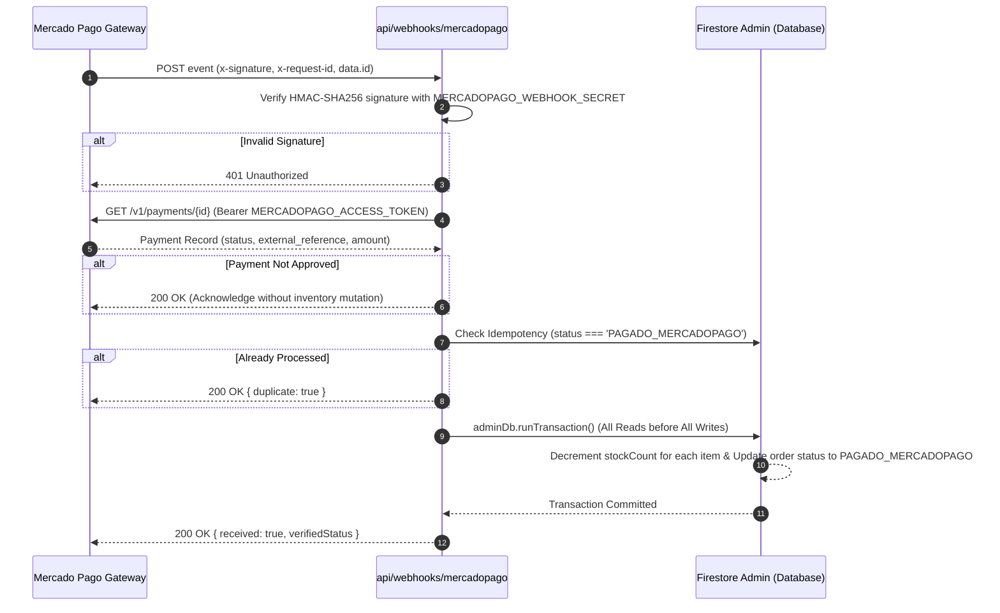

# PRONTO Serverless Backend Guide (`api/`)

As-built technical reference for the serverless backend layer of PRONTO Insumos Odontológicos: Vercel runtime layout, Mercado Pago Chile integration, cryptographic webhook security, Firestore Admin transactions, order tracking, voucher intake, and the transactional email layer.

---

## 🎯 1. Directory Scope & Runtime Architecture

- **Execution Runtime:** Node.js (Vercel Serverless Function Environment).
- **Core Philosophy:** Lean, stateless micro-endpoints. No Express/NestJS, no ORMs, no persistent threads. The one routed entry point (`api/admin/[action].ts`) is a documented exception to the single-purpose rule, forced by the Vercel Hobby function cap — see §1.2.
- **Database Driver:** `firebase-admin` SDK with service-account privileges via `getAdminFirestore()` in [`./_lib/firebaseAdmin.ts`](./_lib/firebaseAdmin.ts) (module singleton; returns `null` when `FIREBASE_PROJECT_ID` / `FIREBASE_CLIENT_EMAIL` / `FIREBASE_PRIVATE_KEY` are missing — every endpoint then degrades to a simulated/logged response rather than crashing).

### 1.1 Serverless Endpoints

| Endpoint | Method | Security / Auth | Business Function |
| :--- | :--- | :--- | :--- |
| [`/api/create-preference`](./create-preference.ts) | `POST` | Public / Server Secrets | Generates a Mercado Pago Checkout Pro preference. **Rebuilds every line from the Firestore `products` catalog** (client payload contributes only `productId`s + quantities; promo resolved from `src/config/promos.ts`) and pre-checks quantities against live `stockCount`/`inStock`, rejecting with `400` for unknown products, missing `productId`, invalid catalog prices or insufficient stock. **Fail-closed:** returns `503` when Firestore Admin is unavailable and a real token exists (Task 0.9). |
| [`/api/webhooks/mercadopago`](./webhooks/mercadopago.ts) | `POST` (`GET` ping → 200) | HMAC-SHA256 (`x-signature`) | Single authority for payment reconciliation and stock deduction. Verifies the signature, double-checks the payment via `GET /v1/payments/{id}`, then decrements stock inside a Firestore transaction. |
| [`/api/track-order`](./track-order.ts) | `POST` | Dual factor (Order ID + RUT) | Public order lookup bypassing the client-side Firestore read lock. Compares the order's stored RUT against the normalized request RUT; mismatch → `401`. Returns a sanitized 5-stage fulfillment payload. |
| [`/api/upload-voucher`](./upload-voucher.ts) | `POST` | Dual factor (Order ID + RUT) | Bank-transfer voucher intake. Stores the Base64 `dataUrl` **inside the order document** and transitions status to `TRANSFERENCIA_COMPROBANTE_SUBIDO`. ⚠️ File size / MIME are validated **client-side only** (see §3.2). |
| [`/api/order-confirmation`](./order-confirmation.ts) | `POST` | Dual factor (Order ID + RUT) | Sends the "order received" Resend email for client-created orders (bank transfer & WhatsApp quote). Idempotent via the `confirmationEmailSentAt` order flag. |

### 1.2 Function Layout & the Vercel Hobby Function Cap

The Vercel **Hobby plan refuses any deployment that adds more than 12 Serverless Functions**. Vercel treats *every* file under `api/` as a function unless its path contains a `_`-prefixed segment, starts with `.`, or ends in `.d.ts`. That cap dictates the backend layout:

| Path | Role | Counted as a function? |
| :--- | :--- | :--- |
| `api/create-preference.ts`, `api/order-confirmation.ts`, `api/track-order.ts`, `api/upload-voucher.ts`, `api/webhooks/mercadopago.ts` | Public endpoints | ✅ Yes |
| `api/admin/[action].ts` | **Single routed entry point** for all 11 administrative actions | ✅ Yes |
| `api/_lib/**` | Shared non-route code (`adminAuth`, `firebaseAdmin`, `firestoreEnv`, `email`, `emailTemplates`, `mercadopagoSignature`) **and** the 11 admin handler modules under `api/_lib/admin/` | ❌ No — `_`-prefixed segment |

**Current function count: 6** (Hobby cap 12 — 6 slots of headroom).

- **Routing:** `/api/admin/<action>` → `req.query.action === '<action>'`. A plain `Record<string, handler>` lookup table in [`api/admin/[action].ts`](./admin/[action].ts) dispatches to the matching module under `api/_lib/admin/`. Unknown, missing, empty, or non-string actions return `404 { success: false, error: 'Endpoint de administración no encontrado' }` and log a `[Admin Router]` warning. Inherited prototype keys (`constructor`, `__proto__`, …) are rejected by an own-property check.
- **Public URLs are unchanged** — `src/admin/services/adminApi.ts` and `vercel.json` need no edits; the 11 client calls map 1:1 to the dispatch table.
- **No framework.** The dispatcher holds no routing library, no middleware pipeline, and no CORS/auth of its own: each delegated handler keeps its own CORS headers, `OPTIONS` preflight, method gate, `verifyAdminToken` call, and error handling.
- **Rule of thumb:** anything under `api/` that is *not* a public route belongs in `api/_lib/`. Every new `api/*.ts` route consumes one of the 12 Hobby slots.

### 1.3 Runtime Module Resolution (ESM on Vercel)

Vercel does **not** bundle `api/` functions. It transpiles each file in place and ships the directory tree, so **Node's own ESM resolver** runs against the emitted `.js` files at request time. Two consequences are load-bearing — break either one and every affected endpoint returns `FUNCTION_INVOCATION_FAILED` (HTTP 500) while the build still reports success.

1. **Relative imports must carry an explicit `.js` extension.** `package.json` declares `"type": "module"`, and Node's ESM resolver rejects extensionless specifiers. `import { getAdminFirestore } from './_lib/firebaseAdmin'` transpiles fine but throws `ERR_MODULE_NOT_FOUND` at runtime. Always write `'./_lib/firebaseAdmin.js'`.
   - **Exception — type-only imports targeting a directory** (e.g. `import type { Product } from '../../../src/types'`) stay extensionless: they are erased during transpile and appending `.js` would break TypeScript's directory resolution.
   - Vitest/Vite maps the `.js` specifier back to the `.ts` source, so tests and the storefront bundle are unaffected.
   - `src/utils/schemaValidation.ts` is traced into the `api/admin/[action]` bundle, so its own `./rut.js` import obeys the same rule.

2. **`jose` is pinned to v5 via `pnpm.overrides`.** `firebase-admin` → `jwks-rsa@4` is CommonJS and calls `require('jose')` at module load, but `jose@6` is ESM-only, so *merely importing `firebase-admin/auth`* crashes with `ERR_REQUIRE_ESM` under Vercel's Node loader (stock Node ≥ 22.12 tolerates it via `require(esm)`; Vercel's does not). Upstream: [auth0/node-jwks-rsa#507](https://github.com/auth0/node-jwks-rsa/issues/507) and [firebase/firebase-admin-node#3181](https://github.com/firebase/firebase-admin-node/issues/3181). jose v5 is the last dual CJS/ESM major, and `jwks-rsa` only uses `jose.importJWK`/`jose.exportSPKI`, which are API-identical across jose 4/5/6.
   - **Removal condition:** drop the override once `jwks-rsa` publishes the lazy-`jose` fix ([PR #508](https://github.com/auth0/node-jwks-rsa/pull/508)) — i.e. any version above `4.1.0` — and re-verify that `firebase-admin/auth` loads on a preview deploy before promoting.

---

## 💳 2. Payment Gateway Architecture (Mercado Pago Chile)

### 2.1 The Two-Phase Payment Boundary

1. **Client Isolation:** The browser never sees card numbers or secret tokens. Checkout invokes `/api/create-preference` with the canonical `orderId` (`PRONTO-NNNNNN`, six digits), customer tax details, and cart items.
2. **Stock Pre-Check:** `/api/create-preference` reads the live `products` collection in Firestore Admin. If an item is depleted (`inStock === false` or `stockCount < quantity`), it aborts with HTTP `400`. ⚠️ Items whose payload carries no `productId`/`id` **skip this check entirely**.
3. **Checkout Pro Redirection:** Mercado Pago returns an `init_point` URL and the customer is redirected to the hosted checkout (Webpay Plus, Redcompra, Visa, Mastercard).

### 2.2 Webhook & Cryptographic Verification (`/api/webhooks/mercadopago`)


```mermaid
sequenceDiagram
    autonumber
    participant MP as Mercado Pago Gateway
    participant WH as api/webhooks/mercadopago
    participant FS as Firestore Admin (Database)

    MP->>WH: POST event (x-signature, x-request-id, data.id)
    WH->>WH: Verify HMAC-SHA256 signature with MERCADOPAGO_WEBHOOK_SECRET
    alt Invalid Signature
        WH-->>MP: 401 Unauthorized
    end
    WH->>MP: GET /v1/payments/{id} (Bearer MERCADOPAGO_ACCESS_TOKEN)
    MP-->>WH: Payment Record (status, external_reference, amount)
    alt Payment Not Approved
        WH-->>MP: 200 OK (Acknowledge without inventory mutation)
    end
    WH->>FS: Check Idempotency (status === 'PAGADO_MERCADOPAGO')
    alt Already Processed
        WH-->>MP: 200 OK { duplicate: true }
    end
    WH->>FS: adminDb.runTransaction() (All Reads before All Writes)
    FS-->>FS: Decrement stockCount for each item & Update order status to PAGADO_MERCADOPAGO
    FS-->>WH: Transaction Committed
    WH-->>MP: 200 OK { received: true, verifiedStatus }
```

- **Signature verification** ([`./_lib/mercadopagoSignature.ts`](./_lib/mercadopagoSignature.ts)) builds the official manifest `id:[data.id];request-id:[x-request-id];ts:[ts];`, computes HMAC-SHA256, and compares with `crypto.timingSafeEqual`. Optional `maxAgeSeconds` replay-window support exists but is **not** currently passed by the webhook.
- ⚠️ **Fail-open when unconfigured:** if `MERCADOPAGO_WEBHOOK_SECRET` is missing or the placeholder, verification returns `{ valid: true, reason: 'secret_not_configured' }`. The MP API double-check (Step 1) still gates mutation, but a deployment that loses the secret silently accepts unsigned requests — never treat the signature gate alone as proof of configuration.
- **Amount assertion (Task 0.9):** inside the transaction the webhook recomputes the payable total from the **current** catalog (`computeOrderTotal` over the consolidated lines, promo from the order's stored `promoCode`) and requires **both** `paymentData.transaction_amount` **and** `order.totalAmount` to equal it exactly (integer CLP) before marking paid. Any mismatch — underpayment, tampered order total, or lines whose `productId`/catalog price cannot be verified — transitions the order to `PAGO_EN_REVISION` (history event + warehouse alert, **no stock deduction**, no customer "paid" email). The review write stamps `mercadopagoPaymentId`, so redeliveries hit the duplicate fast path; a later, correctly-amounted payment re-enters the transaction and approves normally.

### 2.3 Idempotency & Stock Decrement Protection

Two layers defend against duplicate webhook deliveries:

1. **Fast-Path Check:** if the order already has `status === 'PAGADO_MERCADOPAGO'` or `mercadopagoPaymentId === paymentId`, the handler acknowledges `200` with `{ duplicate: true }` without any writes.
2. **Concurrent Transaction Guard:** inside `adminDb.runTransaction()` the order document is re-read; if a concurrent invocation processed the payment in the window, the transaction returns early without touching stock. Emails are gated on the `stockDeducted` flag set inside the transaction, so duplicates never re-notify.

---

## 📦 3. Order Tracking & Voucher Services

### 3.1 Order Tracking (`/api/track-order`)

- Under [`../firestore.rules`](../firestore.rules), client reads on `/orders/{id}` are denied (`allow read: if false;`), so tracking goes through this serverless proxy:
  - Accepts `{ orderId, rut }`; normalizes the RUT by stripping non `[0-9kK]` characters and upper-casing (local `normalizeRut`, **not** a Modulo-11 check — the official check-digit validation runs client-side via `src/utils/rut.ts`; the server only enforces `length >= 8`).
  - Looks the order up by `where('orderId', '==', id)` and compares against `customer.rut || billing.rut`. Mismatch → `401 { error: 'El RUT ingresado no coincide con el registrado para este pedido.' }`.
  - Returns a sanitized payload (items, customer contact, billing, voucher, 5-stage `fulfillment` block) — no internal payment tokens.
- ⚠️ Stale copy to fix eventually: the `ENTREGADO` description still says "…o retirado en Av. Ortúzar 750" (pickup was removed) and the non-Melipilla courier fallback is `'Starken / Chilexpress Regional'` (RM delivery was removed).
- The simulated fallback (returned when `getAdminFirestore()` is `null`) fabricates a plausible order — in a deployed environment a missing Firebase credential would therefore surface fake tracking data instead of an error.

### 3.2 Bank Transfer Voucher Intake (`/api/upload-voucher`)

- As built, the endpoint validates: `orderId` + `rut` presence, RUT normalization/length, the same `customer.rut || billing.rut` equality check (`401` on mismatch), and `dataUrl` presence. **It does not validate file size or MIME type** — those checks (`≤5 MB`, PDF/PNG/JPG) live only in `src/services/transferVoucher.ts`.
- Stores `voucherUrl` (the full Base64 data URL), `voucherFileName`, `voucherContentType`, `voucherUploadedAt` **on the order document**, plus an `order_status_history` event, in one batch — then fires the warehouse alert email.
- ⚠️ **Firestore document limit risk:** the entire data URL is embedded in the order doc. Firestore caps documents at ~1 MiB, so real vouchers larger than ~750 KB will fail `batch.commit()` with a 500. A storage-backed design (or compression) is needed before the 5 MB client limit is meaningful.
- ⚠️ **No status guard:** any party holding orderId + RUT can upload a voucher at any lifecycle stage, overwriting a previous voucher and regressing e.g. `PAGADO_MERCADOPAGO`/`DESPACHADO`/`ENTREGADO` back to `TRANSFERENCIA_COMPROBANTE_SUBIDO`.

---

## ✉️ 4. Transactional Email Layer (Resend)

PRONTO sends transactional email via **Resend** — a single `fetch` POST to `https://api.resend.com/emails`, zero SDK dependency — with verified sender domain `prontoinsumos.com` (DKIM/SPF/DMARC at the DNS provider).

### 4.1 The Fail-Safe Contract

`sendEmail()` in [`./_lib/email.ts`](./_lib/email.ts) **never throws**. A missing `RESEND_API_KEY`, a Resend rejection, or a network failure resolves to `{ sent: false, reason }` and only logs a `console.warn`. An email outage can never break payment reconciliation, voucher intake, or admin approvals. Outbound calls carry an 8-second `AbortSignal.timeout` so a hung provider cannot stall a webhook.

### 4.2 Environment Variables (`process.env` ONLY — never `import.meta.env`)

- `RESEND_API_KEY` — Resend API secret.
- `EMAIL_FROM` — Verified-domain sender (default `PRONTO Insumos <pedidos@prontoinsumos.com>`).
- `WAREHOUSE_NOTIFICATION_EMAIL` — Melipilla dispatch inbox for internal alerts.
- `SITE_URL` (optional) — Base URL for order-tracking deep links (default `https://prontoinsumos.com`). ⚠️ Not currently listed in `.env.example`.
- `VITE_BANK_*` — Bank details in emails reuse the same public `VITE_BANK_*` variables as the storefront (non-secret, single source of truth, read here via `process.env`).

### 4.3 Trigger Points & Templates ([`./_lib/emailTemplates.ts`](./_lib/emailTemplates.ts))

All templates return `{ subject, html, text }`, escape every user-supplied value (`escapeHtml`), and format money as integer CLP (`$189.990`) with the 19% IVA/neto breakdown.

| Event | Endpoint | Customer Email | Warehouse Alert |
| :--- | :--- | :--- | :--- |
| Order registered (transfer / WhatsApp quote) | `/api/order-confirmation` | `buildOrderConfirmationEmail` (incl. bank details + voucher upload link) | — |
| Payment approved (Mercado Pago) | `/api/webhooks/mercadopago` | `buildPaymentConfirmedEmail` | `buildWarehouseAlertEmail('PAGADO_MERCADOPAGO')` |
| Voucher uploaded | `/api/upload-voucher` | — | `buildWarehouseAlertEmail('TRANSFERENCIA_COMPROBANTE_SUBIDO')` |
| Transfer approved by admin | `/api/admin/approve-transfer` | `buildTransferApprovedEmail` | `buildWarehouseAlertEmail('TRANSFERENCIA_APROBADA')` |

⚠️ The shared `layout()` header still reads `Depósito dental — Melipilla & Región Metropolitana` — stale copy (coverage is Melipilla y San Antonio only).

### 4.4 Idempotency & Ordering Guarantees

- **Order confirmation:** `/api/order-confirmation` skips orders already stamped with `confirmationEmailSentAt`; the stamp is written only after a successful send, and a stamp failure degrades to a warning (never a 500 for a sent email).
- **Webhook:** emails fire only when `stockDeducted` was set inside the transaction — duplicate deliveries and concurrency aborts never re-notify.
- **Admin approval:** emails fire only when the transaction result is non-duplicate.
- **Mercado Pago orders** never hit `/api/order-confirmation` — payment confirmation arrives via the verified webhook instead.

---

## 🔒 5. Serverless Security & Runtime Isolation Rules

> [!CAUTION]
> **STRICT NODE.JS ISOLATION:** Code in `api/` executes in Node.js on Vercel servers, NEVER in the customer's browser.

1. **Environment Variables (`process.env` ONLY):**
   - ❌ **NEVER** reference `import.meta.env` in `api/` — it is undefined in Node.js.
   - ✅ Use `process.env.VARIABLE_NAME`.
   - ✅ Secrets (`MERCADOPAGO_ACCESS_TOKEN`, `MERCADOPAGO_WEBHOOK_SECRET`, `FIREBASE_PRIVATE_KEY`, `RESEND_API_KEY`) belong strictly in `process.env`.
2. **Database Access (`firebase-admin` ONLY):**
   - ❌ **NEVER** import client Firebase instances from `src/services/firebase.ts`.
   - ✅ Use `getAdminFirestore()` from [`./_lib/firebaseAdmin.ts`](./_lib/firebaseAdmin.ts).
3. **CORS — as built, not uniform:**
   - `order-confirmation` and **all 11 admin handlers** set `Access-Control-Allow-Origin: *` plus method/header allow-lists.
   - `create-preference`, `track-order`, `upload-voucher` and `webhooks/mercadopago` set **no CORS headers** — they work because the storefront is served from the same Vercel origin (and the webhook is server-to-server). If a future caller is cross-origin, those endpoints will need the headers added explicitly.
   - Every endpoint short-circuits `OPTIONS` with `200`.

---

## 🛡️ 6. Administrative Endpoints (`/api/admin/`)

The backoffice portal calls 11 actions under `/api/admin/<action>`, dispatched by [`api/admin/[action].ts`](./admin/[action].ts) to the handler modules under [`api/_lib/admin/`](./_lib/admin). Behaviour is identical to a dedicated file per endpoint.

### 6.1 Admin Authentication ([`./_lib/adminAuth.ts`](./_lib/adminAuth.ts))

- Extracts `Authorization: Bearer <ID_TOKEN>`; missing/malformed → `'Encabezado de autorización ausente o malformado'`.
- Calls `auth.verifyIdToken(idToken)` via `firebase-admin/auth` on the singleton app. **No `checkRevoked` flag and no clock tolerance are configured** — plain default verification.
- Asserts `decodedToken.admin === true`; otherwise rejects `'Acceso denegado: permisos administrativos requeridos'`.
- Handlers translate any `authenticated: false` result into HTTP `403 { success: false, error }`.

### 6.2 Admin Actions Reference

| Action | Method | Role & Transaction Behaviour |
| :--- | :--- | :--- |
| `dashboard-stats` ([`_lib/admin/dashboard-stats.ts`](./_lib/admin/dashboard-stats.ts)) | `GET` | Full-collection scan aggregating daily sales CLP localized to `America/Santiago`, pending transfers (`PENDIENTE_*` + `TRANSFERENCIA_COMPROBANTE_SUBIDO`), low-stock published items (`stockCount <= 5`), and monthly order count. |
| `orders` ([`_lib/admin/orders.ts`](./_lib/admin/orders.ts)) | `GET` | `?orderId=` does the dual doc-id/`orderId`-field lookup (§8.1). Otherwise fetches the **entire** collection, sorts/filters in memory (`status`, `search` on id/name/razón social/RUT), and slices to `limit` (default 50). ⚠️ The client sends a `cursor` param that is **read and ignored** — no real pagination. |
| `order-history` ([`_lib/admin/order-history.ts`](./_lib/admin/order-history.ts)) | `GET` | Queries `order_status_history` where `orderId == <param>` (history docs are keyed by the canonical code), sorts by `timestamp` ascending. |
| `products` ([`_lib/admin/products.ts`](./_lib/admin/products.ts)) | `GET` | Full catalog with `stockCount`, `inStock`, `isActive`, pricing; optional `?category=` filter. |
| `approve-transfer` ([`_lib/admin/approve-transfer.ts`](./_lib/admin/approve-transfer.ts)) | `POST` | Atomic `runTransaction`: re-reads order, consolidates items, decrements `stockCount`, sets `TRANSFERENCIA_APROBADA` with `approvedBy`/`approvedAt`, writes audit + status history. Idempotent for `TRANSFERENCIA_APROBADA`/`PAGADO_TRANSFERENCIA`/`PAGADO_MERCADOPAGO`. Fires customer + warehouse emails on non-duplicate. |
| `dispatch-order` ([`_lib/admin/dispatch-order.ts`](./_lib/admin/dispatch-order.ts)) | `POST` | Sets `DESPACHADO` with free-text `carrier`, `trackingNumber`, `dispatch` metadata block; batch audit event. |
| `mark-delivered` ([`_lib/admin/mark-delivered.ts`](./_lib/admin/mark-delivered.ts)) | `POST` | Sets `ENTREGADO` with `deliveredAt`; batch audit event. |
| `update-stock` ([`_lib/admin/update-stock.ts`](./_lib/admin/update-stock.ts)) | `POST` | Absolute stock set (`newStock`, `Math.round`), recomputes `inStock = newStock > 0 && isActive !== false`, records `lastStockAdjustment` + audit log (`reason` free-form, defaults `correccion`). |
| `update-product` ([`_lib/admin/update-product.ts`](./_lib/admin/update-product.ts)) | `POST` | Updates `name`, `price` (integer CLP, auto `priceNeto = Math.round(price / 1.19)`), `description`, `category`, `prescriptionRequired`, `tag` — matching `ProductUpdatePayload` exactly. ⚠️ Manufacturer, specs, images and package contents are **not** updatable end-to-end (neither `ProductUpdatePayload` nor this handler carries them). |
| `create-product` ([`_lib/admin/create-product.ts`](./_lib/admin/create-product.ts)) | `POST` | Builds a full `Product` (`pronto-<ts36>-<rand>` id, generated `REF-*` SKU, `priceNeto`), validates via `validateProductSchema`, writes product + `creacion_manual` audit in one batch. |
| `toggle-visibility` ([`_lib/admin/toggle-visibility.ts`](./_lib/admin/toggle-visibility.ts)) | `POST` | Sets `isActive` without touching `stockCount`; recomputes `inStock = stockCount > 0 && isActive`; audit reason `activacion_catalogo`/`pausa_catalogo`. |

### 6.3 Audit Trail Architecture

Append-only audit pattern across two root collections (both `allow read: if isAdmin(); allow write: if false;` in [`firestore.rules`](../firestore.rules)):

1. **`order_status_history`** — `orderId`, `previousStatus`, `newStatus`, `changedBy`, `changedByEmail`, `actorRole` (`ADMIN` | `CUSTOMER` | `SYSTEM_WEBHOOK`), `timestamp`, `reason`, `metadata`. Written inside the same transaction/batch as every status mutation.
2. **`inventory_audit_logs`** — `productId`, `productSku`, `productName`, `changeType` (`STOCK_ADJUSTMENT`, `ORDER_FULFILLMENT_DEDUCTION`, `METADATA_UPDATE`, `VISIBILITY_TOGGLE`), `previousStock`, `newStock`, `delta`, `reasonCode`, `operatorNotes`, `changedBy`, `changedByEmail`, `actorRole`, `timestamp`, `metadata`.
   - `reasonCode` values as built: `reposicion`, `merma`, `correccion`, `venta_manual` (admin + transfer approval), `orden_compra` (webhook), `creacion_manual` (create-product), `activacion_catalogo`, `pausa_catalogo` (toggle-visibility).

---

## 🧪 7. Multi-Environment Firestore Isolation ([`./_lib/firestoreEnv.ts`](./_lib/firestoreEnv.ts))

`getCollectionName()` prefixes collections with `dev_` in development, keeping local dev and Vercel Preview deployments off live data:

```typescript
export function getFirestoreEnv(): FirestoreEnvironment {
  const explicit = process.env.FIRESTORE_ENV || process.env.VITE_FIRESTORE_ENV
  if (explicit === 'development' || explicit === 'dev') return 'development'
  if (explicit === 'production' || explicit === 'prod') return 'production'
  if (explicit === 'test') return 'test'

  if (process.env.NODE_ENV === 'test') return 'test'
  if (process.env.VERCEL_ENV === 'preview') return 'development'
  if (process.env.NODE_ENV === 'development') return 'development'

  return 'production'
}

export function getCollectionName(baseName: FirestoreCollectionKey | string): string {
  const env = getFirestoreEnv()
  if (env === 'development' && !baseName.startsWith('dev_')) {
    return `dev_${baseName}`
  }
  return baseName
}
```

- **Development (`dev_*`):** local dev and `VERCEL_ENV === 'preview'` → `dev_orders`, `dev_products`, `dev_order_status_history`, `dev_inventory_audit_logs`.
- **Production:** canonical root collections.
- **Test (`NODE_ENV === 'test'`):** canonical names for deterministic mocks.
- **Complete scoping:** every `api/` function accesses collections exclusively via `getCollectionName()`. The client-side twin lives at `src/services/firestoreEnv.ts` (same contract, `import.meta.env`-driven).

---

## 🛡️ 8. Key Decisions, Invariants & Known Gaps

### 8.1 Document ID Dual-Lookup Strategy

Storefront orders are written with `setDoc(doc(db, col, orderId))`, so the Firestore Document ID **equals** the canonical code (`PRONTO-483921`). Legacy/manual docs may use auto IDs with `orderId` as a field only. `approve-transfer`, `dispatch-order`, `mark-delivered`, and `orders?orderId=` therefore try `doc(orderId)` first and fall back to `where('orderId','==',orderId)`. The public endpoints (`track-order`, `upload-voucher`, `order-confirmation`) use the `orderId`-field query only, and the MP webhook does the same — both forms resolve either storage style.

### 8.2 Line-Item Consolidation Before Stock Mutation

Duplicate `productId` line items inside one transaction would cause duplicate reads/writes on the same document reference. `webhooks/mercadopago` and `admin/approve-transfer` consolidate into a `Map<productId, { qty, name }>` before the transaction, reading `item.productId || item.id`:

```typescript
const consolidatedItems = new Map<string, { qty: number; name?: string }>()
for (const item of items) {
  const pid = item.productId || item.id
  if (!pid) continue
  const existing = consolidatedItems.get(pid) || { qty: 0, name: item.name }
  existing.qty += Math.max(1, Number(item.quantity) || 1)
  if (item.name) existing.name = item.name
  consolidatedItems.set(pid, existing)
}
```

All product reads precede all writes (Firestore transaction invariant).

### 8.3 Chilean Timezone in Metrics

`dashboard-stats` buckets dates with `Intl.DateTimeFormat` + `timeZone: 'America/Santiago'` so sales between 20:00–23:59 Chilean time land in the correct local day.

### 8.4 Decoupled `isActive` vs `stockCount`

- `stockCount`: physical warehouse units.
- `isActive`: admin catalog-visibility toggle (pause without zeroing).
- `inStock`: computed invariant `stockCount > 0 && isActive !== false` — rewritten by every mutation (`update-stock`, `toggle-visibility`, webhook deduction, approve-transfer).

### 8.5 Known Trust-Boundary Gaps (as built — track against the roadmap)

### 8.5 Known Trust-Boundary Gaps (as built — track against the roadmap)

1. **~~Client-supplied pricing~~ RESOLVED (Task 0.9):** `/api/create-preference` now rebuilds every preference line from the Firestore catalog (client sends only product IDs + quantities; promo validated against `src/config/promos.ts`), fails closed with `503` when Admin is unavailable with a real token, and the webhook asserts `transaction_amount` **and** `order.totalAmount` against a catalog-recomputed total (`src/utils/orderTotal.ts`) before marking `PAGADO_MERCADOPAGO` — mismatches land in `PAGO_EN_REVISION` without stock deduction. Residual caveat: a catalog price change between preference creation and webhook delivery flags the (legitimate) order for manual review — fail-closed by design.
2. **Unsigned webhook when secret missing:** signature verification is fail-open (`secret_not_configured` → valid). See §2.2.
3. **Voucher size/MIME unchecked server-side + 1 MiB doc limit + no status guard:** see §3.2.
4. **No rate limiting** on any endpoint (`track-order`/`upload-voucher`/`order-confirmation` are enumerable-oracle shaped behind RUT match, but nothing throttles attempts).
2. **Unsigned webhook when secret missing:** signature verification is fail-open (`secret_not_configured` → valid). See §2.2.
3. **Voucher size/MIME unchecked server-side + 1 MiB doc limit + no status guard:** see §3.2.
4. **No rate limiting** on any endpoint (`track-order`/`upload-voucher`/`order-confirmation` are enumerable-oracle shaped behind RUT match, but nothing throttles attempts).

---

## 🚀 9. Deployment

Serverless functions deploy with the storefront via the **Vercel CLI** (`pnpm dlx vercel` / `vercel --prod`). Server secrets live in Vercel Project Settings — sync them with `pnpm run env:sync` (root `AGENTS.md` §7.1). A green build proves nothing about function health: ESM resolution faults (§1.3) and missing env vars surface only at request time.
