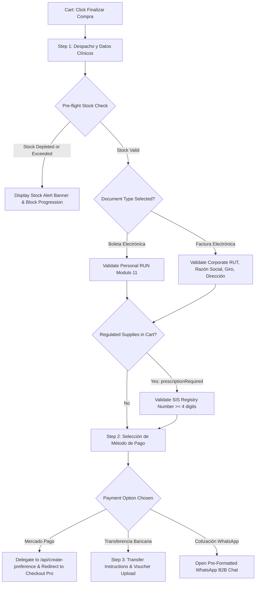
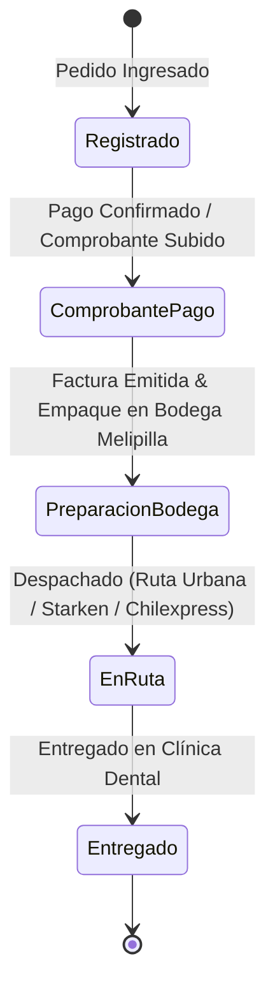

# PRONTO UI Components Guide (`src/components/`)

This document is the **authoritative domain and technical reference** for the user interface layer of PRONTO Insumos Odontológicos. It captures the business context of dental distribution in Chile, architectural decisions, complete component specifications, and an exhaustive field-by-field breakdown of clinical checkout, tax invoicing (SII), and payment workflows.

---

## 🏥 1. Business Context & Clinical Domain Architecture

### 1.1 The Chilean Dental Supplies Market & PRONTO's Role
PRONTO Insumos Odontológicos operates as a specialized **depósito dental** (dental supply distributor) physically based in **Melipilla, Chile** (warehouse and local pickup point at **Av. Ortúzar 750**). 

The customer base is primarily **B2B (Business-to-Business)**:
1. **Private Dental Clinics (Sociedades Odontológicas):** SpA, EIRL, or Sociedades de Profesionales that purchase consumables, impression materials, and handpieces as operational expenses.
2. **Independent Dentists (Odontólogos Generales y Especialistas):** Orthodontists, endodontists, periodontists, implantologists, and pediatric dentists operating private consultation rooms.
3. **Dental Laboratories (Laboratorios Dentales):** Mechanics and technicians fabricating prosthetics, crowns, and aligners requiring specific silicones, stones, and burs.
4. **Public Health Services & Municipal Clinics (CESFAM / Salud Primaria):** Requiring formal tax quotes, registered clinical invoicing, and batch dispatch.

### 1.2 Chilean Tax Invoicing (SII — Servicio de Impuestos Internos)
In Chile, all commercial sales are strictly governed by the **Servicio de Impuestos Internos (SII)** and subject to a **19% Impuesto al Valor Agregado (IVA)**. Commercial transactions fall into two distinct legal categories:

* **Boleta Electrónica (B2C / Personal):**
  - Issued to individual consumers or dentists purchasing under their personal tax identity (**RUN/RUT personal**).
  - IVA is charged and remitted to the fiscal treasury, but **does not grant fiscal tax credit** to a business.
* **Factura Electrónica (B2B / Crédito Fiscal):**
  - Legally mandatory for dental companies, corporate clinics, and incorporated dental practices that wish to claim the 19% IVA as **Crédito Fiscal** (deductible against their monthly sales VAT in **Formulario 29 / F29**) and deduct material expenses from their annual corporate income tax (**Formulario 22 / F22**).
  - The SII strictly mandates specific corporate tax attributes for every Factura:
    1. **RUT de la Empresa:** Corporate tax ID with Modulo 11 check digit verification.
    2. **Razón Social:** Exact registered legal company name.
    3. **Giro Comercial:** Official economic activity classification approved by the SII (e.g., *"Actividades de atención odontológica"*, *"Servicios médicos dentales"*).
    4. **Dirección Tributaria y Comuna:** Official registered fiscal domicile.
    5. **Email de Intercambio DTE (Email para SII):** The registered electronic invoicing inbox where the XML and PDF copies of the electronic tax document (**DTE — Documento Tributario Electrónico**) must be transmitted for automatic fiscal reconciliation.

### 1.3 Sanitary Regulations (ISP Chile & Superintendencia de Salud)
Under Chilean law (**Código Sanitario DFL 725** and **Decreto Supremo 466 del Ministerio de Salud**), medical and dental devices are classified by risk:
* Class I & II: Standard consumables (examination mirrors, bibs, cotton rolls, mixing bowls, micro-applicators). Available for open professional supply.
* Regulated / Prescription Products: Dental local anesthetics (Lidocaína, Mepivacaína, Articaína con epinefrina), pharmaceuticals, surgical scalpels, and specialized etching agents.
* **Legal Obligation:** Depósitos dentales cannot dispense regulated pharmaceuticals or controlled surgical products without recording the professional clinician's registration in the **Registro Nacional de Prestadores Individuales de Salud (RNPI)** managed by the **Superintendencia de Salud (SIS)**. PRONTO enforces this compliance guard directly in checkout.

---

## 🎨 2. Design Philosophy: "Clinical Precision & Local Trust"

The storefront UI conveys the clean, sterile, and highly dependable nature of a dental operating depot:
* **Palette (Brand Manual, Section 3 of the redesign proposal):**
  - **Intense Blue (`#102748`, `var(--brand-blue)`):** Primary brand foundation for structure, headers, add-to-cart actions, and trust anchors. Legacy `--navy-*` / `--teal-*` tokens alias onto this family.
  - **Cayenne Red-Orange (`#C84B31`, `var(--brand-cayenne)`):** Energetic warm accent for hero title span, cart count badge, product tag chips, and promotional urgency.
  - **Limonade Cream / Accent Green (`#ECEFBE` / `#CAE400`, `var(--brand-limonade)` / `var(--brand-accent-green)`):** CTA fills and pill highlights; always paired with dark green text (`--brand-accent-green-text: #3D4A00`).
  - **Almond Cream / Frozen Water (`#FDF8F3` / `#F0F4F8`, `var(--brand-cream)` / `var(--brand-frozen)`):** Warm page background and cool card/input surfaces.
  - **Slate Neutral (`#334155`, `var(--text-secondary)`):** Balanced readability for technical specifications.
  - **Focus indicators (`--border-focus`):** Always `var(--brand-blue)` — accent green fails WCAG 1.4.11 (≥3:1) on light surfaces, so it is reserved for fills only.
* **Typography:** Brand manual dual-face system — `Baloo Da 2` (`--font-display`) for the wordmark and headings, `Syne` (`--font-sans` / `--font-body`) for body and CTA copy, `JetBrains Mono` for REF codes and prices.
* **Strict Aesthetic Guardrails:**
  - Zero fluorescent neon halos or glowing futuristic borders.
  - Zero fake SaaS dashboard widgets.
  - Authentic Chilean currency formatting (`$189.990 CLP`) with zero decimal cents.
  - Transparent Chilean consumer pricing: All customer prices explicitly state `IVA incluido` per **SERNAC** consumer protection rules.

### 2.1 Storefront Landing Composition (`App.tsx`)

The landing page composes the brand experience in a fixed narrative order:

1. [`Hero.tsx`](file:///c:/Users/ecmv2/Documents/PRONTO/src/components/Hero.tsx): editorial headline + CTA, compact inline B2B trust strip, and the right-column lifestyle photography panel (with `imgError` state fallback).
2. [`PromoStrip.tsx`](file:///c:/Users/ecmv2/Documents/PRONTO/src/components/PromoStrip.tsx): slim value-proposition band (slogan, express delivery, SII invoicing).
3. [`CategoryFilter.tsx`](file:///c:/Users/ecmv2/Documents/PRONTO/src/components/CategoryFilter.tsx): category pills, result count, stock toggle, and sort selector (`#catalog-section` scroll anchor).
4. [`CategoryShowcase.tsx`](file:///c:/Users/ecmv2/Documents/PRONTO/src/components/CategoryShowcase.tsx): 4-card specialty hub when viewing `all`, or a contextual banner for the active category. Cards are native `<button>` elements (keyboard accessible); categories without a banner render nothing.
5. [`ProductList.tsx`](file:///c:/Users/ecmv2/Documents/PRONTO/src/components/ProductList.tsx): catalog grid.

> **Category display labels:** Internal Firestore keys (e.g. `DESECHABLES, ESTERILIZACION Y DESINFECCION`) are never shown raw. Always render through `formatCategoryDisplayName()` from [src/utils/categoryAlias.ts](file:///c:/Users/ecmv2/Documents/PRONTO/src/utils/categoryAlias.ts), which is the single source of truth for storefront naming (also consumed by `CATEGORIES` in `src/data/products.ts`).

---

## 🛒 3. Deep Dive: Checkout Modal (`CheckoutModal.tsx`)

The [`CheckoutModal.tsx`](file:///c:/Users/ecmv2/Documents/PRONTO/src/components/CheckoutModal.tsx) component is the commercial nucleus of PRONTO. It executes a **3-step linear state machine** guiding the dental practitioner through identity verification, tax document selection, pre-flight inventory confirmation, payment gateway delegation, and voucher collection.



### 3.1 Field-by-Field Reference & Business Rationale

| Form Field Name | State Property | UI Label | Purpose & Clinical Business Context | Validation Rule |
| :--- | :--- | :--- | :--- | :--- |
| **Tipo de Documento** | `formData.documentType` | `📄 Boleta Electrónica` / `🏢 Factura Electrónica` | Determines the fiscal document issued through the Chilean SII. Clinics must select Factura to claim the 19% IVA tax credit in their monthly F29 declaration. | Required toggle (`'boleta'` \| `'factura'`). Defaults to `'boleta'`. |
| **Nombre del Profesional** | `formData.fullName` | *Nombre del Profesional o Representante Legal* | Identifies the ordering dentist or the clinic's legal representative. Used for package labeling, reception desk delivery signing, and customer care. | Required string. Trimmed of whitespace. |
| **RUT del Comprador** | `formData.rut` | *RUT Personal (RUN)* (Boleta) / *RUT Empresa / Sociedad* (Factura) | Chilean national identity tax number. For Boleta, represents the individual practitioner. For Factura, represents the incorporated dental practice (Sociedad Odontológica). | Must satisfy official Chilean **Modulo 11 check digit** via `validateRut()` in [src/utils/rut.ts](file:///c:/Users/ecmv2/Documents/PRONTO/src/utils/rut.ts). Formats dynamically as `12.345.678-K`. |
| **Email para Documento SII** | `formData.email` | *Email para Documento SII* | **Critical Chilean Fiscal Field:** Electronic tax documents (DTEs) issued through electronic invoicing providers connected to the SII must be dispatched to a formal electronic mailbox. In dental clinics, this email is often monitored by the clinic's accountant or administrator (`facturacion@clinica.cl`), ensuring tax documents are not lost in personal dentist inboxes. For Boleta, receives the purchase confirmation and Boleta PDF. | Required standard email format (`type="email"`). |
| **Razón Social** | `formData.razonSocial` | *Razón Social (según SII) \** | **Factura Only:** The official registered legal entity name of the clinic or dental society (e.g., *"Centro Odontológico Melipilla SpA"*). The SII rejects invoices where the Razón Social does not match the company RUT in the tax registry. | Mandatory when `documentType === 'factura'`. Minimum 3 characters. |
| **Giro Comercial** | `formData.giroComercial` | *Giro Comercial Registrado \** | **Factura Only:** The registered economic activity code and description recognized by the SII (e.g., *"Servicios odontológicos"*, *"Atención médica y dental"*). Invoices lacking a valid economic activity are legally rejected for tax credit. | Mandatory when `documentType === 'factura'`. Minimum 3 characters. |
| **Teléfono Móvil** | `formData.phone` | *Teléfono Móvil* | Direct telephone and WhatsApp contact for courier logistics. Crucial for Melipilla urban delivery and regional couriers to confirm clinic reception hours before dispatching packages. | Required string. |
| **Dirección de Entrega / Fiscal** | `formData.address` | *Dirección de Entrega / Fiscal \** | Dual-purpose field: Specifies the street, building, office number (e.g., *"Av. Ortúzar 750, Of. 302"*), and acts as the fiscal address registered on the electronic tax invoice. | Mandatory. Validated via `validateFacturaFields` when Factura is selected. |
| **Ciudad / Comuna Fiscal** | `formData.city` | *Ciudad / Comuna Fiscal \** | Commune designation (e.g., *"Melipilla"*, *"Talagante"*, *"Providencia"*). Determines the logistics zone, freight calculation, and complies with SII DTE address requirements. | Mandatory. |
| **Código Postal / Región** | `formData.zip` | *Código Postal / Región* | Chilean postal district code (e.g., *"9500000"* for Melipilla) or regional identifier for courier sorting hubs (Chilexpress/Starken). | Required string. |
| **N° Registro SIS** | `sisRegistryNumber` | *N° Registro SIS (Superintendencia) \** | **Sanitary Verification Field:** Mandatory only when cart contains regulated clinical supplies (`prescriptionRequired === true`). Represents the practitioner's official registration in the Superintendencia de Salud's RNPI. | Required if `hasRegulatedItems`. Minimum 4 numeric/alphanumeric characters. |
| **Credencial / Receta** | `credentialFileName` | *Credencial Profesional o Receta (Opcional)* | Allows uploading an image or PDF of the professional credential or prescription authorizing controlled supply acquisition. | Optional file attachment (`.pdf`, `.jpg`, `.png`). |

### 3.2 Pre-Flight Stock Validation in Step 1
Before allowing the customer to proceed from Step 1 to Step 2, `handleNextStep()` iterates through every cart line item against current inventory:
```typescript
const stockIssueItem = cartItems.find(item => {
  const stock = typeof item.product.stockCount === 'number' ? item.product.stockCount : 0
  return !item.product.inStock || stock <= 0 || item.quantity > stock
})
```
If an item has depleted or the requested quantity exceeds physical stock, the transition is halted and an amber alert banner displays:
> *"El producto '[Nombre]' supera el stock disponible (X solicitados, Y disponibles). Por favor ajusta la cantidad en el carro."*

### 3.3 Step 2: Payment Pathways
Presents 3 distinct payment pathways tailored to Chilean healthcare purchasing habits:
1. **Transferencia Bancaria Directa (Banco de Chile):**
   - The preferred B2B method for dental clinics managing monthly account balances.
   - Bank details are externalized in [`src/config/bankDetails.ts`](file:///c:/Users/ecmv2/Documents/PRONTO/src/config/bankDetails.ts) (**Banco de Chile, Cuenta Corriente 849-01284-01, RUT 77.892.410-2, pagos@prontoinsumos.cl**).
   - Advances to Step 3 where the customer receives transfer instructions and can upload their bank receipt directly.
2. **Pago Inmediato Mercado Pago Chile (Webpay Plus / Redcompra):**
   - Instant digital settlement via credit/debit card.
   - **PCI-DSS Compliance:** Zero card fields exist in state or DOM. Processing delegates to `/api/create-preference` which generates an official Checkout Pro URL.
3. **Cotización Formal por WhatsApp:**
   - Designed for municipal procurement, university clinics, or custom high-volume orders.
   - Formats a comprehensive Markdown quote with itemized SKUs and tax breakdowns, opening `https://wa.me/...`.

### 3.4 Step 3: Order Confirmation & Transfer Voucher Intake
When Transferencia Bancaria is confirmed:
* Generates a canonical Order ID (`PRONTO-XXXXXX`).
* Displays the complete Banco de Chile transfer specifications.
* Renders an **embedded voucher upload widget** allowing immediate attachment of receipts (`.pdf`, `.png`, `.jpg` <= 5MB).
* Submitting the voucher invokes `/api/upload-voucher`, advancing the order status to `'TRANSFERENCIA_COMPROBANTE_SUBIDO'`.
* Provides direct navigation to [`OrderTrackingModal.tsx`](file:///c:/Users/ecmv2/Documents/PRONTO/src/components/OrderTrackingModal.tsx) for live fulfillment tracking.

---

## 🔍 4. Deep Dive: Customer Order Tracking Modal (`OrderTrackingModal.tsx`)

The [`OrderTrackingModal.tsx`](file:///c:/Users/ecmv2/Documents/PRONTO/src/components/OrderTrackingModal.tsx) component provides dental practitioners with transparent visibility into their order fulfillment.

### 4.1 Security Architecture
Under [`firestore.rules`](file:///c:/Users/ecmv2/Documents/PRONTO/firestore.rules), client-side queries against `/orders` are blocked (`allow read, update, delete: if false;`) to protect clinical order privacy.
* **Authentication Contract:** Lookups require two canonical factors:
  1. **Canonical Order ID:** `PRONTO-XXXXXX`
  2. **Customer / Clinic Tax ID:** Validated Chilean RUT (Modulo 11) matching the order.
* **Serverless Proxy:** The modal queries [`/api/track-order`](file:///c:/Users/ecmv2/Documents/PRONTO/api/track-order.ts), which uses `firebase-admin` to fetch the order and returns a sanitized `OrderTrackingInfo` model without exposing internal tokens, server secrets, or database timestamps.

### 4.2 The 5-Stage Fulfillment Timeline



1. **Pedido Registrado:** Initial order entry in system (`PENDIENTE_PAGO_MERCADOPAGO` or `PENDIENTE_TRANSFERENCIA`).
2. **Comprobante / Pago Verificado:** Payment confirmed via Mercado Pago webhook or transfer voucher uploaded (`TRANSFERENCIA_COMPROBANTE_SUBIDO` / `PAGADO_*`).
3. **Preparación en Bodega Melipilla:** Order being verified, checked against ISP regulations, packed, and accompanied by Factura Electrónica (`EN_PREPARACION`).
4. **En Ruta de Entrega:** Handed over to local Melipilla courier fleet or regional logistics carrier with tracking number (`DESPACHADO`).
5. **Entregado:** Successfully delivered and signed at clinic reception (`ENTREGADO`).

### 4.3 In-Modal Bank Transfer Voucher Upload
If a customer consults an order that is pending bank transfer (`status === 'PENDIENTE_TRANSFERENCIA'`), the modal dynamically embeds a voucher upload form directly below the timeline, eliminating the need to contact support via email.

---

## 🛍️ 5. Deep Dive: Slide-Over Cart Drawer (`Cart.tsx`)

[`Cart.tsx`](file:///c:/Users/ecmv2/Documents/PRONTO/src/components/Cart.tsx) manages the clinician's shopping bag with real-time stock cues, shipping incentives, and tax breakdowns:

### 5.1 Real-Time Stock Cues
To avoid customer frustration during checkout, the cart actively monitors inventory:
* **"Sin stock disponible"** (Red badge): Displayed if `stockCount <= 0` or `inStock === false`.
* **"Máximo disponible (X unid.)"** (Amber badge): Displayed when the item quantity equals warehouse physical stock.
* **"Excede stock (X unid. disp.)"** (Red badge): Displayed if inventory depleted while items were in the cart.
* **Capped Stepper Action:** The increment (`+`) button is disabled when quantity reaches stock count, displaying an informative tooltip.
* **Sticky Alert Banner & Locked CTA:** When any item exceeds stock, a persistent alert banner appears in the cart footer and the checkout button is disabled with the label `"Insumos sin Stock Suficiente"`.

### 5.2 Chilean Shipping Progress Tracker
* Free shipping threshold is standardized at **$150.000 CLP** (or free for local Melipilla pickup).
* Renders a live progress bar showing the remaining amount to reach free shipping (`"¡Te faltan $X para despacho gratis en Melipilla y RM!"`).

### 5.3 Tax & Discount Breakdown
* Calculates itemized subtotal, promotional discount, and isolates the 19% IVA using Chilean rounding rules (`calculateTaxBreakdown` in [src/utils/tax.ts](file:///c:/Users/ecmv2/Documents/PRONTO/src/utils/tax.ts)).
* Ensures every total sent to checkout is a whole Chilean Peso integer without decimal cents.

---

## 📦 6. Catalog Components Reference

### 6.1 `ProductCard.tsx`
* **Confidential Stock Defense:** Warehouse inventory counts (`stockCount`) are **never rendered** to public users to prevent competitors from scraping inventory levels. Displays clean status cues (`En Stock`, `Pocas unidades`, `Sin Stock`).
* **Technical REF SKU Header:** Features canonical REF codes (e.g. `REF: OD-101`) familiar to dental procurement staff.
* **Sanitary Badging:** Displays `⚕️ Uso Profesional` or `⚕️ Requiere SIS` when `prescriptionRequired === true`.
* **Pricing Standard:** Renders whole Chilean Peso amounts with `IVA incluido` tag.

### 6.2 `ProductQuickView.tsx`
Vertical 1-column Product Detail Modal:
* **Multi-Photo Gallery:** Thumbnail strip, next/prev navigation buttons, and keyboard arrow controls.
* **Clinical Checklists:** Technical specifications checklist (`specs`) and itemized packaging contents (`packageContents` e.g., *"1x Turbina LED, 1x Llave de desarme, 1x Manual técnico"*).
* **Sanitary Notice:** Detailed citation of ISP compliance and autoclave sterilization parameters (134°C).

### 6.3 `CategoryFilter.tsx`
Clinical category tabs (Instrumental, Materiales Restauradores, Equipamiento, Desechables, Endodoncia, Ortodoncia, Periodoncia) with accessible ARIA roles, instant stock toggle (`Solo productos en stock`), and price/rating sort dropdown.

---

## 🌐 7. Navigation, Layout & Utility Components

### 7.1 `Navbar.tsx`
* **Top Commercial Utility Bar:** Displays Melipilla express delivery notices, warehouse pickup address (Av. Ortúzar 750), Factura Electrónica SII compliance, and the direct "Seguimiento de Pedido" action button.
* **Technical Search:** Debounced keyword search matching product names, clinical descriptions, categories, and SKU REF codes.
* **Dynamic Cart Badge:** Visual item counter with micro-animation upon addition.

### 7.2 `Footer.tsx`
* Grounded 4-column B2B distributor layout:
  1. *Identidad Corporativa:* Corporate details, Av. Ortúzar 750 warehouse location, Melipilla, Chile.
  2. *Catálogo Clínico:* Quick links to primary dental categories.
  3. *Logística y Seguimiento:* Tracking modal trigger, shipping routes (Melipilla, RM, Regiones vía Starken/Chilexpress), and withdrawal policies.
  4. *Contacto y Certificaciones:* Factura Electrónica SII notice, ISP sanitary compliance statement, and technical WhatsApp hotline.
* **Zero Prototype Buttons:** Administrative wipe/seed buttons are strictly eliminated from public view.

### 7.3 `PaymentReturnModal.tsx`
Handles Mercado Pago return redirects (`/?status=approved&collection_id=...`):
* `approved`: Displays success header, order ID, payment ID, clears cart and storage, and provides WhatsApp delivery coordination.
* `failure`: Explains payment decline, reassures no funds were charged, and offers retry or bank transfer alternatives.
* `pending`: Informs the customer that the payment is awaiting banking clearance.

### 7.4 `ErrorBoundary.tsx`
Top-level React error boundary preventing white-screen crashes. Catches unhandled exceptions and displays a clinical error card with a direct WhatsApp technical support button pre-filled with error diagnostic details.

---

## 🔒 8. Security & State Guardrails Summary

1. **NO Heavy State Libraries:** Standard React 18 hooks (`useState`, `useEffect`, `useCallback`, `useMemo`) and lightweight `localStorage` persistence.
2. **NO External UI / CSS Frameworks:** Pure Vanilla CSS clinical design system in [src/index.css](file:///c:/Users/ecmv2/Documents/PRONTO/src/index.css).
3. **NO Client-Side Inventory Decrements:** Browser components never deduct stock or assign `'PAGADO_MERCADOPAGO'`. Only `/api/webhooks/mercadopago` or authorized admin functions mutate inventory.
4. **Zero Card Handling (PCI-DSS):** Component state never captures or stores credit card numbers, expiration dates, or CVC codes.
5. **Chilean Modulo 11 Compliance:** Every RUT input is sanitized, formatted (`XX.XXX.XXX-Y`), and validated against the official algorithm.
