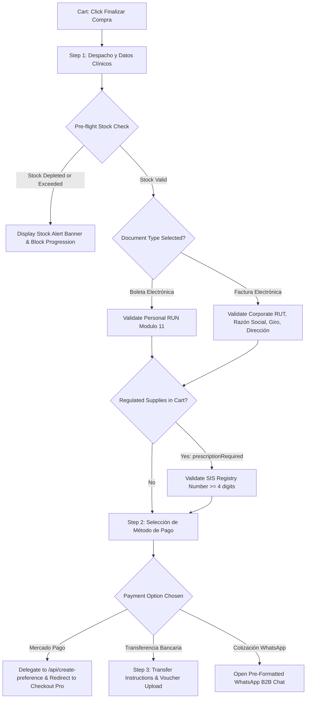
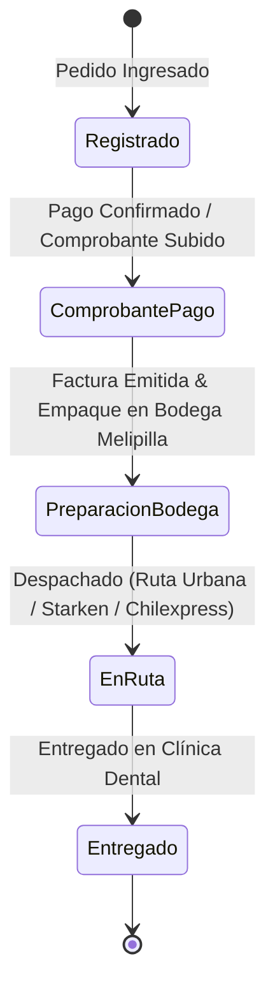

# PRONTO UI Components Guide (`src/components/`)

This document is the **authoritative domain and technical reference** for the user interface layer of PRONTO Insumos Odontológicos. It captures the business context of dental distribution in Chile, architectural decisions, complete component specifications, and an exhaustive field-by-field breakdown of clinical checkout, tax invoicing (SII), and payment workflows.

---

## 🏥 1. Business Context & Clinical Domain Architecture

### 1.1 The Chilean Dental Supplies Market & PRONTO's Role
PRONTO Insumos Odontológicos operates as a specialized **depósito dental** (dental supply distributor) physically based in **Melipilla, Chile** (warehouse and local pickup point at **Av. Ortúzar 750**). 

The customer base is primarily **B2B (Business-to-Business)**:
1. **Private Dental Clinics (Sociedades Odontológicas):** SpA, EIRL, or Sociedades de Profesionales that purchase consumables, impression materials, and handpieces as operational expenses.
2. **Independent Dentists (Odontólogos Generales y Especialistas):** Orthodontists, endodontists, periodontists, implantologists, and pediatric dentists operating private consultation rooms.
3. **Dental Laboratories (Laboratorios Dentales):** Mechanics and technicians fabricating prosthetics, crowns, and aligners requiring specific silicones, stones, and burs.
4. **Public Health Services & Municipal Clinics (CESFAM / Salud Primaria):** Requiring formal tax quotes, registered clinical invoicing, and batch dispatch.

### 1.2 Chilean Tax Invoicing (SII — Servicio de Impuestos Internos)
In Chile, all commercial sales are strictly governed by the **Servicio de Impuestos Internos (SII)** and subject to a **19% Impuesto al Valor Agregado (IVA)**. Commercial transactions fall into two distinct legal categories:

* **Boleta Electrónica (B2C / Personal):**
  - Issued to individual consumers or dentists purchasing under their personal tax identity (**RUN/RUT personal**).
  - IVA is charged and remitted to the fiscal treasury, but **does not grant fiscal tax credit** to a business.
* **Factura Electrónica (B2B / Crédito Fiscal):**
  - Legally mandatory for dental companies, corporate clinics, and incorporated dental practices that wish to claim the 19% IVA as **Crédito Fiscal** (deductible against their monthly sales VAT in **Formulario 29 / F29**) and deduct material expenses from their annual corporate income tax (**Formulario 22 / F22**).
  - The SII strictly mandates specific corporate tax attributes for every Factura:
    1. **RUT de la Empresa:** Corporate tax ID with Modulo 11 check digit verification.
    2. **Razón Social:** Exact registered legal company name.
    3. **Giro Comercial:** Official economic activity classification approved by the SII (e.g., *"Actividades de atención odontológica"*, *"Servicios médicos dentales"*).
    4. **Dirección Tributaria y Comuna:** Official registered fiscal domicile.
    5. **Email de Intercambio DTE (Email para SII):** The registered electronic invoicing inbox where the XML and PDF copies of the electronic tax document (**DTE — Documento Tributario Electrónico**) must be transmitted for automatic fiscal reconciliation.

### 1.3 Sanitary Regulations (ISP Chile & Superintendencia de Salud)
Under Chilean law (**Código Sanitario DFL 725** and **Decreto Supremo 466 del Ministerio de Salud**), medical and dental devices are classified by risk:
* Class I & II: Standard consumables (examination mirrors, bibs, cotton rolls, mixing bowls, micro-applicators). Available for open professional supply.
* Regulated / Prescription Products: Dental local anesthetics (Lidocaína, Mepivacaína, Articaína con epinefrina), pharmaceuticals, surgical scalpels, and specialized etching agents.
* **Legal Obligation:** Depósitos dentales cannot dispense regulated pharmaceuticals or controlled surgical products without recording the professional clinician's registration in the **Registro Nacional de Prestadores Individuales de Salud (RNPI)** managed by the **Superintendencia de Salud (SIS)**. PRONTO enforces this compliance guard directly in checkout.

---

## 🎨 2. Design Philosophy: "Quiet Clinical Confidence"

The storefront UI conveys the clean, sterile, and highly dependable nature of a dental operating depot. One ink, one accent (with a dark-surface variant), unified cool neutrals, real typography, near-zero decorative chrome.
* **Palette (as built — canonical tokens in [src/index.css](file:///c:/Users/ecmv2/Documents/PRONTO/src/index.css)):**
  * **Ink ramp (`--ink-900 #0b1a33`, `--ink-800 #102748`, `--ink-700 #1a3a6a`, `--ink-600 #2a4a7f`):** The anchor. `--ink-900` for footer/utility-bar surfaces, `--ink-800` for headings and primary buttons, `--ink-700` for hover, `--ink-600` for borders on dark.
  * **Single brand accent (`--accent #0e7490`, `--accent-strong #0c6379`, `--accent-soft #e6f4f7`, `--accent-border #b7dee6`, `--accent-on-dark #67e8f9`):** Links, active states, icons, CTA fills on light surfaces (~5.3:1 on white). `--accent-on-dark` is the **only** accent permitted on `--ink-*` surfaces (~8:1 on `--ink-800`) — `--accent` itself fails contrast there (~2.8:1) and must never be used on dark.
  * **Warm semantic (`--signal #c24a32`, `--signal-soft #fbefea`, `--signal-border #efc9be`):** Commercial urgency only — discounts, low-stock cues, cart count badge, featured card strip. Never headings or taglines.
  * **Cool-neutral surfaces (`--surface-bg #f5f7f9`, `--surface-card #ffffff`, `--surface-muted #eef2f5`, `--surface-hover #e7edf2`, `--border-subtle #e4e9ee`, `--border-strong #c9d2db`):** One temperature — the warm/cool clash is gone.
  * **Text ramp (`--text-primary #0f1e33`, `--text-secondary #44536a`, `--text-muted #6b7a8f`, `--text-inverse #ffffff`).**
  * **Status (`--success`, `--warning`, `--danger`):** Quarantined to functional states only.
  * **Spacing (`--space-1 … --space-16`)** and **geometry (`--radius-sm 6px`, `--radius-md 10px`, `--radius-lg 14px`, `--radius-full 999px`)**.
  * **Focus indicators (`--border-focus: var(--ink-800)`):** WCAG 1.4.11 compliant (≥3:1) on light surfaces.
  * **Retired:** lime/limonade/olive (`--brand-limonade`, `--brand-accent-green`, `--brand-accent-green-text`) and cayenne-as-heading-color. The `--brand-*`, `--navy-*`, `--teal-*`, `--slate-*`, `--emerald`, `--cyan`, `--accent-warm` tokens survive only as deprecated aliases.
* **Typography (as built):** `Fraunces` (`--font-display`, 500–700, optical size) for the wordmark and headings — an editorial serif that reads "established firm"; `Inter` (`--font-sans` / `--font-body`, 400–600) for body and CTA copy; `JetBrains Mono` for REF codes and prices. Type scale: `--fs-display` (`clamp(2.5rem, 4vw, 3.5rem)`), `--fs-h2`, `--fs-h3`, `--fs-body`, `--fs-small`, `--fs-micro`. **No italics anywhere.**
* **Strict Aesthetic Guardrails:**
  * Zero fluorescent neon halos or glowing futuristic borders.
  * Zero fake SaaS dashboard widgets.
  * Authentic Chilean currency formatting (`$189.990 CLP`) with zero decimal cents.
  * Transparent Chilean consumer pricing: All customer prices explicitly state `IVA incluido` per **SERNAC** consumer protection rules.

### 2.1 Storefront Landing Composition (`App.tsx`)

The landing page composes the brand experience in a fixed narrative order. **`Hero` renders outside `<main className="main-content">`** because it is a full-bleed navy band; the rest of the page lives inside the 1280px content container.

1. [`Hero.tsx`](file:///c:/Users/ecmv2/Documents/PRONTO/src/components/Hero.tsx): full-bleed `--ink-800` band — pill tag, display headline with the hand-drawn underline, description, one accent CTA plus a WhatsApp quote CTA, a quiet inline trust row (icons in `--accent-on-dark`, **no pill chrome**), and the right-column photography panel with a soft left-edge mask and `imgError` fallback.
2. [`CategoryFilter.tsx`](file:///c:/Users/ecmv2/Documents/PRONTO/src/components/CategoryFilter.tsx): category pills, result count, stock toggle, and sort selector (`#catalog-section` scroll anchor). Icons are `--text-muted`; the active pill is navy text with an `--accent` underline.
3. [`CategoryShowcase.tsx`](file:///c:/Users/ecmv2/Documents/PRONTO/src/components/CategoryShowcase.tsx): **unboxed** 4-card specialty hub (heading + open grid, no border card, no per-card tag-pill overlay) when viewing `all`, or a contextual banner for the active category. Cards are native `<button>` elements (keyboard accessible); categories without a banner render nothing. Its banner copy/photography data lives in [`categoryBanners.ts`](file:///c:/Users/ecmv2/Documents/PRONTO/src/components/categoryBanners.ts) — **not** in the component module, so `CategoryShowcase.tsx` exports components only (React Fast Refresh). Do not move `CATEGORY_BANNERS` back into the component file.
4. [`ProductList.tsx`](file:///c:/Users/ecmv2/Documents/PRONTO/src/components/ProductList.tsx): catalog grid.

**`PromoStrip` was deleted** (redesign proposal §10.4, decision 3). Its unique value messages were folded into the hero trust row; `PromoStrip.tsx`, `PromoStrip.test.tsx`, its CSS and `public/assets/promo-strip-bg.jpg` are all gone. Do not reintroduce a second stacked band between the hero and the catalog — the hero already carries the delivery, invoicing and ISP claims.

> **Category display labels:** Internal Firestore keys (e.g. `DESECHABLES, ESTERILIZACION Y DESINFECCION`) are never shown raw. Always render through `formatCategoryDisplayName()` from [src/utils/categoryAlias.ts](file:///c:/Users/ecmv2/Documents/PRONTO/src/utils/categoryAlias.ts), which is the single source of truth for storefront naming (also consumed by `CATEGORIES` in `src/data/products.ts`).

#### `App.tsx` state contracts (do not regress these)

`App.tsx` was refactored to satisfy the React Compiler-era `react-hooks` rules (see root [AGENTS.md](file:///c:/Users/ecmv2/Documents/PRONTO/AGENTS.md) §8.4). The following are load-bearing contracts, not incidental implementation details:

* **Catalog `loading` is derived, never stored.** `loading === (loadedRequestKey !== catalogRequestKey)`, where `catalogRequestKey` is `${selectedCategory}|${search}|${sortBy}|${inStockOnly}`. The fetch effect writes `loadedRequestKey` only in its `finally`. A filter change therefore flips `loading` to `true` during render — do **not** reintroduce `setLoading(true)` at the top of an effect.
* **Mercado Pago return / tracking query parameters are parsed once, at module scope,** by `parseUrlBootstrap()`, and consumed through lazy `useState` initializers (`paymentReturn`, `isTrackingOpen`, `trackingInitialOrderId`, `trackingInitialRut`, and the approved-return cart reset). The mount effect performs **only** external side effects: `clearCartFromStorage()` and `history.replaceState()`. Moving this parsing back into a state-setting effect will fail `pnpm lint` and reintroduce a cascading render.
* **Cart revalidation happens after the awaited fetch,** reading `cartRef.current` rather than `cart`. This keeps `cart` out of the effect's dependency array (which would trigger a re-fetch on every cart mutation) while still satisfying `exhaustive-deps`. `cartRef` is kept in sync by a dedicated effect.
* **Overlay state is scoped by remount, not by reset effects:**
  * `ProductQuickView` is rendered with `key={quickViewProduct.id}`, so its quantity, gallery index and failed-image state reset per product. Removing the `key` silently reintroduces stale state when switching products.
  * `OrderTrackingModal` is rendered only while `isTrackingOpen` is true (`{isTrackingOpen && …}`), so its form state initializes from `initialOrderId` / `initialRut` on every open. Removing the conditional render reintroduces the prop→state sync effect that the hooks rules forbid.
* **`addToast` is wrapped in `useCallback`** because it is a dependency of the catalog effect.

### 2.2 Brand Lockup & Canonical Naming

The brand mark is **type, not an image** — it renders as crisp text at any zoom and stays accessible. There is no icon mark of any kind.

* **Lockup structure** (`Navbar.tsx`, `Footer.tsx`): a `.brand-lockup` wrapper containing
  * `.brand-wordmark` — `PRONTO`, `Fraunces` 600, `1.375rem` in the navbar / `1.25rem` in the footer; `var(--ink-800)` on light surfaces, `var(--text-inverse)` on navy.
  * `.brand-descriptor` — `INSUMOS ODONTOLÓGICOS`, `Inter` 600, `0.5625rem`, uppercase, `letter-spacing: 0.14em`; `var(--text-muted)` on light, `var(--accent-on-dark)` on navy.
  * `.brand-underline` — the single bespoke detail: a hand-drawn SVG stroke (`path d="M2 4 Q 25 7 50 4 T 98 4"`) in `var(--signal)`, `stroke-width: 3`, `stroke-linecap: round`, absolutely positioned to span ~70% of the wordmark width. **The same motif is the favicon mark** (`public/favicon.svg`). Do not add any other texture or decoration.
  * The footer uses the `brand-lockup--inverse` modifier for the navy surface.
* **Retired:** the Lucide `Activity` icon-in-a-square, the `ODONTOLOGÍA` sticker badge, and the `PRONTO ODONTOLOGÍA` footer lockup. `Navbar.test.tsx` and `ClinicalStorefront.test.tsx` assert these do not come back.
* **Canonical naming rule:**
  * Storefront lockup: `PRONTO` + `INSUMOS ODONTOLÓGICOS` descriptor.
  * `<title>` and meta: `PRONTO Insumos Odontológicos — Depósito Dental en Melipilla`.
  * Legal line: `PRONTO INSUMOS ODONTOLÓGICOS SPA` (unchanged).
* **Favicon:** `public/favicon.svg`, wired via `<link rel="icon" type="image/svg+xml" href="/favicon.svg" />` in `index.html`.
* **`og-preview.png`:** `index.html` references `https://pronto-insumos.vercel.app/og-preview.png` in `og:image`, `twitter:image` and the JSON-LD `image`. The file is produced by a human (redesign proposal Appendix B.1) and dropped at `public/og-preview.png`; the meta tags ship regardless. **Do not generate a substitute image.** `vercel --prod` is blocked until the real file exists.

---

## 🛒 3. Deep Dive: Checkout Modal (`CheckoutModal.tsx`)

The [`CheckoutModal.tsx`](file:///c:/Users/ecmv2/Documents/PRONTO/src/components/CheckoutModal.tsx) component is the commercial nucleus of PRONTO. It executes a **3-step linear state machine** guiding the dental practitioner through identity verification, tax document selection, pre-flight inventory confirmation, payment gateway delegation, and voucher collection.



### 3.1 Field-by-Field Reference & Business Rationale

| Form Field Name | State Property | UI Label | Purpose & Clinical Business Context | Validation Rule |
| :--- | :--- | :--- | :--- | :--- |
| **Tipo de Documento** | `formData.documentType` | `📄 Boleta Electrónica` | The fiscal document issued through the Chilean SII. **Boleta only, as built** — the Factura card is removed behind `const FACTURA_ENABLED = false`. The Factura branch (corporate RUT + Razón Social + Giro) still exists in code and in the order schema, so re-enabling is a one-line change; until then clinics are routed to the WhatsApp quotation path via the note under the card. | Required (`'boleta'` \| `'factura'`). Defaults to `'boleta'`. |
| **Nombre del Profesional** | `formData.fullName` | *Nombre del Profesional o Representante Legal* | Identifies the ordering dentist or the clinic's legal representative. Used for package labeling, reception desk delivery signing, and customer care. | Required string. Trimmed of whitespace. |
| **RUT del Comprador** | `formData.rut` | *RUT Personal (RUN)* (Boleta) / *RUT Empresa / Sociedad* (Factura) | Chilean national identity tax number. For Boleta, represents the individual practitioner. For Factura, represents the incorporated dental practice (Sociedad Odontológica). | Must satisfy official Chilean **Modulo 11 check digit** via `validateRut()` in [src/utils/rut.ts](file:///c:/Users/ecmv2/Documents/PRONTO/src/utils/rut.ts). Formats dynamically as `12.345.678-K`. |
| **Email para Documento SII** | `formData.email` | *Email para Documento SII* | **Critical Chilean Fiscal Field:** Electronic tax documents (DTEs) issued through electronic invoicing providers connected to the SII must be dispatched to a formal electronic mailbox. In dental clinics, this email is often monitored by the clinic's accountant or administrator (`facturacion@clinica.cl`), ensuring tax documents are not lost in personal dentist inboxes. For Boleta, receives the purchase confirmation and Boleta PDF. | Required standard email format (`type="email"`). |
| **Razón Social** | `formData.razonSocial` | *Razón Social (según SII) \** | **Factura Only:** The official registered legal entity name of the clinic or dental society (e.g., *"Centro Odontológico Melipilla SpA"*). The SII rejects invoices where the Razón Social does not match the company RUT in the tax registry. | Mandatory when `documentType === 'factura'`. Minimum 3 characters. |
| **Giro Comercial** | `formData.giroComercial` | *Giro Comercial Registrado \** | **Factura Only:** The registered economic activity code and description recognized by the SII (e.g., *"Servicios odontológicos"*, *"Atención médica y dental"*). Invoices lacking a valid economic activity are legally rejected for tax credit. | Mandatory when `documentType === 'factura'`. Minimum 3 characters. |
| **Teléfono Móvil** | `formData.phone` | *Teléfono Móvil* | Direct telephone and WhatsApp contact for courier logistics. Crucial for Melipilla urban delivery and regional couriers to confirm clinic reception hours before dispatching packages. | Required string. |
| **Dirección de Entrega / Fiscal** | `formData.address` | *Dirección de Entrega / Fiscal \** | Dual-purpose field: Specifies the street, building, office number (e.g., *"Av. Ortúzar 750, Of. 302"*), and acts as the fiscal address registered on the electronic tax invoice. | Mandatory. Validated via `validateFacturaFields` when Factura is selected. |
| **Comuna de Despacho** | `formData.city` | *Comuna de Despacho \** | **A `<select>`, not free text.** Only the two real delivery zones are offered — `Melipilla` (default) and `San Antonio` — sourced from `DELIVERY_ZONES` in [src/config/delivery.ts](file:///c:/Users/ecmv2/Documents/PRONTO/src/config/delivery.ts). It determines logistics eligibility (the San Antonio minimum order) and satisfies the SII DTE address requirement. | Mandatory. Defaults to `DEFAULT_DELIVERY_ZONE` (`Melipilla`). |
| **Código Postal / Región** | `formData.zip` | *Código Postal / Región* | Chilean postal district code (e.g., *"9500000"* for Melipilla) or regional identifier for courier sorting hubs (Chilexpress/Starken). | Required string. |
| **N° Registro SIS** | `sisRegistryNumber` | *N° Registro SIS (Superintendencia) \** | **Sanitary Verification Field:** Mandatory only when cart contains regulated clinical supplies (`prescriptionRequired === true`). Represents the practitioner's official registration in the Superintendencia de Salud's RNPI. | Required if `hasRegulatedItems`. Minimum 4 numeric/alphanumeric characters. |
| **Credencial / Receta** | `credentialFileName` | *Credencial Profesional o Receta (Opcional)* | Allows uploading an image or PDF of the professional credential or prescription authorizing controlled supply acquisition. | Optional file attachment (`.pdf`, `.jpg`, `.png`). |

### 3.2 Pre-Flight Stock Validation in Step 1
Before allowing the customer to proceed from Step 1 to Step 2, `handleNextStep()` iterates through every cart line item against current inventory:
```typescript
const stockIssueItem = cartItems.find(item => {
  const stock = typeof item.product.stockCount === 'number' ? item.product.stockCount : 0
  return !item.product.inStock || stock <= 0 || item.quantity > stock
})
```
If an item has depleted or the requested quantity exceeds physical stock, the transition is halted and an amber alert banner displays:
> *"El producto '[Nombre]' supera el stock disponible (X solicitados, Y disponibles). Por favor ajusta la cantidad en el carro."*

### 3.2.1 Delivery-Zone Minimum Order in Step 1

Immediately after the stock check, `handleNextStep()` enforces the only minimum-sale rule in the system:

```typescript
const productSubtotal = cartItems.reduce((acc, item) => acc + item.product.price * item.quantity, 0)
const deliveryZone = (formData.city || DEFAULT_DELIVERY_ZONE) as DeliveryZone
if (isBelowMinimumOrder(deliveryZone, productSubtotal)) {
  setSubmitError(`La compra mínima para despacho a ${MIN_ORDER_ZONE} es de ${formatCLP(MIN_ORDER_OUTSIDE_MELIPILLA)}`)
  return
}
```

* `isBelowMinimumOrder()` returns true only for `zone === 'San Antonio' && subtotal < 60000`. **Melipilla has no minimum.**
* The subtotal is the pre-tax product sum, matching the figure the Cart drawer shows — not `totalAmount`, which includes IVA.
* The select also renders a proactive muted hint under it when `San Antonio` is chosen: `Compra mínima para despacho a San Antonio: $60.000`.
* The same rule is surfaced in the Cart drawer, so the shopper learns it before reaching checkout. Both read the constants from `src/config/delivery.ts`.

### 3.3 Step 2: Payment Pathways
Presents 3 distinct payment pathways tailored to Chilean healthcare purchasing habits:
1. **Transferencia Bancaria Directa (Banco de Chile):**
   - The preferred B2B method for dental clinics managing monthly account balances.
   - Bank details are externalized in [`src/config/bankDetails.ts`](file:///c:/Users/ecmv2/Documents/PRONTO/src/config/bankDetails.ts) (**Banco de Chile, Cuenta Corriente 849-01284-01, RUT 77.892.410-2, pagos@prontoinsumos.cl**).
   - Advances to Step 3 where the customer receives transfer instructions and can upload their bank receipt directly.
2. **Pago Inmediato Mercado Pago Chile (Webpay Plus / Redcompra):**
   - Instant digital settlement via credit/debit card.
   - **PCI-DSS Compliance:** Zero card fields exist in state or DOM. Processing delegates to `/api/create-preference` which generates an official Checkout Pro URL.
3. **Cotización Formal por WhatsApp:**
   - Designed for municipal procurement, university clinics, or custom high-volume orders.
   - Formats a comprehensive Markdown quote with itemized SKUs and tax breakdowns, opening `https://wa.me/...`.

### 3.4 Step 3: Order Confirmation & Transfer Voucher Intake
When Transferencia Bancaria is confirmed:
* Generates a canonical Order ID (`PRONTO-XXXXXX`).
* Displays the complete Banco de Chile transfer specifications.
* Renders an **embedded voucher upload widget** allowing immediate attachment of receipts (`.pdf`, `.png`, `.jpg` <= 5MB).
* Submitting the voucher invokes `/api/upload-voucher`, advancing the order status to `'TRANSFERENCIA_COMPROBANTE_SUBIDO'`.
* Provides direct navigation to [`OrderTrackingModal.tsx`](file:///c:/Users/ecmv2/Documents/PRONTO/src/components/OrderTrackingModal.tsx) for live fulfillment tracking.

---

## 🔍 4. Deep Dive: Customer Order Tracking Modal (`OrderTrackingModal.tsx`)

The [`OrderTrackingModal.tsx`](file:///c:/Users/ecmv2/Documents/PRONTO/src/components/OrderTrackingModal.tsx) component provides dental practitioners with transparent visibility into their order fulfillment.

### 4.1 Security Architecture
Under [`firestore.rules`](file:///c:/Users/ecmv2/Documents/PRONTO/firestore.rules), client-side queries against `/orders` are blocked (`allow read, update, delete: if false;`) to protect clinical order privacy.
* **Authentication Contract:** Lookups require two canonical factors:
  1. **Canonical Order ID:** `PRONTO-XXXXXX`
  2. **Customer / Clinic Tax ID:** Validated Chilean RUT (Modulo 11) matching the order.
* **Serverless Proxy:** The modal queries [`/api/track-order`](file:///c:/Users/ecmv2/Documents/PRONTO/api/track-order.ts), which uses `firebase-admin` to fetch the order and returns a sanitized `OrderTrackingInfo` model without exposing internal tokens, server secrets, or database timestamps.

### 4.1.1 Lifecycle Contract — mount-while-open, auto-search after the await

The modal is **mounted only while open** (`{isTrackingOpen && <OrderTrackingModal … />}` in `App.tsx`). Its form state (`orderId`, `rut`, error and voucher fields) therefore initializes from the `initialOrderId` / `initialRut` props at mount, and there is **no prop→state synchronisation effect**. Removing the conditional render in `App.tsx` reintroduces the stale-state bug this replaced.

Auto-search behaviour when the caller prefills valid credentials:

* `autoSearchOnMount = Boolean(initialOrderId && initialRut && validateRut(initialRut))` also seeds the `loading` initializer, so the spinner is already on for the first paint.
* The auto-search effect performs its state updates **after** the awaited `fetchOrderTracking()` call. The effect body itself must stay free of synchronous `setState` — this is what `react-hooks/set-state-in-effect` enforces, and `pnpm lint` will fail otherwise.
* `performSearch()` remains the manual path used by the form's *Consultar* button and by the voucher re-fetch; it is a plain function, not a hook.

### 4.1.2 Known deviation — the support link hardcodes its own number

`getWhatsAppSupportUrl()` in this component builds its `wa.me` URL from a **literal**, and that literal is **not** the storefront's configured number:

```ts
// src/components/OrderTrackingModal.tsx
return `https://wa.me/56987654321?text=${encodeURIComponent(msg)}`
```

* **As built:** every other customer-facing entry point (Navbar, Hero, Footer, ProductQuickView, ErrorBoundary) resolves its number and link through [src/config/contact.ts](file:///c:/Users/ecmv2/Documents/PRONTO/src/config/contact.ts) — see §7.1 and [src/services/AGENTS.md](file:///c:/Users/ecmv2/Documents/PRONTO/src/services/AGENTS.md) §4.4. This modal is the **last storefront component that still embeds a `wa.me` URL**, and the digits differ from `WHATSAPP_NUMBER` (`56912345678` fallback), so its *Consultar* chat currently reaches a different placeholder line than the rest of the store.
* **Invariant it breaks:** "no component may hardcode a phone number or a `wa.me` URL". Any change to `VITE_WHATSAPP_NUMBER` updates five surfaces and silently misses this one.
* **Do not fix it by inventing a number.** The correct end state is `whatsappLink('Hola PRONTO Insumos, necesito asistencia con el estado de mi pedido ' + cleanId)` — i.e. the same helper as the other consumers, with no literal.

### 4.2 The 5-Stage Fulfillment Timeline



1. **Pedido Registrado:** Initial order entry in system (`PENDIENTE_PAGO_MERCADOPAGO` or `PENDIENTE_TRANSFERENCIA`).
2. **Comprobante / Pago Verificado:** Payment confirmed via Mercado Pago webhook or transfer voucher uploaded (`TRANSFERENCIA_COMPROBANTE_SUBIDO` / `PAGADO_*`).
3. **Preparación en Bodega Melipilla:** Order being verified, checked against ISP regulations, packed, and accompanied by Factura Electrónica (`EN_PREPARACION`).
4. **En Ruta de Entrega:** Handed over to local Melipilla courier fleet or regional logistics carrier with tracking number (`DESPACHADO`).
5. **Entregado:** Successfully delivered and signed at clinic reception (`ENTREGADO`).

### 4.3 In-Modal Bank Transfer Voucher Upload
If a customer consults an order that is pending bank transfer (`status === 'PENDIENTE_TRANSFERENCIA'`), the modal dynamically embeds a voucher upload form directly below the timeline, eliminating the need to contact support via email.

---

## 🛍️ 5. Deep Dive: Slide-Over Cart Drawer (`Cart.tsx`)

[`Cart.tsx`](file:///c:/Users/ecmv2/Documents/PRONTO/src/components/Cart.tsx) manages the clinician's shopping bag with real-time stock cues, shipping incentives, and tax breakdowns:

### 5.1 Real-Time Stock Cues
To avoid customer frustration during checkout, the cart actively monitors inventory:
* **"Sin stock disponible"** (Red badge): Displayed if `stockCount <= 0` or `inStock === false`.
* **"Máximo disponible (X unid.)"** (Amber badge): Displayed when the item quantity equals warehouse physical stock.
* **"Excede stock (X unid. disp.)"** (Red badge): Displayed if inventory depleted while items were in the cart.
* **Capped Stepper Action:** The increment (`+`) button is disabled when quantity reaches stock count, displaying an informative tooltip.
* **Sticky Alert Banner & Locked CTA:** When any item exceeds stock, a persistent alert banner appears in the cart footer and the checkout button is disabled with the label `"Insumos sin Stock Suficiente"`.

### 5.2 Chilean Shipping Progress Tracker

* Free-shipping threshold is **`FREE_SHIPPING_THRESHOLD = 150000`**, imported from [src/config/delivery.ts](file:///c:/Users/ecmv2/Documents/PRONTO/src/config/delivery.ts) (the Cart previously declared its own `150000` while the Footer advertised `$100.000`). It applies to **both** delivery zones.
* Renders a live progress bar with the final copy deck strings:
  * still short → `Agrega {formatCLP(remaining)} más para Despacho GRATIS`
  * reached → `✓ Despacho sin costo — superaste los {formatCLP(150000)}`
* A muted zone line sits under the bar: `Despacho a Melipilla y San Antonio · Compra mínima San Antonio: $60.000` — the same rule checkout enforces, surfaced proactively.
* **No pickup wording.** The old `despacho gratis en Melipilla y RM` / "retiro" copy is retired; see root [AGENTS.md](file:///c:/Users/ecmv2/Documents/PRONTO/AGENTS.md) §3.4.

### 5.3 Tax & Discount Breakdown

* Calculates itemized subtotal, promotional discount, and isolates the 19% IVA using Chilean rounding rules (`calculateTaxBreakdown` in [src/utils/tax.ts](file:///c:/Users/ecmv2/Documents/PRONTO/src/utils/tax.ts)).
* Ensures every total sent to checkout is a whole Chilean Peso integer without decimal cents.

### 5.4 Overlay Scroll Lock

The Cart drawer is one of five surfaces that call `useScrollLock(...)` from [src/hooks/useScrollLock.ts](file:///c:/Users/ecmv2/Documents/PRONTO/src/hooks/useScrollLock.ts), which freezes `document.body.style.overflow` while open and restores the previous value on unmount. The other four are `ProductQuickView`, `CheckoutModal`, `OrderTrackingModal` and `PaymentReturnModal`. Any new overlay must adopt it — without it the page scrolls behind the overlay, which was a long-standing bug.

---

## 📦 6. Catalog Components Reference

### 6.1 `ProductCard.tsx`
* **Confidential Stock Defense:** Warehouse inventory counts (`stockCount`) are **never rendered** to public users to prevent competitors from scraping inventory levels. The low-stock cue is the fixed string **`Últimas unidades`** (it used to interpolate the count as `Últimas N unid.` — never reintroduce that), the out-of-stock cue is **`Sin stock`**, and the add button reads `Agregar` / `Agotado`. `stockCount` still drives *whether* the cue shows (`<= 5`) and still caps steppers; only the number is withheld.
* **Media placeholder:** All catalog items currently have `images: []`, so every card renders the icon-on-dot-grid placeholder. That placeholder uses **one neutral treatment** — the eight `gradient-*` theme rules were collapsed, so the `placeholderTheme` field no longer changes the look. See `src/index.css` (`.media-placeholder-box`).
* **Badge diet — at most ONE media badge**, by priority **discount > Rx > mediaBadge**. The media area renders the discount pill, else the `Uso Profesional` Rx pill, else `mediaBadge`; never two at once. The `.discount-badge + .rx-badge` stacking rule was removed with it. `.product-card--featured` uses a `var(--signal)` top strip.
* **Technical REF SKU Header:** Features canonical REF codes (e.g. `REF: OD-101`) familiar to dental procurement staff.
* **Sanitary Badging:** Displays `⚕️ Uso Profesional` or `⚕️ Requiere SIS` when `prescriptionRequired === true`.
* **Cart-aware stepper (D.6):** the footer renders, in order of precedence —
  * `!isAvailable` → a disabled `Agotado` button;
  * `cartQuantity === 0` → the `Agregar` CTA calling `onAddToCart(product)`;
  * `cartQuantity > 0` → a `.quantity-controls` stepper (`−` / qty / `+`) that calls `onUpdateQuantity(product.id, cartQuantity ± 1)`; `+` is disabled at `stockCount`, and stepping down to 0 reverts to `Agregar`. Both buttons `e.stopPropagation()` so the card-level quick-view click does not fire.
  * Props are threaded `App (cartQuantityById via useMemo) → ProductList → ProductCard`. `ProductQuickView` receives `cartQuantity` too and seeds its local stepper from it (`Math.max(1, cartQuantity)`).
* **Pricing Standard:** Renders whole Chilean Peso amounts with `IVA incluido` tag. Ratings and strikethrough prices render only when the data actually exists (fixtures now carry `rating: 0` / `reviewsCount: 0`, and only one fixture carries an `originalPrice`).

### 6.2 `ProductQuickView.tsx`
Vertical 1-column Product Detail Modal:
* **Multi-Photo Gallery:** Thumbnail strip, next/prev navigation buttons, and keyboard arrow controls.
* **Clinical Checklists:** Technical specifications checklist (`specs`) and itemized packaging contents (`packageContents` e.g., *"1x Turbina LED, 1x Llave de desarme, 1x Manual técnico"*).
* **Sanitary Notice:** Detailed citation of ISP compliance and autoclave sterilization parameters (134°C).
* **Per-product state via remount:** `App.tsx` renders this component with `key={quickViewProduct.id}`. Quantity, active gallery index and failed-image state are therefore scoped to a single product and reset by remounting — there is deliberately **no** "reset when `product` changes" effect (it would be a synchronous `setState` inside an effect, which `pnpm lint` rejects). Keep the `key`.

### 6.3 `CategoryFilter.tsx`
Clinical category tabs (Instrumental, Materiales Restauradores, Equipamiento, Desechables, Endodoncia, Ortodoncia, Periodoncia) with accessible ARIA roles, instant stock toggle (`Solo productos en stock`), and price/rating sort dropdown.

---

## 🌐 7. Navigation, Layout & Utility Components

### 7.1 `Navbar.tsx`
* **Brand Lockup:** the code-rendered `PRONTO` / `INSUMOS ODONTOLÓGICOS` wordmark with the `--signal` underline motif — see §2.2. The link carries `aria-label="PRONTO Insumos Odontológicos"`.
* **Top Commercial Utility Bar:** Displays Melipilla express delivery notices, warehouse pickup address (Av. Ortúzar 750), Factura Electrónica SII compliance, and the direct "Seguimiento de Pedido" action button.
* **Technical Search:** Debounced keyword search matching product names, clinical descriptions, categories, and SKU REF codes.
* **Dynamic Cart Badge:** Visual item counter with micro-animation upon addition.
* **Contact data:** the "Mesa Clínica" phone and its `wa.me` link come from `src/config/contact.ts` (`WHATSAPP_DISPLAY`, `whatsappLink()`), never from a literal.

### 7.2 `Footer.tsx`
* **Brand Lockup:** the same wordmark as the navbar, in its `brand-lockup--inverse` (navy-surface) variant — see §2.2.
* Grounded 4-column B2B distributor layout:
  1. *Identidad Corporativa:* Corporate details, Av. Ortúzar 750 warehouse location, Melipilla, Chile.
  2. *Catálogo Clínico:* Quick links to primary dental categories.
  3. *Logística y Seguimiento:* Tracking modal trigger, shipping routes (Melipilla, RM, Regiones vía Starken/Chilexpress), and withdrawal policies.
  4. *Contacto y Certificaciones:* Factura Electrónica SII notice, ISP sanitary compliance statement, and technical WhatsApp hotline.
* **Free-shipping figure must match the cart:** the logistics list advertises `Despacho Gratuito sobre $150.000`. It previously said `$100.000` while the cart computed against `150000`, so the storefront contradicted itself. Treat the cart constant as authoritative.
* **Contact icons use `var(--accent-on-dark)`** — the footer is an `--ink-900` surface, where `--accent` fails contrast. The retired `--brand-accent-green` token must not reappear.
* **Zero Prototype Buttons:** Administrative wipe/seed buttons are strictly eliminated from public view.

### 7.3 `PaymentReturnModal.tsx`
Handles Mercado Pago return redirects (`/?status=approved&collection_id=...`):
* `approved`: Displays success header, order ID, payment ID, clears cart and storage, and provides WhatsApp delivery coordination.
* `failure`: Explains payment decline, reassures no funds were charged, and offers retry or bank transfer alternatives.
* `pending`: Informs the customer that the payment is awaiting banking clearance.

### 7.4 `ErrorBoundary.tsx`
Top-level React error boundary preventing white-screen crashes. Catches unhandled exceptions and displays a clinical error card with a direct WhatsApp technical support button pre-filled with error diagnostic details.

---

## 🔒 8. Security & State Guardrails Summary

1. **NO Heavy State Libraries:** Standard React 18 hooks (`useState`, `useEffect`, `useCallback`, `useMemo`) and lightweight `localStorage` persistence.
2. **NO External UI / CSS Frameworks:** Pure Vanilla CSS clinical design system in [src/index.css](file:///c:/Users/ecmv2/Documents/PRONTO/src/index.css).
3. **NO Client-Side Inventory Decrements:** Browser components never deduct stock or assign `'PAGADO_MERCADOPAGO'`. Only `/api/webhooks/mercadopago` or authorized admin functions mutate inventory.
4. **Zero Card Handling (PCI-DSS):** Component state never captures or stores credit card numbers, expiration dates, or CVC codes.
5. **Chilean Modulo 11 Compliance:** Every RUT input is sanitized, formatted (`XX.XXX.XXX-Y`), and validated against the official algorithm.
